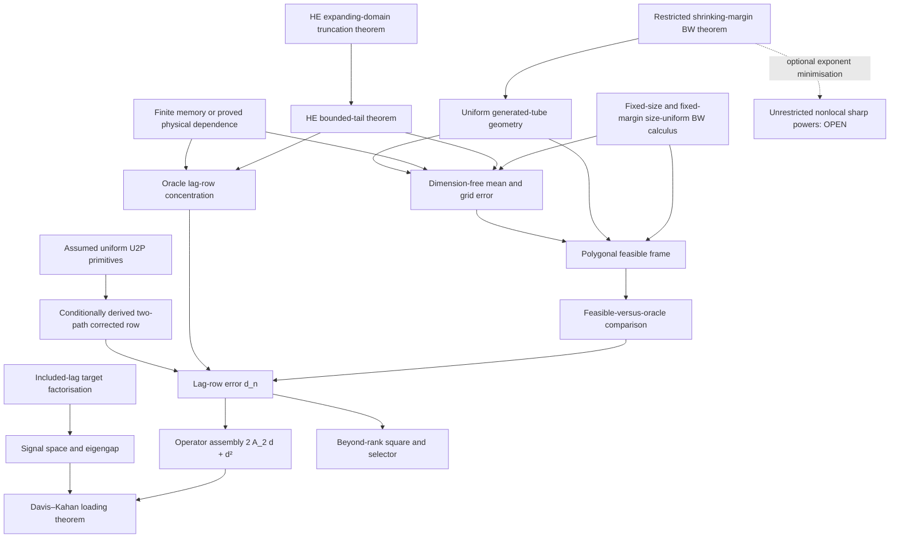

# Analytical reconstruction — proof ledger and rebuilt spec

> **Primary source of truth.** This file records the current programme, theorem boundary, dependency structure, and live research frontier. Detailed proofs live in [[HD1 — growing-dimension Paper 1 proof dossier]], [[G1 audit — resolution of the uniform local Fréchet rate]], and the records under `Archived/Proof workstreams`. Superseded ledgers are preserved under `Archived/Historical canonical files`; they are not sources of current theorem status.

## 1. Scientific object

The parent Riemannian factor model is a dynamic dimension-reduction model for manifold-valued time series. It maps observations to a tangent space at a Fréchet centre, estimates a low-dimensional loading space from lagged covariance, and optionally forecasts the extracted factor scores with a separate time-series model before mapping the result back to the manifold.

Paper 1 replaces the fixed centre by a smooth path while retaining one covariantly constant loading space:

\[
X_{t,n}=\operatorname{Exp}_{\mu_n(u_t)}
\left[\mathcal P^{\mu_n}_{u_0\to u_t}A_nf_{t,n}+\delta_{t,n}\right],
\qquad u_t=t/n.
\]

After transport to the anchor tangent space,

\[
Y_{t,n}=A_nf_{t,n}+\varepsilon_{t,n},\qquad A_n^*A_n=I_r.
\]

The estimand is the fixed transported loading space \(E_n=\operatorname{ran}A_n\). Paper 2 asks a different question—whether the loading subspace itself moves—and remains standalone.

## 2. Canonical theorem boundary

The proved robust Paper 1 theorem permits arbitrary \(p_n\to\infty\) under the following explicit package:

1. fixed factor rank, included lag count, and either fixed finite memory or the proved dimension-uniform Hilbert physical-dependence budgets;
2. uniformly bounded total tangent energy, or the displayed typed moment substitutes required by each score and lag-product consumer;
3. uniform generated-tube geometry and fixed-order differential bounds;
4. a smooth moving centre with level local-stationarity error \(O(n^{-a})\);
5. exact absence of idiosyncratic lag covariance and factor–noise cross covariance at the included lags, unless their population contamination is explicitly budgeted;
6. positive lag-factor rank and an actual operator eigengap \(\Delta_n\);
7. the positive three-scale mean estimator and derivative-free polygonal frame.

Define

\[
\ell_n=b_n^3+(nb_n)^{-1/2}+n^{-a}+n^{-1}.
\]

Under exact included-lag factorisation, the feasible lag-row error and loading-space error obey

\[
d_n=O_p(n^{-1/2}+\ell_n),
\qquad
\|\sin\Theta(\widehat E_n,E_n)\|_{\rm op}
=O_p\!\left(\frac{n^{-1/2}+\ell_n}{\Delta_n}\right),
\]

provided the assembled operator perturbation is \(o_p(\Delta_n)\). With approximate target defect
\[
\zeta_n^2=\sum_h\|\Gamma_n(h)-A_nC_{f,n}(h)A_n^*\|_{\rm op}^2,
\]
the honest row numerator is \(n^{-1/2}+\ell_n+\zeta_n\) and the denominator is the ideal-target gap \(\Delta_n^0\). At \(b_n=n^{-1/7}\) and \(a\ge3/7\), the exact-target robust numerator is \(n^{-3/7}\). This is an ambient-dimension-free bounded-total-energy theorem, not a classical pervasive-factor theorem.

## 3. Signal, operator, and factor number

Use separate symbols:

\[
s_n=\max_{1\le h\le h_0}\sigma_r(C_{f,n}(h)),
\qquad
\Delta_n=\lambda_r(\mathbb L_n)-\lambda_{r+1}(\mathbb L_n).
\]

Under exact included-lag factorisation,

\[
\mathbb L_n=A_nQ_nA_n^*,\qquad
Q_n=\sum_{h=1}^{h_0}C_{f,n}(h)C_{f,n}(h)^*.
\]

Thus \(\operatorname{ran}\mathbb L_n=E_n\) when \(Q_n\succ0\). One full-rank included lag implies \(\Delta_n\ge s_n^2\), but this is only a sufficient corollary. Davis–Kahan pays \(\Delta_n^{-1}\), not \(\Delta_n^{-2}\).

If \(\mathcal G=[\Gamma_1\ \cdots\ \Gamma_{h_0}]\), then \(\mathbb L=\mathcal G\mathcal G^*\). Lag-row control gives the beyond-rank square

\[
\widehat\lambda_{r+1}\le d_n^2.
\]

Threshold and ridged-ratio selectors are proved under their displayed separation windows. The raw unregularised eigenvalue ratio is disproved from the available rate assumptions.

## 4. Proved application-specific branches

The canonical property-to-application source is [[Application map — geometry, symmetry, and rate accelerators]]. Its current proved branches are:

- **Exact flat/common-commuting branch.** In one simply connected convex flat containing every model and estimator object, geometric recentering and non-rigid frame terms vanish. With genuine training/evaluation innovation separation, the remaining linear mean terms conditionally centre and
  \[
  d_n=O_p(n^{-1/2}+\ell_n^2+\rho_n).
  \]
  Negligible defects recover the oracle \(n^{-1/2}/\Delta_n\) loading numerator.
- **FRAME-2P-U conditional two-path branch.** Use three exactly separated training, validation, and evaluation colours. The training path uses \(b_n=n^{-1/7}\) and \(M_n\asymp n^{2/7}\); an independent validation path uses \(c_n=n^{-\gamma}\), \(1/6<\gamma<3/14\). Differentiating the observable evaluation polygon row from the training path toward the validation path cancels the complete pilot first variation. Under the explicit U2P generated-tube, strong-convexity, composed-action, replacement, dependence, mask, GLO, included-lag, and exact-local-law or \(a>1/2\) package, with every constant uniform in \(p_n\),
  \[
  \widehat{\mathfrak T}^{2p}_n-\mathfrak T_n
  =\mathbb G_{E,n}[Z_n]+\mathbb G_{V,n}[\varphi_{n,c}]+R_n,
  \qquad \|R_n\|_{\oplus HS}=o_p(n^{-1/2}).
  \]
  Both influence rows are root-\(n\), so \(d_n^{db}=O_p(n^{-1/2})\), loading recovery is \(O_p(n^{-1/2}/\Delta_n)\) under the actual assembly/gap condition, and the beyond-rank spectrum is \(O_p(n^{-1})\). This is an abstract implication uniform over arrays satisfying U2P, not a verified generic growing-curvature theorem. The only growing-\(p_n\) witness currently pads a fixed hyperbolic active block with flat inactive directions; growing-size AIRM/BW U2P remains unverified. Bounded total energy alone is insufficient.
- **Known or root-\(n\) centre branch.** A known centre is immune. A constant pooled or finite-dimensional parametric centre estimated at root-\(n\) preserves oracle order but generally changes the first-order law.
- **Physical-dependence branch.** Uniform summable Hilbert \(L^2\) and essential-sup innovation effects replace fixed finite memory for the robust mean and oracle-row concentration chain. They do not create exact sample separation under infinite memory.
- **AIRM fixed-band geometry.** All fixed-order Exp, Log, transport, Hessian, Richardson, connector, and ruled-surface differentials consumed by the theorem are uniform in SPD matrix size in the project norms on fixed generated spectral bands. This proves geometry, not bounded energy, lag orthogonality, cancellation, or signal.
- **Structured signed mean branch.** Deterministic, scalar-plus-uniformly-Hilbert–Schmidt, or controlled block-scalar observation Hessians yield dimension-free signed local-polynomial mean estimation. Faster mean estimation alone does not give loading immunity.

## 5. The four first-order nuisance terms

After removing one common rigid anchor rotation, the feasible lag product has four linear nuisance channels:

1. current-endpoint mean/Hessian recentering;
2. lagged-endpoint mean/Hessian recentering;
3. current-endpoint non-rigid frame error;
4. lagged-endpoint non-rigid frame error.

Flatness removes the frame channels but does not by itself centre the two additive mean channels. Law symmetry may cancel population Hessian coefficients but does not control frame holonomy. Sample separation centres evaluation terms but does not make curved Hessians deterministic. A generic oracle claim therefore requires a term-by-term argument, not a geometry label.

FRAME-2P-U supplies such a term-by-term correction without estimating the true centre, true frame, \(e_t\), \(\Omega_t\), a population Hessian, or an unobserved ribbon. For fitted training vertices \(\widehat q^T\), independent undersmoothed validation vertices \(\check q^V\), and an evaluation-row functional \(\widehat{\mathfrak T}_E\), define

\[
d_j^{TV}=\log_{\widehat q_j^T}\check q_j^V,
\qquad
\widehat{\mathfrak T}^{2p}_{T,V,E}
=\widehat{\mathfrak T}_E(\widehat q^T)
+D\widehat{\mathfrak T}_E(\widehat q^T)[d^{TV}],
\]

and average over cyclic colour assignments. The derivative contains the inverse-Karcher base-log action and the polygon transport, Jacobi, connector, and curvature actions, so it cancels both mean channels and both non-rigid frame channels. A common rigid gauge conjugates the base row and correction together and is never charged as additive error. The validation influence is leading root-\(n\) sampling noise; only the post-influence nuisance remainder is \(o_p(n^{-1/2})\).

The same-band score/Richardson correction is **DISPROVED**: it is centred at the same smoothed barycentre and generically retains \(b_n^3K[B_3]\asymp n^{-3/7}\) on a curved noncommuting example. Direct \(\Omega\)-plug-in is only conditionally valid because it needs an additional observable frame producer. An invariant-only redesign is rejected because it changes the loading estimand. The validation influence in the successful construction is leading sampling noise, so FRAME-2P-U matches oracle rate order but not the oracle limit law or efficiency.

## 6. HE — growing energy and pervasive factors

Let \(r_{\mu,n}\) be the proved centre/grid RMS rate under the displayed bias, Hilbert-score, local-stationarity, design, strong-convexity, and generated-domain budgets. Let \(r_{F,n}\) be the polygonal non-rigid frame error. The full feasible tangent-observation error is

\[
q_{R,n}\lesssim
L_{\log,n}\{r_{\mu,n}+K_{\mu,n}M_n^{-2}\}
+r_{F,n}\{\mathcal E_{2,n}+L_{\log,n}r_{\mu,n}\}
+\rho_{{\rm con},n}+\rho_{{\rm obs},n},
\]

not merely \(r_{\mu,n}\). With variance-sensitive product-row rate \(\omega_n\), target defect \(\zeta_n\), and empirical RMS energy \(\mathcal E_{2,n}\),

\[
d_n\lesssim \omega_n+\sqrt{h_{0,n}}
\{2\mathcal E_{2,n}q_{R,n}+q_{R,n}^2\}
+\zeta_n+\rho_{{\rm mask},n}+\rho_{{\rm disc},n}.
\]

The loading theorem is

\[
\boxed{\|\sin\Theta(\widehat E_n,E_n)\|_{\rm op}
\lesssim \frac{2A_{2,n}d_n+d_n^2}{\Delta_n}},
\qquad
2A_{2,n}d_n+d_n^2=o_p(\Delta_n),
\]

and \(\widehat\lambda_{r_n+1}\le d_n^2\). Threshold and ridged selectors use the canonical row-square windows. The theorem is proved for bounded-tail/generated-domain score packages and for finite-memory or typed Hilbert/HS physical-dependence product rows.

The unbounded-score extension is also proved by deterministic expanding-domain truncation. With clipping level \(T_n\), it adds the population score bias \(b_{S,n}(T_n)\) to \(r_{\mu,n}\), the direct-sum product bias \(\sqrt{h_{0,n}}b_{W,n}(T_n)\) to \(d_n\), and requires

\[
N_{X,n}\pi_{X,n}(T_n)+N_{Y,n}\pi_{Y,n}(T_n)\to0.
\]

All geometry constants are evaluated on the expanding deterministic domain. A sub-Weibull corollary uses \(T_n=K_n\{c\log N_n\}^{1/\alpha}\), \(c>1\), with the exact tail integrals retained. This is a sufficient truncation theorem, not a minimal-moment claim.

Under the simplified envelope package \(R_n=n^\rho\), bounded geometry, fixed gap, rank, memory, and lag count, the sufficient flat/rigid window is

\[
\rho<3/13,\qquad
b_n=n^{-(1-2\rho)/7},\qquad
d_n=O_p\!\left(n^{-(3-13\rho)/7}+n^{-(a-\rho)}\right),
\]

and the generic curved moving-frame window is

\[
\rho<3/20,\qquad
b_n=n^{-(1-2\rho)/7},\qquad
d_n=O_p\!\left(n^{-(3-20\rho)/7}+n^{-(a-2\rho)}\right).
\]

These are sufficient, not minimax, regions. Explicit pervasive and growing-rank DGPs prove that strengthening signal can pay growing energy through the exact assembly/gap ratio. Coordinatewise control, fixed gap with arbitrary energy, harmless global normalisation, coloured-lag immunity, and unrestricted growing rank are disproved by analytic counterexamples.

**Status: PROVED UNDER EXPLICIT ASSUMPTIONS**, including the bounded-tail and expanding-domain truncation routes.

## 7. BW — moving-centre Bures–Wasserstein covariance dynamics

For fixed matrix size, the full-rank SPD manifold is treated as the free quotient \({\rm GL}(m)/O(m)\) with the BW metric. The polar alignment is unique on the invertible cone; repeated positive eigenvalues are not a nonuniqueness margin. Rank loss is the genuine obstruction.

The proved estimator is local/regularized:

1. positive stage means are constrained to a compact strongly geodesically convex regular domain;
2. a complete generated-set membership test covers Richardson/blend outputs, chords, connectors, quotient ODE paths, ruled surfaces, and reconstructions, with a deterministic fallback;
3. reconstruction is clipped only when the full-rank Exp margin would fail.

On the probability-tending-to-one regular event the safeguards are inactive relative to this constrained estimator. No equality with the original global unconstrained argmin is claimed. The fixed-margin size campaign now proves the required smooth quotient primitives and typed variational ODEs uniformly in matrix size on one explicitly checked generated domain. The recurrence-defined coefficient

\[
C_{\rm BW}(\alpha,\beta,\chi,r_0,k_0)<\infty
\]

is independent of \(m\) and controls the consumed projector, connection, curvature, PT, score/Hessian, Exp/Log, alignment, Richardson/blend/chord, and canonical ruled-map differentials. The generated-domain package requires fixed spectral, polar, Exp, normal-pair, and total-path-length margins and is nonempty whenever its compatibility/slack conditions hold; in particular the scalar-centred construction requires \(\max\{\chi,\chi^2\}<\beta\). Generic independently parameterised polygon derivatives retain their explicit \(N+\mathsf L\) Bell budget, while the PF consumer retains

\[
C_{\rm PF}\{v_\mu r_N+(N+1)r_N^2+v_\mu a_\mu N^{-2}\}.
\]

This geometry result does not supply total energy, dependence, lag signal, eigengap, or selector conditions. Under those separate statistical assumptions,

\[
d_n=O_p(n^{-1/2}+\ell_n),\qquad
\|\sin\Theta(\widehat E_n,E_n)\|_{\rm op}
=O_p\!\left(\frac{n^{-1/2}+\ell_n}{\Delta_n}\right)
\]

under bounded BW tangent energy, exact included-lag factorisation, and the displayed local-domain/dependence assumptions. With approximate factorisation defect \(\zeta_n\), replace the numerator row rate by \(n^{-1/2}+\ell_n+\zeta_n\) and use the ideal-target eigengap; this is the same (P1-OP-zeta) budget as robust HD1. The beyond-rank square and corrected selectors carry over.

The shrinking-margin campaign closes a narrower noncommuting triangular-array class. On complete fractional-normal generated domains with strict population score-pair slack, proportional factor/polar/Exp slacks, fractional-normal PF cells, and shrinking support \(R_{X,n}^{\sup},\mathcal E_{2,n}=O(\sqrt{\alpha_n})\), the verified local coefficients are

\[
K_S,K_{R1},K_G,K_{L1},K_C=O(1),\quad
K_B=O(1+\alpha_n^{-1}),\quad
K_{L2}=O(\alpha_n^{-1/2}),\quad
K_F=O(\alpha_n^{-1}),
\]

with \(\rho_{H,n}=O(\sqrt{\alpha_n})\). The statistical propagation is termwise: higher curvature multiplies cubic bias and quadratic remainders, not the leading Hilbert score fluctuation. The complete theorem retains grid/object counts, cell length, speed, acceleration, energy, lag count/dependence, \(A_{2,n}\), and the actual \(\Delta_n\), and requires

\[
\eta_n=2A_{2,n}d_n+d_n^2=o(\Delta_n),\qquad
d_n^2=o(\tau_n)\ll\Delta_n.
\]

One conservative sufficient corollary takes \(\alpha_n\asymp m_n^{-A}\), \(m_n=n^x\), matched support and rank-one signal \(A_{2,n}\asymp\alpha_n\), \(\Delta_n\asymp\alpha_n^2\), and gives

\[
0<x<\frac{3}{5A}.
\]

This is not a sharp maximum window. A self-similar fixed active block whose law/path/support/signal scales with \(\sqrt{\alpha_n}\) permits any fixed polynomial number of deterministic inactive coordinates, proving that no universal direct \(m_n\)-ceiling exists. Fixed or growing tangent energy is incompatible with the shrinking normal-pair support package; stronger signal cannot repair domain escape.

Global/rank-changing PSD claims are disproved by orthogonal rank-one endpoints with nonunique alignments, geodesics, logarithms, and means. Raw spectral bands do not close generated Richardson images. Eigenvalue collapse blows the BW metric and Sylvester constants.

**Status:** fixed-size full-rank local/regularized theorem **PROVED UNDER EXPLICIT ASSUMPTIONS**; fixed-margin noncommuting growing-\(m\) geometry **PROVED UNDER EXPLICIT COMPATIBLE GENERATED-DOMAIN ASSUMPTIONS**; shrinking-margin noncommuting theorem **PROVED UNDER EXPLICIT RESTRICTED FRACTIONAL-NORMAL ASSUMPTIONS WITH SUFFICIENT WINDOWS**; global/rank-changing theorem **DISPROVED**. Unrestricted nonlocal sharp exponent minimisation remains open and is not consumed.

The general noncommuting HE–BW intersection is not proved. A fixed-basis diagonal/root-coordinate BW corollary is proved under an explicit positive-root DGP; one nonempty window is \(b_n=n^{-1/7}\), \(m_n=o(n^{6/7}/\log n)\), together with its boundary and tail conditions.

## 8. Dependency graph

Every displayed conclusion is either proved from the named baseline assumptions or stated as an implication conditional on its named producer package. In particular, FRAME-2P-U consumes U2P as explicit assumptions; U2P verification for growing-curvature applications is not claimed closed.

## 9. Claims excluded from the canon

- coordinatewise bounded variation as a substitute for bounded total norm;
- normalisation without recomputing the estimand and eigengap;
- unqualified polynomial mixing as a dimension-free root-\(n\) assumption;
- flatness, local symmetry, marginal sign symmetry, or cross-fitting alone as first-order immunity;
- bounded total energy alone as a source of FRAME-2P-U's uniform composed-action, replacement, mask, and coupling producers;
- the same-band score/Richardson correction as generic curved debiasing;
- an invariant-only frame redesign presented as estimating the original loading space;
- bounded AIRM spectra as a total-energy bound;
- automatic transfer of AIRM results to Bures–Wasserstein geometry;
- an unbounded-score HE theorem without explicit escape probabilities, tail integrals, clipped-array dependence, expanding-domain geometry, and target bias;
- a global or rank-changing BW Fréchet/Log construction;
- an unrestricted, pervasive, or globally sharp shrinking-margin BW theorem inferred from the restricted fractional-normal result;
- a general noncommuting HE–BW intersection beyond the proved fixed-basis positive-root branch;
- \(\Delta_n^{-2}\) in Davis–Kahan;
- a raw eigenvalue-ratio consistency claim from the displayed eigenvalue errors;
- numerical success as a proof of any analytical statement.

## 10. Hostile audit disposition — 2026-08-12

| Audit item | Disposition | Canonical effect |
|---|---|---|
| 1. FRAME “generic curved” | SUSTAINED | renamed conditional U2P implication; flat-padded witness no longer counts as growing active curvature |
| 2. producers proved and assumed | SUSTAINED / TYPED | low-level assumptions and conditionally derived vertex/replacement rates are separated in the canonical FRAME theorem |
| 3. global no-open-node invariant | RETRACTED | replaced by branch-specific dependency statements |
| 4. citationless PROVED/CITED | SUSTAINED | compound label retired; [[References and external claim audit]] restores sources and C-AUDIT-1–10 |
| 5. unnamed parent | SUSTAINED | Huang–Chen–Chen (2026), arXiv:2607.28385v1, Theorem 2, Proposition 3, and P1 are recorded |
| 6. rate versus limit law | SUSTAINED | FRAME matches root-\(n\) order only; validation influence and changed variance are explicit |
| 7. local-stationarity modes | SUSTAINED | robust RMS theorem uses \(L^2\); optional uniform path theorem uses essential sup; tube support is separate |
| 8. hidden strength of bounded energy | SUSTAINED | robust scope is called ambient-dimension-free trace-class/function-space, not classical per-coordinate high dimension |
| 9. GLO class | SUSTAINED | GLO remains an explicit restrictive assumption; broad application characterization is open |
| 10. hidden lag contamination | SUSTAINED | (P1-OP-zeta) and the \((n^{-1/2}+\ell_n+\zeta_n)/\Delta_n^0\) rate are canonical |
| 11. floating derivative order | SUSTAINED | HD-G fixes \(k_0=4\) |
| 12. stale BW shrinking ledger | SUSTAINED | top-layer and objection tables now record the completed adjudication |
| 13. archived proofs called noncanonical | SUSTAINED | archive is citable proof provenance; status authority is separate; FRAME has a canonical theorem-boundary file |
| 14. zero code/numbers | SUSTAINED | numerical suite is explicitly empirically unvalidated with zero implementation/output |
| 15. \(\Delta_n\) collision | SUSTAINED | G1 Hessian defect renamed \(\delta_{H,\mathrm{LS},n}\) |
| 16. genuinely open list | CONFIRMED | items remain open and unconsumed except where a theorem is explicitly conditional |
| 17. mechanical defects | SUSTAINED | missing LaTeX slashes, false wiki link, bare inline math, and queue title/scope repaired |

## 11. Canonical file map

| File | Authority |
|---|---|
| [[Time-varying Fréchet mean Riemannian factor model]] | scientific overview and paper split |
| [[Paper 1 — Locally stationary Riemannian factor model]] | concise current Paper 1 theorem |
| [[HD1 — growing-dimension Paper 1 proof dossier]] | full robust theorem proof |
| [[G1 audit — resolution of the uniform local Fréchet rate]] | mean-estimation proof source |
| [[Application map — geometry, symmetry, and rate accelerators]] | property, cancellation, rate, and application matching |
| [[Numerical suite — theorem-driven design matrix]] | planned analytical stress tests; no numerical verdicts |
| [[OPEN OBLIGATIONS — current research actions]] | only live queue and execution order |
| [[References and external claim audit]] | parent-paper metadata, external citations, and restored C-AUDIT corrections |
| [[FRAME-2P-U — conditional two-path debiasing theorem]] | canonical FRAME-2P-U theorem boundary, producer classification, and scope correction |
| [[FRAME-IF — closure adjudication]] | archived FRAME-2P-U theorem, route adjudication, and canonical migration source |
| [[FRAME-IF-A — geometry closure]] | archived typed polygon, gauge, Jacobi, and dimension-uniform geometry proof |
| [[FRAME-IF-B — statistical closure]] | archived replacement, Hájek, bandwidth-window, and row theorem proof |
| [[FRAME-IF-C — impossibility and replacement]] | archived two-pass hostile audit, same-band counterexample, and growing-dimensional witness |
| [[HE — growing energy and pervasive signal working dossier]] | archived HE proof and counterexample provenance |
| [[BW — moving-centre Bures-Wasserstein working dossier]] | archived fixed-size-first BW proof and counterexample provenance |
| [[BW-SIZE-FIXED-MARGIN — Agent A quotient calculus]] | archived fixed-margin quotient/curvature proof source |
| [[BW-SIZE-FIXED-MARGIN — Agent B transport and generated geometry]] | archived fixed-margin PT/Hessian/G1/PF proof source |
| [[BW-SIZE-FIXED-MARGIN — Agent C hostile audit]] | archived two-pass fixed-margin adversarial record |
| [[BW-SIZE-FIXED-MARGIN — lead claim and objection ledger]] | archived Gate A adjudication and dependency ledger |
| [[BW-SIZE-SHRINKING-MARGIN — Agent D primitive sharp exponents]] | archived sharp/sufficient primitive exponent source |
| [[BW-SIZE-SHRINKING-MARGIN — Agent E statistical propagation and growth windows]] | archived termwise G1/PF/row/gap propagation source |
| [[BW-SIZE-SHRINKING-MARGIN — Agent F sharpness and impossibility audit]] | archived two-pass shrinking-margin hostile record |
| [[BW-SIZE-SHRINKING-MARGIN — lead dependency and exponent ledger]] | archived restricted-theorem adjudication ledger |
| [[Joint HE-BW error ledger and hostile audit]] | archived typed ledger and two hostile passes |
| [[Paper 2 — Moving loading subbundle]] | standalone Paper 2 scope |
| `Archived/Proof workstreams` | citable proof and hostile-audit provenance; archive location does not determine theorem status |
| `Archived/Historical canonical files` | superseded ledgers and queues |
