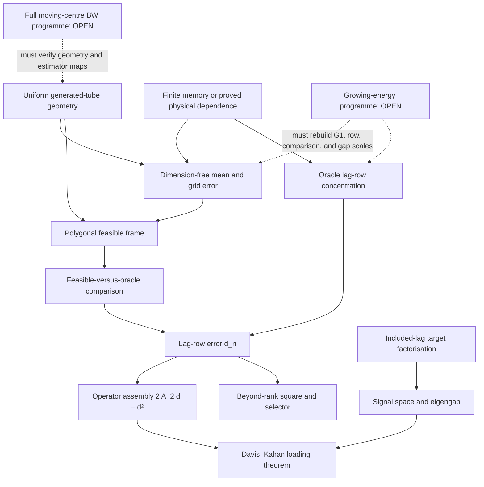

# Analytical reconstruction — proof ledger and rebuilt spec

> **Primary source of truth.** This file records the current programme, theorem boundary, dependency structure, and live research frontier. Detailed proofs live in [[HD1 — growing-dimension Paper 1 proof dossier]], [[G1 audit — resolution of the uniform local Fréchet rate]], and the records under `Archived/Proof workstreams`. Superseded ledgers are preserved under `Archived/Historical canonical files`; they are not sources of current theorem status.

## 1. Scientific object

The parent Riemannian factor model is a dynamic dimension-reduction model for manifold-valued time series. It maps observations to a tangent space at a Fréchet centre, estimates a low-dimensional loading space from lagged covariance, and optionally forecasts the extracted factor scores with a separate time-series model before mapping the result back to the manifold.

Paper 1 replaces the fixed centre by a smooth path while retaining one covariantly constant loading space:

\[
X_{t,n}=\operatorname{Exp}_{\mu_n(u_t)}
\left[\mathcal P^{\mu_n}_{u_0\to u_t}A_nf_{t,n}+\delta_{t,n}\right],
\qquad u_t=t/n.
\]

After transport to the anchor tangent space,

\[
Y_{t,n}=A_nf_{t,n}+\varepsilon_{t,n},\qquad A_n^*A_n=I_r.
\]

The estimand is the fixed transported loading space \(E_n=\operatorname{ran}A_n\). Paper 2 asks a different question—whether the loading subspace itself moves—and remains standalone.

## 2. Canonical theorem boundary

The proved robust Paper 1 theorem permits arbitrary \(p_n\to\infty\) under the following explicit package:

1. fixed factor rank, included lag count, and either fixed finite memory or the proved dimension-uniform Hilbert physical-dependence budgets;
2. uniformly bounded total tangent energy, or the displayed typed moment substitutes required by each score and lag-product consumer;
3. uniform generated-tube geometry and fixed-order differential bounds;
4. a smooth moving centre with level local-stationarity error \(O(n^{-a})\);
5. exact absence of idiosyncratic lag covariance and factor–noise cross covariance at the included lags, unless their population contamination is explicitly budgeted;
6. positive lag-factor rank and an actual operator eigengap \(\Delta_n\);
7. the positive three-scale mean estimator and derivative-free polygonal frame.

Define

\[
\ell_n=b_n^3+(nb_n)^{-1/2}+n^{-a}+n^{-1}.
\]

Then the feasible lag-row error and loading-space error obey

\[
d_n=O_p(n^{-1/2}+\ell_n),
\qquad
\|\sin\Theta(\widehat E_n,E_n)\|_{\rm op}
=O_p\!\left(\frac{n^{-1/2}+\ell_n}{\Delta_n}\right),
\]

provided the assembled operator perturbation is \(o_p(\Delta_n)\). At \(b_n=n^{-1/7}\) and \(a\ge3/7\), the robust numerator is \(n^{-3/7}\). This is a dimension-free bounded-total-energy theorem, not a classical pervasive-factor theorem.

## 3. Signal, operator, and factor number

Use separate symbols:

\[
s_n=\max_{1\le h\le h_0}\sigma_r(C_{f,n}(h)),
\qquad
\Delta_n=\lambda_r(\mathbb L_n)-\lambda_{r+1}(\mathbb L_n).
\]

Under exact included-lag factorisation,

\[
\mathbb L_n=A_nQ_nA_n^*,\qquad
Q_n=\sum_{h=1}^{h_0}C_{f,n}(h)C_{f,n}(h)^*.
\]

Thus \(\operatorname{ran}\mathbb L_n=E_n\) when \(Q_n\succ0\). One full-rank included lag implies \(\Delta_n\ge s_n^2\), but this is only a sufficient corollary. Davis–Kahan pays \(\Delta_n^{-1}\), not \(\Delta_n^{-2}\).

If \(\mathcal G=[\Gamma_1\ \cdots\ \Gamma_{h_0}]\), then \(\mathbb L=\mathcal G\mathcal G^*\). Lag-row control gives the beyond-rank square

\[
\widehat\lambda_{r+1}\le d_n^2.
\]

Threshold and ridged-ratio selectors are proved under their displayed separation windows. The raw unregularised eigenvalue ratio is disproved from the available rate assumptions.

## 4. Proved application-specific branches

The canonical property-to-application source is [[Application map — geometry, symmetry, and rate accelerators]]. Its current proved branches are:

- **Exact flat/common-commuting branch.** In one simply connected convex flat containing every model and estimator object, geometric recentering and non-rigid frame terms vanish. With genuine training/evaluation innovation separation, the remaining linear mean terms conditionally centre and
  \[
  d_n=O_p(n^{-1/2}+\ell_n^2+\rho_n).
  \]
  Negligible defects recover the oracle \(n^{-1/2}/\Delta_n\) loading numerator.
- **Known or root-\(n\) centre branch.** A known centre is immune. A constant pooled or finite-dimensional parametric centre estimated at root-\(n\) preserves oracle order but generally changes the first-order law.
- **Physical-dependence branch.** Uniform summable Hilbert \(L^2\) and essential-sup innovation effects replace fixed finite memory for the robust mean and oracle-row concentration chain. They do not create exact sample separation under infinite memory.
- **AIRM fixed-band geometry.** All fixed-order Exp, Log, transport, Hessian, Richardson, connector, and ruled-surface differentials consumed by the theorem are uniform in SPD matrix size in the project norms on fixed generated spectral bands. This proves geometry, not bounded energy, lag orthogonality, cancellation, or signal.
- **Structured signed mean branch.** Deterministic, scalar-plus-uniformly-Hilbert–Schmidt, or controlled block-scalar observation Hessians yield dimension-free signed local-polynomial mean estimation. Faster mean estimation alone does not give loading immunity.

## 5. The four first-order nuisance terms

After removing one common rigid anchor rotation, the feasible lag product has four linear nuisance channels:

1. current-endpoint mean/Hessian recentering;
2. lagged-endpoint mean/Hessian recentering;
3. current-endpoint non-rigid frame error;
4. lagged-endpoint non-rigid frame error.

Flatness removes the frame channels but does not by itself centre the two additive mean channels. Law symmetry may cancel population Hessian coefficients but does not control frame holonomy. Sample separation centres evaluation terms but does not make curved Hessians deterministic. A generic oracle claim therefore requires a term-by-term argument, not a geometry label.

## 6. New frontier A — growing energy and pervasive factors

The current theorem assumes a uniform total-energy scale. Many major applications instead satisfy

\[
R_n:=\sup_t\|Y_{t,n}\|\longrightarrow\infty.
\]

The proved defect ledger already identifies the leading replacements:

\[
\text{score fluctuation}\sim \frac{R_n}{\sqrt{nb_n}},\qquad
\text{oracle lag fluctuation}\sim \frac{R_n^2}{\sqrt n},\qquad
\text{feasible comparison}\lesssim 2R_nq_n+q_n^2,
\]

where \(q_n\) is the fully rederived mean/frame error on the growing tube. With

\[
\eta_n=2A_{2,n}d_n+d_n^2,
\]

consistency is governed by the joint relation \(\eta_n=o(\Delta_n)\), not by energy alone. A pervasive factor may strengthen \(A_{2,n}\) and \(\Delta_n\) as dimension grows; a localised factor may be destroyed by normalisation. The next theorem must therefore track \(R_n\), dependence/product moments, tube geometry, \(A_{2,n}\), and \(\Delta_n\) together.

**Status: OPEN PROGRAMME.** The individual scaling identities above are proved. A complete growing-energy theorem and its sharp admissible phase diagram are not.

## 7. New frontier B — moving-centre Bures–Wasserstein covariance dynamics

The parent paper’s main covariance application uses Bures–Wasserstein geometry, whereas the completed growing-size differential verification here is for AIRM. No transfer is claimed.

A full moving-centre BW theorem must establish, in the norms consumed by Paper 1:

1. an explicit SPD/PSD domain and a quantitative margin from rank-loss and nonunique-alignment strata;
2. existence and uniqueness of all population and local empirical Fréchet means used by the estimator;
3. dimension-uniform Exp, Log, horizontal-lift/alignment, connector, Hessian, Richardson, and ruled-surface derivatives on every generated estimator image;
4. a BW-valid polygonal-frame comparison or a replacement estimator that avoids the unavailable transport identities;
5. energy, product-moment, dependence, included-lag target, and eigengap assumptions stated separately from geometry;
6. a reduction showing that the resulting lag operator identifies the intended covariance-dynamic loading space;
7. fixed-size and growing-size theorems clearly separated.

**Status: OPEN PROGRAMME.** Diagonal BW in one fixed basis has a flat square-root-coordinate reduction. Full noncommuting BW does not yet have a growing-size Paper 1 corollary.

## 8. Dependency graph

No open node is consumed by a proved theorem.

## 9. Claims excluded from the canon

- coordinatewise bounded variation as a substitute for bounded total norm;
- normalisation without recomputing the estimand and eigengap;
- unqualified polynomial mixing as a dimension-free root-\(n\) assumption;
- flatness, local symmetry, marginal sign symmetry, or cross-fitting alone as first-order immunity;
- bounded AIRM spectra as a total-energy bound;
- automatic transfer of AIRM results to Bures–Wasserstein geometry;
- \(\Delta_n^{-2}\) in Davis–Kahan;
- a raw eigenvalue-ratio consistency claim from the displayed eigenvalue errors;
- numerical success as a proof of any analytical statement.

## 10. Canonical file map

| File | Authority |
|---|---|
| [[Time-varying Fréchet mean Riemannian factor model]] | scientific overview and paper split |
| [[Paper 1 — Locally stationary Riemannian factor model]] | concise current Paper 1 theorem |
| [[HD1 — growing-dimension Paper 1 proof dossier]] | full robust theorem proof |
| [[G1 audit — resolution of the uniform local Fréchet rate]] | mean-estimation proof source |
| [[Application map — geometry, symmetry, and rate accelerators]] | property, cancellation, rate, and application matching |
| [[OPEN OBLIGATIONS — current research actions]] | only live queue and execution order |
| [[Paper 2 — Moving loading subbundle]] | standalone Paper 2 scope |
| `Archived/Proof workstreams` | noncanonical proof and hostile-audit provenance |
| `Archived/Historical canonical files` | superseded ledgers and queues |

