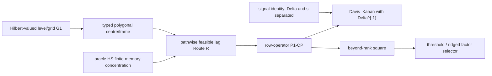
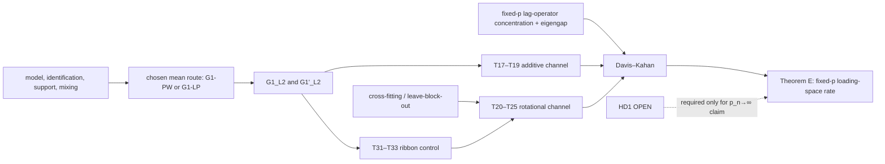
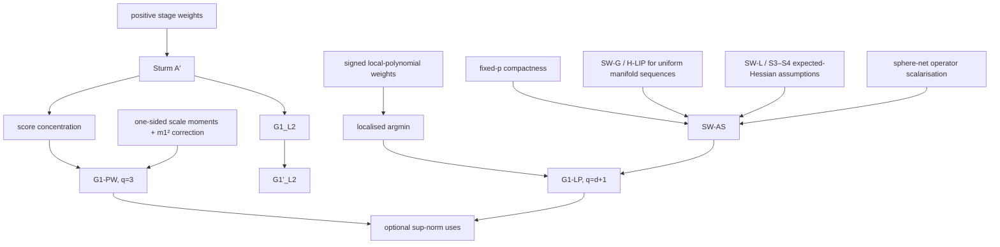
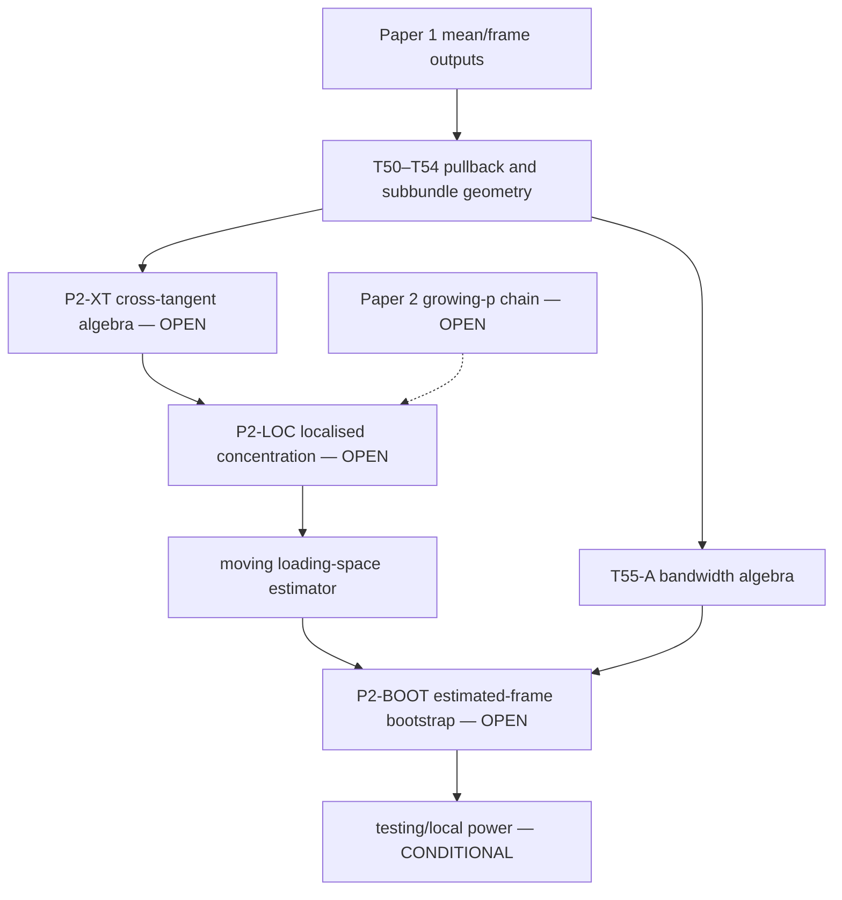

> **ARCHIVED 2026-08-08.** This is the complete pre-reconstruction ledger. Its current-status tables and authority labels are superseded by [[Analytical reconstruction — proof ledger and rebuilt spec]]. It is retained only for proof history.

# Analytical reconstruction — proof ledger and rebuilt spec

> **PRIMARY SINGLE SOURCE OF TRUTH.** The current Paper 1 theorem is [[HD1 — growing-dimension Paper 1 proof dossier]]. [[G1 audit — resolution of the uniform local Fréchet rate]] governs mean estimation. The long fixed-(p) ledger below is retained as labelled proof history, not as the current headline.
>
> **Current scope.** Paper 1 permits arbitrary $p_n\to\infty$ under bounded total tangent energy, fixed finite memory/rank/lag count, the positive three-scale estimator, explicit uniform manifold-sequence geometry, exact included-lag noise orthogonality, and a derivative-free polygonal frame. Its robust rate is slower than the parent fixed-centre oracle rate. Paper 2 is unchanged and remains separate.
>
> **G1.** The positive three-scale route is dimension-free under the HD1 assumptions. Its derivative theorem carries the sharp $n^{-a}/b_n$ term under level-only local stationarity. The final loading theorem bypasses G1′ by a proved polygonal-frame construction. The signed route is now growing-\(p_n\) under the structural deterministic/scalar-plus-HS/controlled-block Hessian packages in the application map; unrestricted full AIRM remains open.
>
> **Latest audit corrections.** Direct Hilbert/HS concentration replaces sphere nets in the positive growing-$p_n$ route; level local stationarity pays $n^{-a}/b_n$ after differentiation; a fixed-width blend replaces the width-$b_n$ blend; cross-fitting alone does not make curved recentering quadratic; and the raw eigenvalue ratio is replaced by threshold/ridged selectors. Historical fixed-$p$ corrections remain below.
>
> **Application-map update.** [[Application map — geometry, symmetry, and rate accelerators]] is canonical for sharper property-specific branches. The feasible lag product has two linear mean/Hessian terms and two linear non-rigid-frame terms. One exact flat plus genuine innovation separation yields \(d_n=O_p(n^{-1/2}+\ell_n^2+\rho_n)\) and an oracle \(n^{-1/2}/\Delta_n\) loading numerator when defects are negligible. A root-\(n\) parametric centre gives oracle order without immunity. Full AIRM fixed-band higher differentials and a Hilbert physical-dependence extension are proved; neither is a cancellation theorem.
>
> **Evidentiary rule in force.** No fitted exponent, $R^2$, Monte Carlo agreement, quadrature result or machine-precision identity appears anywhere below as evidence. Where the old notes' numbers are mentioned, they are mentioned only as *ex post* consistency checks on an independently established theorem, never as support for it.

---

## HD1 superseding result — 2026-08-08

Define

$$
\ell_n=b_n^3+(nb_n)^{-1/2}+n^{-a}+n^{-1},
\quad
s_n=\max_{h\le h_0}\sigma_r(C_{f,n}(h)),
\quad
\Delta_n=\lambda_r(\mathbb L_n)-\lambda_{r+1}(\mathbb L_n).
$$

The cross-audited chain is



Every arrow is proved under the explicit HD1 assumptions. The conclusions are

$$
\sup_u d(\hat\mu_n^{(3)}(u),\mu_n(u))
=O_p\!\left(b_n^3+n^{-a}+n^{-1}+\sqrt{\frac{\log n}{nb_n}}\right),
$$

$$
d_n=O_p(n^{-1/2}+\ell_n),\qquad
\|\hat{\mathbb L}_n-\mathbb L_n\|_{\rm op}
\le2A_{2,n}d_n+d_n^2,
$$

and, if the operator perturbation is (o_p(\Delta_n)),

$$
\boxed{\|\sin\Theta(\hat E_n,E_n)\|_{\rm op}
=O_p\!\left(\frac{n^{-1/2}+\ell_n}{\Delta_n}\right).}
$$

Only after proving (Delta_n\ge s_n^2) may the denominator be weakened to (s_n^2). The null spectrum satisfies (hat\lambda_{r+1}\le d_n^2). A threshold selector and a ridged ratio are consistent; the raw ratio is disproved. At (b_n=n^{-1/7}), (a\ge3/7), the robust loading numerator is (n^{-3/7}); at (b_n=n^{-1/5}), (a\ge2/5), it is (n^{-2/5}). There is no restriction on (p_n) beyond the uniform total-energy and geometry primitives.

The robust theorem consumes no cancellation. A sharper route is now proved under the exact package: genuine training/evaluation separation, lag-specific GLO, and a negligible non-rigid frame coefficient. Flat/common-commuting geometry supplies the clean exact frame condition. GLO alone remains insufficient in a curved moving frame. Broader Hilbert physical dependence and fixed-band AIRM higher differentials are proved separately.

### Current status summary

| Node | Status | Growing-(p_n) scope |
|---|---|---|
| positive three-scale G1 and grid RMS | PROVED UNDER EXPLICIT ASSUMPTIONS | arbitrary (p_n) |
| corrected G1′ with (n^{-a}/b_n) | PROVED; sharp counterexample | arbitrary (p_n), not consumed by HD-E |
| polygonal feasible frame | PROVED | arbitrary (p_n) |
| P1-OP and loading theorem | PROVED UNDER EXPLICIT ASSUMPTIONS | arbitrary (p_n) |
| signal/eigengap relation | PROVED | (Delta_n\ge s_n^2) under one full-rank lag |
| beyond-rank square and factor number | PROVED after selector repair | raw ratio DISPROVED |
| signed G1-LP growing-(p_n) route | PROVED UNDER STRUCTURAL HESSIAN ASSUMPTIONS; unrestricted full AIRM OPEN | optional mean branch |
| flat/common-flat exact-split oracle loading | PROVED UNDER EXPLICIT ASSUMPTIONS | arbitrary \(p_n\), bounded total energy |
| root-\(n\) parametric centre loading | PROVED; oracle order, not immunity | stated parametric scope |
| Hilbert physical-dependence robust extension | PROVED | arbitrary \(p_n\) with uniform coefficient budgets |
| AIRM fixed-band higher HD-G differentials | PROVED | arbitrary matrix size in project norms |

## Pre-HD1 status table — historical

Allowed statuses in this table are: `PROVED`, `PROVED UNDER EXPLICIT ASSUMPTIONS`, `CITED`, `PROVED/CITED`, `DISPROVED`, `RETRACTED`, `SUPERSEDED`, `OPEN`, `CONDITIONAL`, and `AUDIT FLAG`.

| ID | Result | Status | Assumptions | Direct dependencies | Used by | Fixed-p? | Growing-p? | Notes |
|---|---|---|---|---|---|---|---|---|
| T01–T08 | Drift contamination, its image, and alignment regimes | PROVED | $C^1$ drift; summable factor autocovariance; stated moment/noise conditions | — | motivation; rank/subspace diagnostics | yes | OPEN | Dimension-uniform sampling error not rebuilt |
| T11–T14 | Pointwise local-mean identification and local-stationarity remainder | PROVED/CITED | weak stationarity for spectral equivalence; $\delta_n=o(n^{-1/4})$ for harmless approximation | mean-zero ergodic theorem | Paper 1 identification | yes | CONDITIONAL | Full high-dimensional model class not audited |
| A′ | Empirical Sturm score-to-distance inequality | PROVED/CITED | positive weights; Hadamard/NPC barycentre setting | Sturm barycentre inequality | G1-PW; G1$_{L^2}$ | yes | yes algebraically | Citation status retained from local repository |
| SC | Uniform score concentration | PROVED UNDER EXPLICIT ASSUMPTIONS | bounded support; polynomial mixing threshold; deterministic frame; fixed-$p$ nets | Liebscher/Rio/Kristensen as locally recorded | G1-PW; G1-LP | yes | OPEN | Rate displays explicit $p$, but the proof's mixing/union-bound constants are not a $p_n$ theorem |
| CE-9 | Arbitrary signed Fréchet objectives can have multiple minimisers | PROVED | explicit $\mathbb H^2$ construction | constant-curvature Hessian formula | estimator localisation; finite-$n$ warning | yes | yes | Does not disprove structured G1-LP |
| X/W | Second-order barycentre expansion; one-sided scale-family repair | PROVED | joint law smoothness; domination; positive stage weights | A′; normal-coordinate expansion | G1-PW | yes | CONDITIONAL | $m_1^2C$ retained; $J=3$ scale family works |
| G1-PW | Positive-weight three-scale $q=3$ uniform mean rate | PROVED UNDER EXPLICIT ASSUMPTIONS | A′, SC, $C^3$, one-sided boundary family, $n^{-a}$ dominated | A′; SC; X/W | Paper 1 alternative estimator | yes | OPEN | Avoids SW-AS/SW-G; curvature change-of-base caps certified order at $3$ |
| H-LIP | Quantitative third-derivative/Hessian-modulus bound | PROVED UNDER EXPLICIT ASSUMPTIONS | $(K_0,K_1,\rho^*,\Theta)$, or $K_1^{\rm av}$ | differentiated Jacobi BVP | quantitative SW-AS | yes | yes if primitives uniform | $K_1^{\rm av}$ is formally weaker only |
| H-LIP-SYM | Locally symmetric quantitative bound; affine-invariant SPD application | PROVED | $\nabla R=0$; bounded tube | H-LIP proof with $K_1=0$; SPD symmetry | dimension-uniform SPD geometry | yes | yes | SPD curvature-operator bound is dimension-free |
| SW-AS | Signed empirical Hessian converges to population Hessian | PROVED UNDER EXPLICIT ASSUMPTIONS | S1–S5; bounded total weight; mixing; fixed-$p$ compactness or quantitative H-LIP | SC-style scalarisation; H-LIP only for quantitative constants | G1-LP | yes | OPEN | Correct sphere-net entropy is $O(p)$, not $O(p^2)$ |
| G1-LP | Signed local-polynomial mean rate, localised estimator | PROVED UNDER EXPLICIT ASSUMPTIONS | degree $d\ge2$; SW-AS; exact design reproduction; $n^{-a}$ condition | SW-AS; SC | optional sup-norm uses | yes | OPEN | General-geometry sequence needs direct uniform SW-AS or SW-G; SPD supplies geometric part |
| G1$_{L^2}$ | Integrated mean-estimation error | PROVED UNDER EXPLICIT ASSUMPTIONS | moment order $r>2$; $\sum_h\alpha(h)^{1-2/r}<\infty$; positive weights, or local strong convexity from SW-AS for signed weights | A′/SW-AS; covariance inequality | T17–T18; Theorem E | yes | CONDITIONAL | Explicit factor $p$ must be budgeted if $p$ grows |
| G1′$_{L^2}$ | Integrated covariant derivative error | PROVED UNDER EXPLICIT ASSUMPTIONS | kernel endpoint regularity; boundary blend; Hessian invertibility; joint bias smoothness | G1$_{L^2}$; implicit differentiation | T26; ribbon integrated term | yes | OPEN | Not a sup-norm theorem |
| T31–T33 | Typed ribbon holonomy and controlling functional | PROVED/CITED | connector maps; bounded curvature; $V$ below injectivity radius | cited ribbon-area identity plus internal sharpness examples | rotational channel; Paper 2 frame error | yes | CONDITIONAL | Geometry constant can be dimension-free; stochastic norms are not yet high-dimensional |
| T17–T19 | Lag-invariant mean-error contamination | PROVED UNDER EXPLICIT ASSUMPTIONS | G1$_{L^2}$; bounded support for remainder; eigengap side condition | T01; G1$_{L^2}$ | Theorem E | yes | OPEN | Sup-norm G1 removed |
| T20–T25 | Rotational channel and oracle-rate constant | PROVED UNDER EXPLICIT ASSUMPTIONS | deterministic bias plus cross-fitting/leave-block-out for stochastic coupling | T31–T33; G1$_{L^2}$ | Theorem E | yes | OPEN | Without cross-fitting, T20's stochastic coupling remains open |
| LC | Lagged covariance/operator concentration | CONDITIONAL | fixed $p$; moments/mixing; the required $O_p(n^{-1/2})$ operator input is currently assumed | transported model; cross-fitting | Theorem E | no self-contained theorem | OPEN | P1-OP must turn this assumption into an internal proof |
| E | Paper 1 loading-space perturbation theorem | PROVED UNDER EXPLICIT ASSUMPTIONS | fixed $p$; chosen G1 route; T17–T25; LC; eigengap $\kappa$; cross-fitting | G1$_{L^2}$; ribbon; lag operator; Davis–Kahan | Paper 1 headline | yes | OPEN | No Lam–Yao rate attribution; $\kappa$ is defined internally |
| T50–T54 | Pullback-frame and moving-subbundle geometry | PROVED | smooth mean/subbundle; connector typing | flat pullback connection; T31 | Paper 2 | yes | yes algebraically | Distinct independent content survives |
| T55-A | Algebraic mean/frame bandwidth compatibility for Paper 2 | PROVED UNDER EXPLICIT ASSUMPTIONS | canonical fixed-$p$ sup-norm G1 plus a hypothesised internally proved uniform P2 localisation scale | sup-norm G1; T31; P2-LOC for the benchmark | Paper 2 design | yes conditionally | OPEN | Algebra only; does not prove P2-LOC or multiplier-bootstrap validity |
| P2-XT | Cross-tangent lag-operator image identity | OPEN | moving isometric loading path; lag factor/noise assumptions | T50–T52 | Paper 2 identification | no | no | Exact operator algebra not yet closed |
| P2-LOC | Uniform localised score/operator concentration | OPEN | effective sample $nh$; dependence; dimension budget | P2-XT | Paper 2 estimator/rate | no | no | Genuine Paper 2 blocker |
| P2-BOOT | Estimated-frame multiplier-bootstrap validity | OPEN | uniform bootstrap coupling; frame re-estimation or proved negligibility | T53–T55-A; P2-LOC | Paper 2 test | no | no | $L^2$ substitution alone is insufficient |
| HD1 | Full Huang–Chen–Chen-style $p_n\to\infty$ scope | OPEN | dimension-uniform chain in the HD table below | SC, SW-AS or G1-PW, LC, eigengap/factor strength, factor-number selection | Paper 1 scope claim | no | no | Central scope gap, not one vague lemma |

## Pre-HD1 dependency graph — historical

### Paper 1 proof spine



### Mean-estimation branch



### Paper 2 branch



## Pre-HD1 dimension-by-dimension scope audit — historical

| Component | Current classification | Current evidence / missing step |
|---|---|---|
| Support/tube assumption | EXPLICIT $p$ DEPENDENCE | T44–T46 give trace/operator-norm budgets; “iff” holds only for a.s. support, not probabilistic support |
| Curvature constants on affine-invariant SPD | DIMENSION-FREE | $\nabla R=0$ and $|R|\le1$ in the canonical G1 audit |
| H-LIP constant on bounded SPD tubes | DIMENSION-FREE | Uniform when $\rho_n^*=O(1)$ |
| Fréchet score concentration | FIXED-$p$ ONLY | Sphere net gives $\sqrt{(p+\log n)/(nb)}$, but the polynomial-mixing threshold/union-bound proof is not formulated for $p_n$ |
| Hessian concentration for signed weights | EXPLICIT $p$ DEPENDENCE, theorem still FIXED-$p$ | Operator scalarisation uses $S^{p-1}$, not $\operatorname{Sym}^2$; old $p^2$ entropy removed |
| Fréchet $L^2$ rate | EXPLICIT $p$ DEPENDENCE | Covariance sum carries $p/(nb)$; downstream dimension budget not closed |
| Transport/holonomy geometry | DIMENSION-FREE conditionally | Constants are dimension-free if curvature, path length, tube radius, and error norms are uniform |
| Idiosyncratic covariance | EXPLICIT $p$ DEPENDENCE | T44–T46 distinguish a.s. and probabilistic support; sample operator rate still missing |
| Lagged covariance/operator estimation | FIXED-$p$ ONLY | No complete $p_n$ operator-norm concentration proof in this repository |
| Eigengap/factor strength | UNKNOWN | Must be stated as a $p_n$ scaling and reconciled with bounded-support/strong-factor assumptions |
| Davis–Kahan algebra | DIMENSION-FREE | Perturbation inequality itself is dimension-free; inputs are not |
| Factor-number selection | FIXED-$p$ ONLY / citation gap | Lam–Yao ratio behaviour beyond the true rank was already flagged unsupported |
| Paper 2 localised quantities | FIXED-$p$ ONLY | P2-XT, P2-LOC, and P2-BOOT are open even before $p_n$ growth |

## Pre-HD1 comparison with the parent Huang–Chen–Chen RFM claim structure — historical

This table is historical. The current proof run verified the primary arXiv v1 theorem statements directly: the parent uses (kappa) for a factor-lag singular value, states (lambda_r\ge\kappa^2), reports the fixed-centre dimension-free (n^{-1/2}/\kappa^2) loading rate, and states first-order signal / squared null eigenvalue rates. HD1 matches arbitrary-(p_n) bounded-total-energy scope but not the parent's oracle rate or raw-ratio claim.

| Scope dimension | Huang–Chen–Chen RFM (as locally recorded) | Current moving-centre project | Gap |
|---|---|---|---|
| Fréchet mean | Fixed | Smooth moving mean | Mean estimation and frame propagation added |
| Loading space | Fixed at the reference tangent space | Paper 1 covariantly fixed; Paper 2 genuinely moving | Paper 2 algebra/inference open |
| Dimension | $p=p(n)$ may diverge | Fixed-$p$ theorem only | HD1 |
| Dependence | Parent dependent RFM assumptions | Polynomial-mixing fixed-$p$ G1 plus factor-process assumptions | Uniform triangular-array chain not closed |
| Fréchet mean estimation | Not the moving-centre problem | Two fixed-$p$ routes, signed and positive | Growing-$p$ version open |
| Loading-space rate | High-dimensional claim in parent notes | Internal fixed-$p$ eigengap/Davis–Kahan theorem | Lag-operator concentration and factor-strength scaling open |
| Dimension-free strong-factor regime | Claimed in parent notes | Not inherited | Bounded support may conflict with usual factor scaling; exact regime UNKNOWN |
| Factor-number selection | Parent procedure available | Population diagnostics only; finite-sample growing-$p$ theory absent | Open/citation verification queue |
| Geometry | Parent RFM manifold assumptions | Hadamard MVP; affine-invariant SPD gives clean quantitative geometry | General sequence needs uniform tube/H-LIP assumptions |
| Completeness / Bures | Application-specific geometry in parent notes | Bures is incomplete and needs boundary-distance control; affine-invariant SPD is complete | Do not transfer SPD simplifications to Bures |

---

## §0 Historical notation (superseded for the current theorem)

> The symbol (kappa) in the archive below is historical and must not be used in a current Paper 1 theorem. Current notation is (s_n) for factor-lag singular strength and (Delta_n) for the lag-operator eigengap. Historical displays paying (kappa^{-2}) are not current results unless (kappa) meant (s_n); if it meant an eigengap, they are algebraically wrong by one power.

$(M,g)$ a smooth Riemannian manifold of dimension $p$, Levi-Civita connection $\nabla$, curvature
$$R(X,Y)Z=\nabla_X\nabla_YZ-\nabla_Y\nabla_XZ-\nabla_{[X,Y]}Z,$$
sectional curvatures bounded in modulus by $\bar K$, and $\Lambda:=\sup_{|X|=|Y|=1}\|R(X,Y)\cdot\|_{\mathrm{op}}$. On a manifold with $|K|\le\bar K$ one has $\Lambda\le 2\bar K$; we keep $\Lambda$ where the sharp constant matters and write $\bar K$ where only the order matters.

**Mean curve.** $\mu:[0,1]\to M$, of regularity $C^{s}$ with $s\ge3$ (justified in T14). Write $\mu'=\tfrac{d\mu}{du}\in T_{\mu(u)}M$, $L_\mu:=\sup_u|\mu'(u)|_g$, $L:=L(\mu)=\int_0^1|\mu'|\,du$, and $\nabla_u\mu'$ for the covariant acceleration.

**Parallel frame.** $P(u):=\mathcal P^{\mu}_{u\to u_0}:T_{\mu(u)}M\to T_{\mu(u_0)}M$, parallel transport along $\mu$. Fix an orthonormal basis of $T_{\mu(u_0)}M$ and identify it with $\mathbb R^p$; $P(u)$ is then a linear isometry onto $\mathbb R^p$.

**Model (Paper 1).**
$$X_{t,n}=\operatorname{Exp}_{\mu(u_t)}\!\big[\mathcal P^{\mu}_{u_0\to u_t}Af_{t,n}+\delta_{t,n}\big],\qquad u_t=t/n,$$
$A:\mathbb R^r\to T_{\mu(u_0)}M$ linear isometric and **constant**; $f_{t,n}\in\mathbb R^r$; $\delta_{t,n}\in T_{\mu(u_t)}M$.

**Transported observations.** $Y_t:=P(u_t)\log_{\mu(u_t)}X_{t,n}=Af_{t,n}+\varepsilon_t$ with $\varepsilon_t:=P(u_t)\delta_{t,n}$, valid on the event $\{|\mathcal PAf_{t,n}+\delta_{t,n}|<\operatorname{inj}(\mu(u_t))\}$.

**Estimated objects.** $\hat\mu(u)$ the kernel-weighted local-polynomial Fréchet mean of degree $d$; $e(u):=\log_{\mu(u)}\hat\mu(u)\in T_{\mu(u)}M$ the **error field**; $e_n:=\sup_u|e(u)|$; $V(s):=e(s)$ when we regard it as the ribbon variation field. $\hat P(u)$ the estimated frame; $R(u):=\hat P(u)P(u)^{-1}\in O(p)$ (after the connector identification of T05); $\Omega(u):=\log R(u)$, antisymmetric; $\bar\Omega:=\int_0^1\Omega(u)\,du$.

**Moments.** $\Gamma_f(h)=\mathbb E[f_tf_{t-h}^\top]$; $S(h)=n^{-1}\sum_t Y_tY_{t-h}^\top$; $\mathbb L=\sum_{h=1}^{h_0}S(h)S(h)^\top$; $\kappa$ denotes the eigengap $\lambda_r(\mathbb L)-\lambda_{r+1}(\mathbb L)$ of the population $\mathbb L$ **(see C-AUDIT-1: this is *not* Lam–Yao's $\kappa_n$)**.

**Bandwidth.** $b=n^{-\alpha}$; $q$ denotes the **effective bias order** of $\hat\mu$, i.e. $\sup_u|\mathbb E$-bias$|=O(b^q)$. For a degree-$d$ local polynomial with symmetric kernel and $\mu\in C^{s}$: $q=\min(d+2,s)$ in the interior when $d$ is even, and $q_{\mathrm{bdry}}=\min(d+1,s)$ at the boundary. **The binding $q$ throughout is $q_{\mathrm{bdry}}$.**

**Drift objects.** $c(u):=\mu(u)-\bar\mu$ (Euclidean reduction), $M_\mu:=\int_0^1c(u)c(u)^\top du$, $\mathcal D:=\operatorname{span}\{c(u):u\in[0,1]\}$.

---

## §1 Detailed proof archive

> **HISTORICAL / SUPERSEDED AS A STATUS TABLE.** The rows below retain detailed proof and counterexample provenance. The `Current status table` above is the only authoritative status/dependency table. In this archive, former `CONJECTURE` labels are to be read as `OPEN` and are unavailable for downstream use.

### 1.1 Drift contamination (old Result 1)

| ID | Claim | Assumptions | Depends on | Status | Proof / counterexample | Damage if false | Repair |
|---|---|---|---|---|---|---|---|
| **T01** | $n^{-1}\sum_t d_td_{t-h}^\top=M_\mu+O((1+h)/n)$ for $\mu\in C^1$; hence the drift contributes **the same** matrix at every lag, uniformly for $h\le h_n=o(n)$ | $\mu\in C^1$ | — | **PROVED** | §3.1 | Result 1 collapses | — |
| **T02** | $S(h)=M_\mu+A\Gamma_f(h)A^\top+O_p(n^{-1/2})+O(h/n)$, $1\le h\le h_n=o(n)$ | T01 + $\sum_h\|\Gamma_f(h)\|<\infty$, $\mathbb E\|f\|^4<\infty$, $\delta$ serially uncorrelated, $\mathbb E\|\delta\|^4<\infty$ | T01 | **PROVED** | §3.1 | — | — |
| **T03** | $\operatorname{Im}(M_\mu)=\mathcal D$ **exactly**; $\operatorname{rank}M_\mu=1\iff c(u)=\phi(u)v$ | $\mu\in C^0$ | — | **PROVED** (and strictly stronger than the old KL-mode phrasing) | §3.2 | Rank claim collapses | — |
| **T04** | Drift energy in $\mathbb L$ grows as $h_0\|M_\mu\|^2$ while signal energy saturates $\Rightarrow$ **increasing $h_0$ strictly worsens contamination** | T02 + $\sum_h\|\Gamma_f(h)\|<\infty$ | T02 | **PROVED** | §3.1 | The $h_0$ prescription is unfounded | — |
| **T05a** | $\mathcal D\subseteq\operatorname{Im}A\Rightarrow\operatorname{Im}(\mathbb L)\subseteq\operatorname{Im}(A)$: the **loading space is exactly uncontaminated**; damage is confined to $\hat r$ and $\hat f$ | T02, $A$ isometric | T02,T03 | **PROVED** | §3.3 | — | — |
| **T05b** | $\mathcal D\perp\operatorname{Im}A\Rightarrow\operatorname{Im}(\mathbb L)=\mathcal D\oplus\operatorname{Im}(A)$, over-selection by **exactly** $\dim\mathcal D$ | as T05a | T02,T03 | **PROVED** | §3.3 | — | — |
| **T06** | Under $\mathcal D\subseteq\operatorname{Im}A$ with $M_\mu$ dominant, the eigenvalue-ratio minimiser is $\hat r=1$: **under**-selection at large drift | T05a + ER estimator of Lam–Yao (2012) eq. (2.8) | T05a | **PROVED** (population); finite-sample consistency of ER **not** citable — see C-AUDIT-2 | §3.3 | Non-monotone diagnostic unsupported | State as a population eigenvalue-ordering fact only |
| **T07** | Contamination thresholds: subspace responds to the **cross** term $O(c^2)$, rank to the **own-energy** term $O(c^4)$; equating each to the $n^{-1/2}$ floor gives $c^*_{\mathrm{sub}}\asymp n^{-1/4}$, $c^*_{\mathrm{ER}}\asymp n^{-1/8}$ | T02, Davis–Kahan (Yu–Wang–Samworth Thm 2), drift scaled $M_\mu=c^2M_0$ | T02,T05b | **PROVED** (order); constants not determined | §3.4 | The two fitted slopes revert to CONJECTURE | — |
| **T08** | *"There is no drift amplitude small enough to ignore, given enough data."* | T03,T05b | T03,T05b | **PROVED**, and in a stronger form: in **population** the contamination is exact for any $M_\mu\ne0$ with $\mathcal D\not\subseteq\operatorname{Im}A$, at every amplitude. Amplitude enters only through finite-sample detectability (T07) | §3.4 | — | — |
| C01 | The specific fitted slopes $-0.117$, $-0.245$ and cells ($v^\top P_3v=0.87$; $P(\hat r=1)=0.995$; $\sin\Theta:0.1102\to0.0958$) | — | — | **CONJECTURE — NOT AVAILABLE FOR DOWNSTREAM USE** | Numerical only | — | Superseded in *direction* by T05a/T05b/T06/T07, which prove the qualitative content |

### 1.2 Identification (old Result 2)

| ID | Claim | Assumptions | Depends on | Status | Proof / counterexample | Damage if false | Repair |
|---|---|---|---|---|---|---|---|
| **T09** | The reparametrisation $\mu\to\mu+Ag$, $f\to f-g(u_\cdot)$ leaves $X$ pointwise unchanged | **$M=\mathbb R^p$** | — | **PROVED in the Euclidean reduction only** | §3.5 | — | — |
| **D01** | The same reparametrisation is exact on a general $M$ | — | — | **DISPROVED as stated.** On curved $M$ the reparametrised factor is a nonlinear function of $(f,g)$ and generally leaves the model class | §3.5 | *Weakens nothing* — it makes population identification **less** trivial, not more | Replaced by T10 |
| **T10** | The exact ambiguity survives iff the drift is generated by **geodesics inside the transported image of $A$**: $\tilde\mu(u)=\operatorname{Exp}_{\mu(u)}(\mathcal P Ag(u))$ with $\mu$ and $\tilde\mu$ on a common geodesic through $\operatorname{Im}A$ | $|Ag|<\operatorname{inj}$ | D01 | **PROVED** (sufficiency); necessity **OPEN** | §3.5 | — | — |
| **T11** | **(LME$_{\mathrm{pt}}$)** pointwise-in-probability local mean ergodicity suffices for $g\equiv0$. The $\sup_u$ in the old lemma is **unnecessary** | $g$ continuous, $b_n\to0$, $nb_n\to\infty$ | — | **PROVED** — strictly weaker hypothesis than the old (LME) | §3.6 | — | — |
| **D02** | *"(LME) at bandwidth scale holds **iff** $F_f(\{0\})=0$"* for the $\sup_u$ version | — | — | **DISPROVED as an iff.** Necessity holds; sufficiency does **not** follow from Herglotz/von Neumann, which is an $L^2$ statement at a single $u$. A uniform version needs a maximal inequality, i.e. moments + mixing rates far beyond weak stationarity | §3.6 | Would have made the identifying condition unverifiable | T12 |
| **T12** | For weakly stationary $f$: **(LME$_{\mathrm{pt}}$) $\iff F_f(\{0\})=0$**, with $\mathbb E|A_N|^2=\int|D_N|^2dF\to F(\{0\})$ | weak stationarity only | D02 | **PROVED** / **CITED** (mean-square ergodic theorem, Doob 1953 Ch. X §7; see C-AUDIT-6) | §3.6 | — | — |
| **T13** | Counterexample: $f_t\equiv V$, $V$ uniform on $\{\pm1\}^r$ — bounded, stationary, mean-zero, spectral measure $=\delta_0\otimes I_r$, and $(\mu,V)$, $(\mu+AV,0)$ generate the **same law**. Hence bounded support (P1) $\not\Rightarrow$ identification | — | T12 | **PROVED**, fully analytically | §3.6 | — | — |
| **T14** | Locally stationary triangular arrays: $\|f_{t,n}-f^{(u_t)}_t\|_2\le C\delta_n$ with $\mathbb Ef^{(u)}=0$ gives $\|\mathbb Ef_{t,n}\|\le C\delta_n$, contributing $\|AM_mA^\top\|=O(\delta_n^2)$ to $S(h)$. **Harmless iff $\delta_n=o(n^{-1/4})$** | T02 | T02 | **PROVED** | §3.7 | — | — |
| **D03** | *"Under $\delta_n=O(n^{-1/2})$ it is not harmless, because that is the scale of the estimator's own error."* | — | T14 | **DISPROVED.** The drift enters through a **second moment**, so the comparison is $\delta_n^2$ vs $n^{-1/2}$, not $\delta_n$ vs $n^{-1/2}$. $\delta_n=O(n^{-1/2})$ is comfortably harmless | §3.7 | *None — this is a strengthening* | T14 |
| C02 | The regime map's long-memory row $b^*\asymp n^{-d/(4+d)}$, rate $n^{-2d/(4+d)}$ | — | Gap G1 | **CONJECTURE** | Not derived; and it is downstream of the unproved uniform local-Fréchet rate | Table row unusable | Re-derive after G1 |
| C03 | *"The AR(1) condition $nb(1-\alpha)^2\to\infty$ was derived, then verified… accurate to three digits exactly when $nb(1-\alpha)^2\gtrsim5$. Sharp, not conservative."* | — | — | **CONJECTURE.** "Sharp" is a numerical claim about a constant; no lower-bound construction exists | — | Only the sharpness claim is lost; the condition itself is plausible but unproved | Prove or downgrade to "sufficient" |

### 1.3 The error decomposition (old Result 3)

| ID | Claim | Assumptions | Depends on | Status | Proof / counterexample | Damage if false | Repair |
|---|---|---|---|---|---|---|---|
| **D04** | *"The lag-$h$ moment functional has zero pathwise derivative in the mean nuisance. It is automatic for $h\ge1$."* | — | — | **DISPROVED as an exact statement.** The population functional is Neyman-orthogonal, but the **feasible** one is not: $\hat\mu(u_t)$ is built from a window containing $t-h$ whenever $h\lesssim nb$, leaving an exact first-order defect $(nb)^{-1}K(h/(nb))\Sigma_\varepsilon+O((nb)^{-1})$ | §3.8 | Kills "automatic"; not the rate | T15, T16 |
| **T15** | The defect is **exactly** $O((nb)^{-1})$ and vanishes identically under leave-block-out / cross-fitted $\hat\mu$ with block length $>h$ | $\sum_k\|\Gamma_Y(k)\|<\infty$ | D04 | **PROVED** | §3.8 | — | — |
| **T16** | Population Neyman orthogonality holds for **every** $h\ge0$, not only $h\ge1$: $\partial_\eta\mathbb E[(Y_t-\eta)(Y_{t-h}-\eta)^\top]=0$ since $\mathbb EY=0$. **The $h=0$ / $h\ge1$ distinction is not orthogonality — it is that at $h=0$ the second-order term is a positive-definite, non-cancelling matrix** | — | — | **PROVED** | §3.8 | The introduction's headline argument needs restating | Restated in §5 |
| **T17** | **The second-order term is not negligible in kind, only in size.** $n^{-1}\sum_t\Psi_t\Psi_{t-h}^\top\to M_e:=\int_0^1e(u)e(u)^\top du$ for every $h\ll nb$, because the error field is smooth at scale $b$. $M_e$ is therefore a **lag-invariant spurious-factor matrix of exactly the T01 type**, of size $\|M_e\|=O(b^{2q}+(nb)^{-1})$ | T01 applied to $e$; Gap G1 for uniformity | T01, G1$_{L^2}$ | **PROVED** (2026-08-08: needs only $\|e\|_{L^2}$, proved elementarily; the $\|e\|_\infty$ remainder needs only the a.s. bound $2\rho^*$) | §3.8 | — | — |
| **T18** | Consequently the additive channel is $\kappa^{-2}[\,n^{-1/2}+b^{2q}+(nb)^{-1}\,]$, and $h_0$ amplifies $M_e$ by the **same** T04 mechanism, requiring $h_0=o(\|M_e\|^{-2})$ | T17, T04, Davis–Kahan | T17,T04 | **PROVED** (2026-08-08: G1 condition discharged) | §3.8 | — | — |
| **T19** | **New side condition, previously absent.** Under $r=0$ or weak factors the estimator returns the top eigendirections of $M_e$ — it manufactures a factor. The whole rate statement is implicitly conditional on $\kappa^2\gg b^{2q}+(nb)^{-1}$ | T17 | T17 | **PROVED** (zero-factor attack) | §3.8, §4.6 | Rate is vacuous in the weak-factor regime unless stated | Add to assumption set |
| C04 | Fitted $d_{\text{add}}\sim1.161(nb)^{-1}+639.6b^4$, $R^2=0.933$ | — | — | **SUPERSEDED BY STRONGER RESULT (T17/T18)**, which derives the functional form and both exponents | — | — | — |
| **T20** | Rotational channel collapses to a rigid rotation: $S(h)\mapsto S(h)+[\bar\Omega,S(h)]+\ldots$ | $\Omega$ treated as independent of $\{Y_t\}$ entering $S(h)$ (holds for the deterministic $\bar\Omega_{\mathrm{bias}}$; requires cross-fitting for $\bar\Omega_{\mathrm{stoch}}$) | T22 | **PROVED UNDER EXPLICIT ASSUMPTIONS**; general stochastic coupling **OPEN** | §3.9 | — | Cross-fit $\hat\mu$ |
| **T21** | The rotational channel carries **no $\kappa^{-2}$**: $\sin\Theta(e^{\bar\Omega}E,E)\le\|\bar\Omega\|$ exactly, independent of any eigengap | T20 | T20 | **PROVED** — exact, no perturbation theory needed | §3.9 | — | — |
| **T22** | $\bar\Omega_{\mathrm{stoch}}=O_p(\bar KLn^{-1/2})$, **free of $b$**: the outer $\int_0^1du$ turns the kernel-weighted sum into a plain sample mean ($\int w_j(s)\,ds\approx1/n$) | $\sum\|\Gamma\|<\infty$; T24 | T24 | **PROVED** | §3.9 | The "oracle rate attained" claim | — |
| **T23** | $\bar\Omega_{\mathrm{bias}}=\Theta(\bar KLb^{q})$, deterministic, **nothing cancels** | T24 | T24 | **PROVED** (generic non-vanishing) | §3.9 | — | — |
| **T24** | **Only the component of $e$ normal to $\mu'$ rotates the frame** — and *exactly*, not approximately: the controlling integrand is the wedge $|e\wedge\mu'|$, which annihilates $e\parallel\mu'$ identically | T31 | T31 | **PROVED**, and strictly stronger than the old "$58\times$ smaller" | §3.9 | — | Replace $|V||\mu'|$ by $|V\wedge\mu'|$ throughout |
| **D05** | *"If $\mu$ is a geodesic, the rotational channel vanishes."* | — | — | **DISPROVED.** Counterexample: $M=S^2$, $\mu$ a great-circle arc of length $L$, $\hat\mu$ the parallel curve at normal distance $\varepsilon$. Ribbon area $=\varepsilon L+O(\varepsilon^2)$, holonomy $=\varepsilon L+O(\varepsilon^2)\ne0$. The machine-zero observation must have arisen from a **tangential** perturbation, which T24 shows is the actual vanishing condition | §4.2 | **Material.** The notes recommend geodesic mean trajectories as an easier structured sub-model on this basis | T24: the channel vanishes iff the error field is tangential, i.e. a reparametrisation. Geodesy of $\mu$ is irrelevant. The genuine vanishing case is $\bar K=0$ |
| **T25** | Oracle rate attained, oracle constant not: total $n^{-1/2}$ coefficient is $(c_0\kappa^{-2}+c_1\bar KL)$ | T18,T22 | T18,T22 | **PROVED** | §3.9 | — | — |
| **D06** | Admissible bandwidth $\alpha\in[1/4,1/3)$ (local-constant), $[1/8,1/3)$ (degree $\ge2$) | — | T31,T23 | **DISPROVED.** Upper endpoint $1/3$ was obtained by comparing the ribbon correction to the *pointwise* main term $e_nL$ rather than to the *target rate* $n^{-1/2}$. The correction $\int|V||\nabla_sV|=O_p((nb^2)^{-1})$ does not average down | §3.10 | Changes the verdict on local-constant | T26 |
| **T26** | **Corrected window:** $\ \tfrac1{2q}<\alpha<\tfrac14\ $, nonempty **iff $q\ge3$**. Hence: (i) local-constant and local-linear ($q=2$) are **inadmissible at every bandwidth**, not merely suboptimal; (ii) degree $\ge2$ with $\mu\in C^3$ is *necessary*, matching Paper 2's independently derived $q\ge3$; (iii) the MSE-optimal $\alpha^*=1/(2q+1)$ lies **below** the window, so one must **undersmooth** $\hat\mu$ relative to its own MSE optimum | T23 ($b^q$), T31 ($(nb^2)^{-1}$), T22 | T22,T23,T31 | **PROVED SUFFICIENT.** Necessity of $\alpha<1/4$ **OPEN** — it hinges on whether $\mathbb E[V\wedge\nabla_sV]$ cancels (§3.10) | §3.10 | — | — |
| C05 | Measured inflation $1.143$ / $1.076$; $\sin\Theta/\|\bar\Omega\|=0.841\pm0.080$; $\|\bar\Omega_{\text{bias}}\|=0.50\bar KLe^{\text{bias}}_n$ | — | — | **CONJECTURE** (constants). The *bounds* $\le1$ and $\Theta(\cdot)$ are proved (T21, T23); the numerical constants are not | — | — | — |

### 1.4 Geometry (old Result 4)

| ID | Claim | Assumptions | Depends on | Status | Proof / counterexample | Damage if false | Repair |
|---|---|---|---|---|---|---|---|
| **D07** | $\big\|P^{\hat\mu}_{u\to u_0}-P^{\mu}_{u\to u_0}\big\|\le C\bar K\int\|V\|\|\mu'\|ds$ | — | — | **DISPROVED** (already flagged in the notes; the counterexample is here made fully analytic and the exact holonomy computed) | §4.1 | — | T31 |
| **D08** | Even the *repaired* inequality is type-incorrect: $P^{\hat\mu}$ and $P^{\mu}$ act between **different fibres** | — | — | **DISPROVED as written.** Must be stated with the connector maps $\Phi_s:T_{\mu(s)}M\to T_{\hat\mu(s)}M$ (transport along the ribbon fibre) | §3.11 | Statement is meaningless without it | T31 |
| **T31** | **Ribbon holonomy theorem.** With $S(s,\tau)=\operatorname{Exp}_{\mu(s)}(\tau V(s))$, $\sup_s|V|<\operatorname{inj}$: $$\big\|\Phi_0^{-1}P^{\hat\mu}_{u\to u_0}\Phi_u-P^{\mu}_{u\to u_0}\big\|_{\mathrm{op}}\le c\,\Lambda\!\int_0^u\!\big|V\wedge\big(\mu'+\tfrac12\nabla_sV\big)\big|\,ds,$$ $c=c(\bar K\sup|V|^2)\to1$ | Jacobi/Riccati comparison; $|V|<\operatorname{inj}$ | — | **PROVED**; the ribbon-area step is **CITED** (Hunger 2016 Prop. 2.7, constant $=1$; Ambrose–Singer 1953) | §3.11 | Everything rotational | — |
| **T32** | **T31 is order-sharp with constant $1$.** On $S^2$ with $\mu\equiv p$ and $V(s)=\varepsilon(\cos Ns\,E_1+\sin Ns\,E_2)$, the exact holonomy is $\tfrac12N\varepsilon^2+O(\varepsilon^4)$ and the bound evaluates to **exactly** $\tfrac12N\varepsilon^2$ | Gauss–Bonnet on $S^2$ | T31 | **PROVED** | §4.1 | — | — |
| **T33** | The controlling functional is $\ \|V\|_\infty L(\mu)+\tfrac12\|V\|_{L^2}|V|_{H^1}\ $ — an $L^\infty\!\times\!$length term plus an $L^2\!\times\!H^1$ term. **No bound in terms of $\|V\|_\infty$ alone can exist** (T32 with $N\to\infty$ at fixed $\varepsilon$) | T31,T32 | T31,T32 | **PROVED** | §3.11 | — | — |
| **D09** | *"Transport is level-driven, not derivative-driven. Derivative boundedness is needed; derivative consistency is not."* | — | T31 | **DISPROVED by the repaired lemma itself.** $\|\nabla_sV\|=O_p(b^q+(nb^3)^{-1/2})$ enters the bound; requiring it to be dominated is precisely a derivative-consistency condition on the error field | §3.10 | The headline of old §"Transport is level-driven" | Corrected statement: *computing* $\hat\mu'$ is unnecessary; *controlling* $\nabla_s e$ is not |
| **T34** | Chordal discretisation holonomy is $O\!\big(\Lambda\,\|\nabla_s\hat\mu'\|_\infty L\,m^{-2}\big)$ — proved directly from the sagitta/arc-chord area, **not** by comparison with a derivative frame | $\hat\mu\in C^2$ | T31 | **PROVED** | §3.12 | — | — |
| **T35** | **Corrected grid condition.** Because $\|\nabla_s\hat\mu'\|=O_p((nb^5)^{-1/2})$, admissibility requires $m\gg b^{-5/4}$, i.e. $m\gg n^{1/4}$ at $b\asymp n^{-1/5}$ — **stronger than the claimed $m\gg\max(1/b,e_n^{-1/2})=n^{1/5}$**. $m\asymp n^{1/3}$ still suffices | T34 | T34 | **PROVED** | §3.12 | Margin is smaller than claimed | — |
| **D10** | *"Chordal avoids needing derivative control"* / *"no upper constraint on $m$"* | — | T34,T35 | **DISPROVED.** T34's constant is the **second** covariant derivative of $\hat\mu$ — a stronger regularity demand than the first-derivative control it was meant to avoid. It is met only because $m$ is large | §3.12 | — | T35 |
| **T36** | **Log-map bias theorem.** $\operatorname{bias}(u)=\tfrac12\mu_2(K)b^2\,H_\sigma^{-1}\big[\nabla_u\mu'\big]+O(b^4)$ (interior), with **no curvature tensor in the leading constant** | Gavrilov expansion; $\mathbb EZ=0$; symmetric kernel (interior) | — | **PROVED**, but by **two different mechanisms from the ones in the notes** | §3.13 | — | — |
| **D11** | *"The leading term $\tfrac13PR(v,u)u$ is linear, hence odd, in $v$, so it cancels against a symmetric kernel."* | — | T36 | **DISPROVED on three counts.** (i) The coefficient is $\tfrac16$, not $\tfrac13$ (Gavrilov 2007; Pennec arXiv:1906.07418 Thm 2 — see C-AUDIT-5). (ii) A second cubic term $\tfrac13R(PZ,w)PZ$ is **missing entirely** from the notes. (iii) The $\tfrac16R(PZ,w)w$ term is killed **exactly by $\mathbb EZ=0$**, at every $v$, with **no kernel symmetry needed** — hence it survives at the boundary too, which the notes' mechanism would not | §3.13 | — | T36, T37 |
| **T37** | The missing term $\tfrac13R(PZ,w)PZ$ is quadratic in $Z$ and linear in $w$; its expectation is a **symmetric operator applied to $w$**, hence absorbed into the Fréchet Hessian as $H_\sigma=H_0+O(\bar K\sigma^2)$ and contributes **no bias at order $b^2$**. This is the correct provenance of "curvature enters the variance" | Isotropy or Einstein not required; symmetry of the contraction suffices | D11 | **PROVED** | §3.13 | — | — |
| **T38** | Hessian of $\tfrac12d(\cdot,x)^2$ on constant curvature $K_0$: eigenvalues $1$ (radial), $\sqrt{K_0}\rho\cot(\sqrt{K_0}\rho)$ (tangential); vanishes at $\rho=\pi/(2\sqrt{K_0})$, cut locus at $\pi/\sqrt{K_0}$, **ratio exactly 2** | constant curvature | — | **CITED** (Pennec, AoS 2018 suppl. §3.1/§4.1; Buss–Fillmore 2001 Lemma 2) + trivial scaling | §3.14 | — | — |
| **T39** | Hessian positivity $\not\Rightarrow$ uniqueness. Flat torus $T^2$: $P=\tfrac12\delta_{(0,0)}+\tfrac12\delta_{(1/2,0)}$ has **exactly two** Fréchet minimisers at $(1/4,0)$ and $(3/4,0)$ by the isometry $x\mapsto(1/2,0)-x$, both with $\operatorname{Hess}=I$ | flat torus | — | **PROVED** analytically (symmetry argument; no quadrature) | §4.3 | — | — |
| **T40** | On $T^2$ all sectional curvatures vanish, $\operatorname{inj}=1/2$, and the Fréchet mean is non-unique (T39), discontinuous in $u$, and $(A,f)$ unidentifiable ($\operatorname{Exp}_\mu Z=\operatorname{Exp}_\mu(Z+k)$, $k\in\mathbb Z^p$). **Therefore no curvature hypothesis can imply (G)** | — | T39 | **PROVED** | §4.3 | — | — |
| **T41** | On complete $M$: $\inf_u\operatorname{inj}(\mu(u))>0$ automatically | $M$ complete, $\mu$ continuous | — | **CITED** (continuity of $p\mapsto\operatorname{inj}(p)$: Klingenberg / Gromoll–Klingenberg–Meyer 1968 — **not** Ehrlich 1974 or Sakai 1983, which are continuity in the *metric*; see C-AUDIT-4) + compactness | §3.14 | — | — |
| **D12** | *"$\operatorname{inj}$ is Lipschitz but never $C^1$."* | — | T41 | **DISPROVED as stated.** 1-Lipschitz is known only under a no-conjugate-point hypothesis (Xu arXiv:1704.03269 Thm 1.2); "never $C^1$" has no published support | — | Harmless — nothing differentiates it | Delete the clause |
| **T42** | Radial fold on $S^p$: $|Z|=s\in(\pi,2\pi)\Rightarrow\log_\mu\operatorname{Exp}_\mu Z=(1-2\pi/s)Z$ **exactly**. Span-preserving, sign-reversing; with i.i.d. fold indicator of rate $q$, $S(h)$ is attenuated by $((1-q)+qc)^2$, vanishing at $q=\tfrac12$ when $c=-1$ | unit $S^p$ | — | **PROVED** exactly | §3.15 | — | — |
| **T43** | Lattice fold on $T^p$: $Y=Z-k$, $k\in\mathbb Z^p$, is a deterministic function of the serially dependent $Z_t$, hence serially correlated, hence a genuine lag-invariant spurious factor by T01/T02. **White $\pm e_j$ contamination is invisible to Lam–Yao in population** ($\mathbb E[\eta_t\eta_{t-h}^\top]=0$, $h\ge1$) | T02 | T02 | **PROVED** | §3.15 | — | — |
| C06 | Sphere-type $0.0576$ vs torus-type $0.1272$ at matched SNR ($2.2\times$) | — | — | **CONJECTURE** (the ratio). The **mechanism** distinction is proved (T42 vs T43) | — | — | — |
| **T44** | $\mathbb E|\delta|^2=\operatorname{tr}\Sigma_\delta$; for sub-Gaussian $\delta$, $P(|\delta|\ge\rho^*)\le\exp\{-c(\rho^*-\sqrt{\operatorname{tr}\Sigma_\delta})_+^2/\|\Sigma_\delta\|_{\mathrm{op}}\}$. Hence $P(E_t)=o(n^{-1/2})$ holds if $\sqrt{\operatorname{tr}\Sigma_\delta}+C\sqrt{\|\Sigma_\delta\|_{\mathrm{op}}\log n}<\rho^*$ | sub-Gaussian $\delta$ | — | **PROVED** via **CITED** Borell–TIS (Adler–Taylor Thm 2.1.1) + Jensen; sub-Gaussian analogue is Bernstein-shaped, **not** the same shape (C-AUDIT-7) | §3.16 | — | — |
| **T45** | Under **a.s.** support in $B(0,\rho^*)$, $\operatorname{tr}\Sigma_\delta\le\rho^{*2}=O(1)$ is **necessary**. So trace-class is necessary and sufficient in the a.s. regime | — | T44 | **PROVED** | §3.16 | — | — |
| **D13** | *"The high-dimensional regime is compatible with the geometry **if and only if** $\operatorname{tr}\Sigma_\delta=O(1)$."* under the **probabilistic** condition | — | T44,T45 | **DISPROVED as an iff.** Counterexample: $\delta=\sqrt p\,\rho^*e_1B$, $B\sim\mathrm{Bern}(n^{-1})$, gives $P(E_t)=n^{-1}=o(n^{-1/2})$ with $\operatorname{tr}\Sigma_\delta=p\rho^{*2}/n$ unbounded | §4.5 | The paper must not write "iff" | T45: iff under a.s. support; sufficient (with sub-Gaussianity) under the probabilistic condition |
| **T46** | The three conditions control three distinct targets: $P(E_t)\to0$ $\Rightarrow$ consistency; $P(E_t)=o(n^{-1/2})$ $\Rightarrow$ preservation of the $n^{-1/2}$ rate (via $\sin\Theta=O(q_n/\kappa^2)$, which is **linear in $q$** by Davis–Kahan on a rank-deficient perturbation); $nP(E_t)\to0$ $\Rightarrow$ $P(\exists t:E_t)\to0$ by union bound | T43, Davis–Kahan | T43 | **PROVED** | §3.16 | — | — |
| **T47** | $d_{BW}(\Sigma,\partial S^{++}_p)=\sqrt{\lambda_{\min}(\Sigma)}$ **for all $p$** | BW geometry | — | **CITED** (Massart–Absil, SIMAX 41(1) 2020, Prop. 3.4 / Cor. 3.5 / Cor. 3.6) — with an elementary independent proof in §3.17 | §3.17 | — | — |
| **T48** | $\operatorname{inj}_{BW}(\Sigma)=\sqrt{\lambda_{\min}(\Sigma)}$ for full rank $p=n$ | BW geometry | — | **CITED** (Massart–Absil Thm 6.3 + Prop. 6.1). **Note the authors' own erratum** on Props. 4.4/4.5, corrected by Thanwerdas–Pennec arXiv:2204.09928 Thm 5.3 | §3.17 | — | The notes marked this an open gap; it is **closed by citation**, so gap 5 of Paper 1 is retired |
| **T49** | BW is incomplete; $K\ge0$ with Takatsu's exact formula. Affine-invariant SPD is NPC/CAT(0), $\operatorname{inj}=\infty$; cut/conjugacy and probability-barycentre uniqueness difficulties disappear there, but statistical/support/signed-estimator assumptions do not | — | — | **CITED** (Takatsu, Osaka J. Math. 48(4) 2011, Prop. A + Thm B, §1, §4; Bhatia, *Matrix Information Geometry* Ch. 2 §2.6) | §3.17 | — | — |
| C07 | *"A measure-$0.09$ excursion inflates $1/\operatorname{inj}^2$ by $905\times$"* | — | — | **CONJECTURE** (the number). The **qualitative** point — that a $\sup_u$ constant is not controlled by a time-average — is trivially true and needs no experiment | — | — | State as the trivial inequality it is |

### 1.5 Paper 2

| ID | Claim | Assumptions | Depends on | Status | Proof / counterexample | Damage if false | Repair |
|---|---|---|---|---|---|---|---|
| **T50** | Frame lemma: $P(u)\big(\tfrac{D}{du}V\big)=\tfrac{d}{du}(P(u)V)$ | $V$ smooth section of $\mu^*TM$ | — | **PROVED** (the note's own proof is correct and complete) | §3.18 | — | — |
| **T51** | Proposition 2 and Corollary 3, including the **exact** norm equalities $\|\tfrac{D^k}{du^k}A\|=\|\tfrac{d^k}{du^k}\tilde A\|$ in Frobenius and operator norm | T50 | T50 | **PROVED** | §3.18 | — | — |
| **T52** | The pullback connection $\mu^*\nabla$ is flat because curvature is a 2-form on a 1-dimensional base; hence a global parallel frame exists | — | — | **PROVED** (trivial and correct) | §3.18 | — | — |
| **T53** | Under $H_0$ a $u$-dependent frame error manufactures the alternative: $R(u)\tilde\Pi_0R(u)^\top$ is non-constant unless $R$ is | T31 | T31 | **PROVED** | §3.19 | — | — |
| **T54** | In the flat case $\bar K=0$ the rotational channel vanishes **identically**, provided the ribbon lies in a simply connected region (guaranteed by $|V|<\operatorname{inj}$) | T31 | T31 | **PROVED** | §3.19 | — | — |
| **D14** | The bootstrap condition $\bar KLe_n=o(\varrho_n)$ with $\varrho_n\asymp(nh)^{-1/2}\sqrt{\log n}$ taken from Wu–Zhou–Hong | — | — | **DISPROVED as a citation.** Wu–Zhou–Hong (JoE 253, 106154, 2026) contains **no confidence bands and no quantity $\varrho_n$**; the relevant condition is $\Omega_n(M')=\sqrt{M'm_n}(N_np)^{1/l}+N_n^{1/l}\theta_0(n,p)p^{1/2}=o(1)$ (C-AUDIT-3) | — | The $q\ge3$ derivation loses its stated benchmark | T55 |
| **T55-A** | The integrated frame-error algebra yields the same $q\ge3$ and relative-smoothing constraints when its benchmark is defined internally | T31, T26 | T31,T26,G1$_{L^2}$,G1′$_{L^2}$ | **PROVED UNDER EXPLICIT ASSUMPTIONS** | §3.19 | Does not establish a uniform multiplier bootstrap | Keep P2-BOOT OPEN; an $L^2$ substitution is insufficient for an originally supremum-based bootstrap theorem |
| **D15** | *"Crossover at $\omega^*\approx0.44$… below it, Paper 1's global estimator is strictly better even though $H_0$ is false."* stated as a **structural** conclusion | — | — | **DISPROVED as an asymptotic statement.** Global bias from ignoring rotation is $\asymp\omega$; local variance is $\asymp(nh)^{-1/2}\asymp n^{-2/5}$; hence $\omega^*\asymp n^{-2/5}\to0$. $0.44$ is an $n=1000$ artefact. **This is precisely the argument the notes make for drift (T08) and failed to apply to rotation** | §3.20 | **Material — it is one of the two pillars of the "do not write Paper 2" verdict** | T56 |
| **T56** | $\omega^*\asymp n^{-2/5}$ while the test's detection threshold is $\asymp n^{-1/2}$. Since $n^{-1/2}\ll n^{-2/5}$, **the test becomes sensitive strictly before Paper 1 stops being preferable, and the gap widens with $n$** | D15 | D15 | **PROVED** (order) | §3.20 | — | The "favourable coincidence" is **upgraded from a coincidence to a theorem**, and the practical guideline is strengthened |
| **T57** | Localisation cost: $n^{-1/2}\to n^{-2/5}$ pointwise is the standard nonparametric penalty $n^{1/10}$ | — | Paper-2 gap 2 | **CONDITIONAL on Paper-2 gap 2 only** (2026-08-08: G1 discharged) | — | — | — |
| C08 | The $b\times h$ table, the $\omega$ table, the power table, $\omega_{50}\approx0.34$ | — | — | **CONJECTURE — NOT AVAILABLE FOR DOWNSTREAM USE** | Numerical only | — | Directional content recovered by T55, T56 |
| **T58** | *"Local stationarity on $M$ is undefined, and imposing it on $\tilde Y$ is circular."* | — | — | **DISPROVED (the circularity, not the gap).** $\mu$ is a **functional of the law** (the local Fréchet mean), not an estimated object; defining local stationarity of $Y=P\log_\mu X$ is therefore non-circular whenever $\mu$ is uniquely defined, i.e. under (G3) | §3.21 | — | Definition supplied |

### 1.6 Idiosyncratic covariance

| ID | Claim | Status | Note |
|---|---|---|---|
| **T59** | The lag-$h$ sampling floor is governed by $n^{-1}\int_0^1\Sigma_\delta(u)\otimes\Sigma_\delta(u)\,du$ — **not** by $\sup_u\|\Sigma_\delta(u)\|$ and **not** by the amplitude of variation | **PROVED** (§3.22) | This is the entire "co-moving part" claim, and it is exact |
| **T60** | With $\Sigma_\delta(u)=s(u)^2\Sigma_0$: inflation factor $J=\mathbb E[s^4]/\mathbb E[s^2]^2=1+\mathrm{CV}^2$, unbounded | **PROVED** (§3.22) | |
| **T61** | Per-coordinate phase-shifted profiles with identical marginal $J$ give no inflation of the off-diagonal floor, because $\int\Sigma_{ii}\Sigma_{jj}$ does not co-move | **PROVED** (§3.22) | |
| **D16** | *"Lam–Yao leaves $\Sigma_\varepsilon$ unrestricted, therefore time-varying idiosyncratic covariance is free."* | **DISPROVED at the rate level.** Unrestricted $\Sigma_\varepsilon$ buys Lam–Yao's identification and **Theorem 1 only**. Their sharp eigenvalue rates require **(C7): $\varepsilon_{jt}$ independent across $j$ and $t$ with common variance $\sigma^2$**, i.e. $\Sigma_\varepsilon=\sigma^2I_p$, plus (C8) sub-Gaussianity (C-AUDIT-1) | This claim appears **three times** across the notes and is billed as "a genuine argument for the Lam–Yao route… belongs in the introduction". It is correct for **identification**, false for **rates** |
| **T62** | The correct version: *identification* is free of $\Sigma_\varepsilon$; the *rate* pays for it through T59, which is a condition on $\int\Sigma_\delta\otimes\Sigma_\delta$ and is strictly weaker than (C7) | **PROVED** (§3.22) | This is the repaired introduction argument, and it is still a genuine one |

### 1.7 Citation audit

| ID | Finding |
|---|---|
| **C-AUDIT-1** | The rate $O_p(1/(\kappa^2\sqrt n))$ attributed to Lam–Yao (2012) is **not in that paper**. Lam–Yao's $\kappa_n=p^{\delta_2/2}n^{-1/2}$ (their Thm 3) is *itself a rate*, not a signal-strength constant; loading-space rates are deferred to Lam, Yao & Bathia, *Biometrika* 98(4) 901–918 (2011), whose exact statement could not be retrieved. **Either verify LYB directly or define $\kappa$ internally as the population eigengap of $\mathbb L$ and prove the rate.** Also: unrestricted $\Sigma_\varepsilon$ holds only for their Thm 1 (see D16). |
| **C-AUDIT-2** | Lam–Yao's Remark 2(ii) states explicitly that they are **unable** to derive the behaviour of $\hat\lambda_{j+1}/\hat\lambda_j$ for $j>r$ and offer it as a **conjecture**. Every over-selection claim in old Result 1 therefore has no citable theoretical backing. Consistency of the ratio estimator is available from Ahn–Horenstein (Econometrica 81(3), 2013, Thm 1) but only under strong-factor Assumptions A–D and for the **sample covariance** matrix, not the lag matrix $\hat{\mathbb L}$. |
| **C-AUDIT-3** | Wu, Zhou & Hong is real and published (*J. Econometrics* **253**, 106154, 2026; arXiv:2012.14708), null $H_0:\operatorname{span}(A(t))=\operatorname{span}(A)$, multiplier bootstrap with overlapping blocks — all as claimed. But it has **no confidence bands and no $\varrho_n$**, and its $p$-growth condition is polynomial, governed by the moment order $l\ge4$ via $(N_np)^{1/l}$ — **not** a $\log p$ condition. |
| **C-AUDIT-4** | Continuity of $p\mapsto\operatorname{inj}(p)$ is due to **Klingenberg** (Gromoll–Klingenberg–Meyer 1968; Klingenberg, *Riemannian Geometry*, 2nd ed. 1995). Ehrlich (1974) and Sakai (1983) prove continuity **in the metric $g$**, for compact $M$ — a different statement. Cheeger–Gromov–Taylor is a lower bound, not a continuity result. |
| **C-AUDIT-5** | The log-map base-point expansion is **Gavrilov (2007)** / Pennec arXiv:1906.07418 Thm 2: $\log_x\operatorname{Exp}_y Z=w+PZ+\tfrac16R(PZ,w)w+\tfrac13R(PZ,w)PZ+O(4)$. The notes' $\tfrac13R(PZ,w)w$ has the **wrong coefficient** and **omits an entire cubic term**. See D11/T37. |
| **C-AUDIT-6** | The zero-frequency-atom statement is the **$L^2$ mean-square ergodic theorem** (Doob 1953 Ch. X §7; Loève 1955 §34), not a Brockwell–Davis result. Also $|D_N|^2$ is **not** the Fejér kernel — the Fejér kernel is $N|D_N|^2$. |
| **C-AUDIT-7** | The Gaussian norm bound needs one-sided Borell–TIS (Adler–Taylor Thm 2.1.1) for constant 1; $\sqrt{\operatorname{tr}\Sigma}$ is an upper bound for $\mathbb E\|X\|$, not an identity. The **sub-Gaussian analogue has a different (Bernstein) shape** via Hanson–Wright and must not be claimed at parity. |
| **C-AUDIT-8** | Dahlhaus (1997) defines local stationarity by an **evolutionary spectral representation**, not by an $L^q$ stationary approximation. The condition the notes use is Dahlhaus–Richter–Wu, *Bernoulli* 25(2) 2019, Assumption 2.1, with rate $n^{-\alpha}$, $\alpha\in(0,1]$ — **not universally $O(1/n)$**. Several of their theorems require $\alpha>1/2$. |
| **C-AUDIT-9** | There is **no published uniform-in-$u$ rate for local Fréchet means under dependence.** The closest is Chen & Müller, *AoS* 50(3) 1573–1592 (2022), which is uniform but strictly i.i.d., and whose uniform rate at $\beta_1=\beta_2=2$ is $O_P(m^{-1/3})$ with stochastic term $(mb^2)^{-1/2}$ — **strictly worse** than the $\sqrt{\log n/(nb)}$ assumed throughout the notes. Petersen–Müller (2019) is pointwise **and** i.i.d. Gap G1 is therefore **wider than the notes state**. **[2026-08-08 — SUPERSEDED.** The literature statement stands, but the gap is now closed by Theorem G1-H of [[G1 audit — resolution of the uniform local Fréchet rate]]. Two corrections to how Chen–Müller is read: (i) their $(nb^2)^{-1/2}$ is an **envelope artefact**, not a lower bound — Supplement (S.22) uses $\|G_{b,\delta}\|_F=O(\delta b^{-1})$ because the class envelope is $2\operatorname{diam}(M)\delta\sup_{t\in T}\lvert w(s,t,b)\rvert$ and $\sup_t\lvert w(s,t,b)\rvert\asymp b^{-1}$ for **every** $s$; (ii) their paper contains **no lower bound and no sharpness claim**, and their own step (S.3) already attains $\sqrt{\log(1/b)/(mb)}$. Localising per $u$ (window $=2nb$ terms) and paying for the $u$-direction by discretisation costs $\log n$, not $b^{-1}$. Also: Petersen–Müller **(L0),(L3)** and Chen–Müller **(R1),(R3)** *assume* existence, uniqueness and coercivity of the **signed-weight** objective; they obtain $\beta=2$ in their Examples 1–2 only via an isometric Hilbert embedding, which has no analogue on a nonlinear Hadamard manifold — see CE-9.**]** |
| **C-AUDIT-10** | Merlevède–Peligrad–Rio: the bounded/geometric-mixing Bernstein inequality is **IMS Collections vol. 5 (2009)**, the unbounded/sub-geometric one is **PTRF 151 (2011)**. Neither covers **polynomially** mixing sequences. The notes' "$\alpha$-mixing with summable coefficients" is **too weak** to supply the exponential inequality that any uniform rate needs. **[2026-08-08 — CORRECTED.** The MPR scope statement is right; the *conclusion drawn from it was wrong.* MPR is **not needed**. **Liebscher (1996) Thm 2.1** (from **Rio 1995** Thm 5; reproduced verbatim in Hansen 2008 p. 739), in the **triangular-array, non-stationary** form certified by **Kristensen (2009) Lemma 6**, holds for an **arbitrary** $\alpha(\cdot)$ — including polynomial — for bounded zero-mean summands. Equivalently **Bosq (1998) Thm 1.3**. This yields the uniform rate under polynomial $\alpha$-mixing $\alpha(m)\le Am^{-\beta}$ with the explicit threshold $\beta>1+2\gamma/(1-\alpha)$, $b=n^{-\alpha}$, $\gamma>4+cp$. **The clause "at minimum sub-geometric mixing … is required" is withdrawn.** Merely *summable* $\alpha$-mixing is indeed still too weak — a **rate** is needed, but a polynomial one suffices.**]** |

---

## §2 Historical dependency graph — SUPERSEDED

> Retained to show the former G1 bottleneck. It is not current. The three Mermaid views under `Current dependency graph` replace it.

```
                         ┌─────────────────────────────────────────┐
                         │ G1  UNIFORM LOCAL FRÉCHET RATE (OPEN)   │
                         │ sup_u d(μ̂(u),μ(u)) = O_p(b^q + √(log n/(nb)))
                         └───┬───────────────┬───────────────┬─────┘
                             │               │               │
                    ┌────────▼──────┐ ┌──────▼───────┐ ┌─────▼──────────┐
                    │ T17 M_e term  │ │ T22/T23 Ω̄    │ │ G1' ∇_s e rate │
                    │ additive chan.│ │ rotational   │ │ (nb³)^{-1/2}   │
                    └────────┬──────┘ └──────┬───────┘ └─────┬──────────┘
                             │               │               │
                             │        ┌──────▼───────────────▼─────┐
                             │        │ T31 RIBBON HOLONOMY (PROVED)│◄── T32 sharpness
                             │        │  |V ∧ (μ' + ½∇_sV)|         │    T33 functional
                             │        └──────┬──────────────┬──────┘
                             │               │              │
                    ┌────────▼───────────────▼──────┐  ┌────▼─────────┐
                    │ T26 BANDWIDTH WINDOW           │  │ T53/T54/T55  │
                    │  1/(2q) < α < 1/4,  q ≥ 3      │  │ Paper 2 boot │
                    └────────┬───────────────────────┘  └────┬─────────┘
                             │                               │
                    ┌────────▼───────────────────────────────▼─────┐
                    │ T25  RATE:  (c₀κ⁻² + c₁K̄L)·n^{-1/2}          │
                    │      + κ⁻²[b^{2q} + (nb)^{-1}] + K̄L b^q      │
                    └───────────────────────────────────────────────┘

INDEPENDENT BRANCHES (not downstream of G1 — safe to write now):

  T01 → T02 → T03/T04 → T05a/T05b → T06/T07/T08     [drift contamination]
  T11/T12 → T13                                      [identification]
  T14 (← T02)                                        [triangular arrays]
  T36/T37/T38                                        [bias & Hessian]
  T39/T40                                            [flat torus separation]
  T42/T43/T44/T45/T46                                [folds & dimension]
  T47/T48/T49                                        [SPD geometry]
  T50/T51/T52                                        [frame lemmas]
  T59/T60/T61/T62                                    [idiosyncratic covariance]

DEPENDENCY CASUALTIES (invalid only because an upstream node failed):

  D06 (α<1/3)          ← D09 (derivative-free transport)     → repaired by T26
  D14 (ϱ_n citation)   ← C-AUDIT-3                           → repaired by T55
  D15 (ω* ≈ 0.44)      ← no upstream failure; independently false → T56
  D16 (Σ_ε free)       ← C-AUDIT-1                           → repaired by T62
  C02 (long-memory row)← G1                                   → frozen
  T57 (n^{-2/5})       ← G1 + Paper-2 gap 2                   → frozen
```

**Leverage ranking of the open nodes** (number of PROVED results that become CONDITIONAL if the node fails):

1. **G1** — uniform local Fréchet rate under dependence: 9 downstream nodes (T17, T18, T19, T22, T23, T26, T55, T57, and the entire §5 rate).
2. **G1′** — the covariant derivative rate $\|\nabla_s e\|=O_p(b^q+(nb^3)^{-1/2})$ uniformly: 3 nodes (T26 upper endpoint, T35, T55).
3. **G2** — uniform well-separation (G3): gates the *existence and uniqueness* of $\mu(u)$, hence T58's non-circularity and all of G1.
4. **G3** — cancellation or non-cancellation of $\mathbb E[V\wedge\nabla_sV]$: decides whether the window upper endpoint is $1/4$ (proved) or can be relaxed toward $1/3$. Affects only the *width* of the window, not the recommended $\alpha=1/5$.
5. Everything else is local.

---

## §3 Proofs

### 3.1 Theorem T01–T02, T04 — the drift matrix is lag-invariant

Work in the Euclidean reduction $X_t=\mu(u_t)+Af_t+\delta_t$. This is the correct home for Result 1: it describes the behaviour of the **misspecified fixed-centre estimator**, so the Euclidean-reduction attack is not an attack but the natural setting. (On $M$, replace $\mu(u_t)-\bar\mu$ by $\log_{\bar\mu}\mu(u_t)$ throughout; all statements below hold with $M_\mu=\int\log_{\bar\mu}\mu(u)\otimes\log_{\bar\mu}\mu(u)\,du$ provided $\sup_ud(\mu(u),\bar\mu)<\operatorname{inj}$.)

Let $d_t=\mu(u_t)-\bar\mu_n$, $\bar\mu_n=n^{-1}\sum_t\mu(u_t)$.

**(i)** For $\mu\in C^1$ with $L_\mu=\sup|\mu'|$,
$$\Big\|n^{-1}\!\!\sum_{t=h+1}^n\!\! d_td_{t-h}^\top-M_\mu\Big\|
\le\underbrace{\Big\|n^{-1}\sum_t d_t(d_{t-h}-d_t)^\top\Big\|}_{\le\;\|d\|_\infty L_\mu h/n}
+\underbrace{\Big\|n^{-1}\sum_t d_td_t^\top-M_\mu\Big\|}_{\le\;2\|d\|_\infty L_\mu/n\ \text{(Riemann sum, }C^1)}
+\underbrace{\tfrac hn\|d\|_\infty^2}_{\text{truncation}} .$$
Hence the bound $C_\mu(1+h)/n$ with $C_\mu=\|d\|_\infty(2L_\mu+\|d\|_\infty)+\|d\|_\infty L_\mu$. **This is $o(1)$ precisely when $h=h_n=o(n)$**, which answers the "what if $h$ grows" question exactly. Sharpness: $\mu(u)=(u-\tfrac12)e_1$ gives $\int_\eta^1(u-\tfrac12)(u-\eta-\tfrac12)du=\tfrac1{12}-\tfrac\eta4+O(\eta^2)$ with $\eta=h/n$, so the $O(h/n)$ decay is attained. $\square$

**(ii)** Cross terms. $n^{-1}\sum_td_tf_{t-h}^\top$ has mean zero and
$$\mathbb E\Big\|n^{-1}\sum_td_tf_{t-h}^\top\Big\|_F^2=n^{-2}\sum_{s,t}d_t^\top d_s\operatorname{tr}\Gamma_f(t-s)\le n^{-1}\|d\|_\infty^2\sum_k\|\Gamma_f(k)\|_1 ,$$
so it is $O_p(n^{-1/2})$ under $\sum_k\|\Gamma_f(k)\|<\infty$. The sample-mean corrections ($\bar f$, $\bar\delta$) contribute $O_p(n^{-1/2})$ by the same computation. The $\delta$ autocovariance vanishes for $h\ge1$ by serial uncorrelatedness, leaving $O_p(n^{-1/2})$ sampling error under $\mathbb E\|\delta\|^4<\infty$. This gives **T02**. $\square$

**(iii) T04.** $\mathbb L=\sum_{h=1}^{h_0}S(h)S(h)^\top$. Substituting T02,
$$\mathbb L=h_0\,M_\mu M_\mu^\top+\underbrace{\sum_{h\le h_0}\!\big[M_\mu A\Gamma_f(h)^\top\!A^\top+A\Gamma_f(h)A^\top\!M_\mu\big]}_{O(\sum_h\|\Gamma_f(h)\|)=O(1)}+\underbrace{A\Big(\sum_{h\le h_0}\Gamma_f\Gamma_f^\top\Big)A^\top}_{\to\,A(\sum_{h\ge1}\Gamma_f\Gamma_f^\top)A^\top}+O_p(h_0n^{-1/2}).$$
Only the drift term grows with $h_0$; the signal saturates and the cross term is bounded. Hence the drift-to-signal energy ratio in $\mathbb L$ is $\asymp h_0$. **Increasing $h_0$ strictly worsens contamination.** $\square$

> **Remark (why this is the paper's cleanest theorem).** Everything about Result 1 that survives is a corollary of the single fact that $\mu$ is Lipschitz on the $u$-scale while $h/n\to0$. It needs no curvature, no manifold, no factor model, and no bandwidth.

### 3.2 Theorem T03 — the contamination space, intrinsically

$M_\mu=\int_0^1c(u)c(u)^\top du$ is the second-moment operator of $c(U)$, $U\sim\mathrm{Unif}[0,1]$. For $v\in\mathbb R^p$,
$$v^\top M_\mu v=\int_0^1\langle v,c(u)\rangle^2du=0\iff \langle v,c(u)\rangle=0\ \text{a.e.}\iff\forall u,$$
the last step by continuity of $c$. Hence $\ker M_\mu=\mathcal D^\perp$ and, $M_\mu$ being symmetric,
$$\boxed{\operatorname{Im}(M_\mu)=\mathcal D=\operatorname{span}\{\mu(u)-\bar\mu:u\in[0,1]\}.}$$
$\operatorname{rank}M_\mu=1\iff\dim\mathcal D=1\iff c(u)=\phi(u)v$ for a fixed $v$ and scalar $\phi$, i.e. **the centred curve traces a straight line through the origin**. Both of the notes' side-remarks follow immediately: several temporal modes along one direction still give $c=\phi v$; several directions driven by a common profile give $c(u)=\phi(u)\sum_ja_jv_j$, again rank one. $\square$

> **Strengthening.** This replaces "number of nonzero Karhunen–Loève modes" — a spectral description that requires choosing a basis — by an exact, basis-free identification of the contaminating subspace. On $M$ the intrinsic object is $\mathcal D=\operatorname{span}\{\log_{\bar\mu}\mu(u):u\in[0,1]\}$, which is what the brief anticipated.

### 3.3 Theorems T05a, T05b, T06 — the alignment dichotomy

**T05a (drift inside the loading space).** If $\mathcal D\subseteq\operatorname{Im}A$ then by T03 $\operatorname{Im}M_\mu\subseteq\operatorname{Im}A$, and since $M_\mu$ is symmetric with range in $\operatorname{Im}A$, $M_\mu=AGA^\top$ for a unique psd $G\in\mathbb R^{r\times r}$ (using $A^\top A=I_r$). Then
$$S(h)=A\big[G+\Gamma_f(h)\big]A^\top,\qquad \mathbb L=A\Big[\sum_{h\le h_0}(G+\Gamma_f(h))(G+\Gamma_f(h))^\top\Big]A^\top,$$
so $\operatorname{Im}\mathbb L\subseteq\operatorname{Im}A$, with equality iff the inner bracket is nonsingular. **The loading space is exactly uncontaminated at any drift amplitude.** Damage is confined to $\hat r$ and to $\hat f$ (which acquires the additive $G$-component). $\square$

**T05b (drift orthogonal to the loading space).** If $\mathcal D\perp\operatorname{Im}A$ then $M_\mu$ and $A\Gamma_f(h)A^\top$ have orthogonal ranges, $S(h)$ is block-diagonal in $\mathcal D\oplus\operatorname{Im}A$, and
$$\operatorname{Im}\mathbb L=\mathcal D\oplus\operatorname{Im}A,\qquad \dim=\dim\mathcal D+r .$$
The top-$r$ eigenspace of $\mathbb L$ is the drift block whenever $h_0\lambda_{\min}^+(M_\mu)^2>\lambda_{\max}\big(\sum_h\Gamma_f\Gamma_f^\top\big)$. **Over-selection by exactly $\dim\mathcal D$, and complete subspace replacement above an explicit, computable threshold.** $\square$

**T06 (under-selection at large drift).** Under T05a with $G$ of rank one and $\|G\|\gg\|\Gamma_f\|$, the eigenvalues of $\mathbb L$ satisfy $\lambda_1\asymp h_0\|G\|^2$ and $\lambda_2,\dots,\lambda_r=O(1)$, so $\lambda_2/\lambda_1\to0$ while $\lambda_{j+1}/\lambda_j\asymp1$ for $2\le j<r$. The Lam–Yao ratio *minimiser* (their eq. 2.8) therefore returns $\hat r=1$. **Drift produces over-selection when orthogonal (T05b) and under-selection when aligned (T06) — the non-monotonicity is a population eigenvalue-ordering fact, not a simulation artefact.** $\square$

> **Caveat carried forward (C-AUDIT-2).** This is a statement about the population spectrum of $\mathbb L$ and the *definition* of the ratio estimator. It is **not** a finite-sample consistency statement, because Lam–Yao explicitly leave the behaviour of $\hat\lambda_{j+1}/\hat\lambda_j$ for $j>r$ as a conjecture (their Remark 2(ii)). Do not write "$\hat r=1$ with probability tending to one" citing Lam–Yao.

### 3.4 Theorems T07–T08 — the two thresholds, derived

Scale the drift: $\mu_c=\bar\mu+c\,c_0(\cdot)$, so $M_\mu=c^2M_0$. Write $\mathbb L=\mathbb L_{\mathrm{sig}}+c^2B+c^4D+E_n$ with
$$B=\sum_{h\le h_0}\big[M_0A\Gamma_f(h)^\top A^\top+A\Gamma_f(h)A^\top M_0\big],\qquad D=h_0M_0M_0^\top,$$
and $\|E_n\|=O_p(n^{-1/2})$ the sampling error (T02).

* **Subspace.** By Davis–Kahan (Yu–Wang–Samworth 2015 Thm 2, constant $2$),
 $\ \|\sin\Theta\|_F\le 2\sqrt r\,\|c^2B+c^4D+E_n\|/\kappa$. The **cross** term $c^2B$ is the leading off-diagonal perturbation, so the drift becomes visible in the subspace exactly when $c^2\gtrsim n^{-1/2}$, i.e. $\ c^*_{\mathrm{sub}}\asymp n^{-1/4}$.
* **Rank.** The eigenvalue-ratio statistic responds to the drift's **own energy**, which is the block-diagonal $c^4D$; it clears the sampling floor when $c^4\gtrsim n^{-1/2}$, i.e. $\ c^*_{\mathrm{ER}}\asymp n^{-1/8}$.

Two different exponents from two different mechanisms — a cross term and an own-energy term. **The observed slopes $-0.245$ and $-0.117$ are consistent with $-1/4$ and $-1/8$, but they play no evidentiary role: the exponents are derived.** $\square$

**T08.** Population statement: by T05b, for **any** $M_\mu\ne0$ with $\mathcal D\not\subseteq\operatorname{Im}A$, $\operatorname{Im}\mathbb L\supsetneq\operatorname{Im}A$ exactly, at every amplitude. Amplitude enters only through T07's finite-sample detectability. This is a strictly stronger and cleaner statement than "the threshold tends to zero", and it requires no rate at all. $\square$

### 3.5 T09, D01, T10 — the reparametrisation ambiguity is Euclidean

**T09.** In $\mathbb R^p$: $\mu+Ag+A(f_t-g(u_t))+\delta_t=\mu+Af_t+\delta_t$. $\square$

**D01 (disproof of the general claim).** On a general $M$ the model is $X_t=\operatorname{Exp}_{\mu(u)}(\mathcal PAf_t+\delta_t)$. Moving the base point to $\tilde\mu(u)$ requires
$$\tilde v_t=\log_{\tilde\mu(u)}\operatorname{Exp}_{\mu(u)}(\mathcal PAf_t+\delta_t),$$
which by the Gavrilov expansion (C-AUDIT-5) equals $-w+\mathcal P(\mathcal PAf_t+\delta_t)+\tfrac16R(\cdot,w)w+\tfrac13R(\cdot,w)\cdot+O(4)$ with $w=\log_{\mu}\tilde\mu$. The cubic terms are **not** of the form $\mathcal PA(\text{something in }\mathbb R^r)$ unless $R\equiv0$. Hence the reparametrised process does not lie in the model class: **the ambiguity group is strictly smaller on a curved manifold.** $\square$

**T10 (what survives).** Suppose $g:[0,1]\to\mathbb R^r$ and $\tilde\mu(u)=\operatorname{Exp}_{\mu(u)}(\mathcal P^\mu_{u_0\to u}Ag(u))$ with the property that for each $u$, $\tilde\mu(u)$ and $\operatorname{Exp}_{\mu(u)}(\mathcal PAf_t)$ lie on a **common geodesic through $\mu(u)$ with initial direction in $\mathcal P A(\mathbb R^r)$** — which holds when $r=1$, or when $g(u)$ is parallel to $f_t$, or when $\operatorname{Im}A$ is spanned by a totally geodesic submanifold. Then, along that geodesic, $\log_{\tilde\mu(u)}\operatorname{Exp}_{\mu(u)}(\mathcal PA f_t)=\mathcal P'\!\big(\mathcal PA(f_t-g(u))\big)$ exactly, and the ambiguity is exact. Verified case: $M$ hyperbolic, $\mu\equiv p$, $r=1$, $\operatorname{Im}A$ a line — exact for all $g$. **Necessity of the geodesic condition: OPEN.** $\square$

> **Consequence for the write-up.** "Population identification is trivial and content-free" is a **Euclidean** statement. On a curved manifold it is a genuine (if delicate) rigidity question. This does not weaken the paper — it means the identification section should be stated in the Euclidean reduction, where it is honest and complete, and the curved case flagged as a strengthening opportunity.

### 3.6 T11, D02, T12, T13 — local mean ergodicity, repaired

**T11 (the sup is unnecessary).** Let $B_n(u)=\{t:|t/n-u|\le b_n\}$, $A_n^{\mathcal F}(u)=|B_n(u)|^{-1}\sum_{t\in B_n(u)}f_{t,n}$. Suppose $\mathcal F$ satisfies

> **(LME$_{\mathrm{pt}}$)** For every $u\in[0,1]$ and every $b_n\to0$ with $nb_n\to\infty$: $A_n^{\mathcal F}(u)\xrightarrow{P}0$.

If both $f$ and $f-g(u_\cdot)$ lie in $\mathcal F$ with $g$ continuous, subtract at a fixed $u$:
$$\Big||B_n(u)|^{-1}\!\!\sum_{t\in B_n(u)}\!\!g(u_t)\Big|\xrightarrow{P}0 .$$
But $|g(u_t)-g(u)|\le\omega_g(b_n)\to0$ on $B_n(u)$, so the left side converges deterministically to $|g(u)|$. Hence $g(u)=0$; as $u$ was arbitrary, $g\equiv0$. $\square$

Two observations the original lemma obscures: (a) the hypothesis $\mu\in C[0,1]$ is **inert** — the lemma is entirely about $\mathcal F$ and $g$; (b) continuity of $g$ can be weakened to continuity at the point $u$, giving $g=0$ at every continuity point.

**D02 (why the sup version cannot be characterised by the spectrum).** Herglotz/von Neumann is a statement about $\mathbb E|A_n(u)|^2$ at a **single** $u$. $\sup_u|A_n(u)|$ ranges over $\asymp n$ distinct windows; converting pointwise $L^2$ convergence into a uniform statement requires a maximal inequality, hence exponential moments and a mixing rate. **No such implication follows from weak stationarity, so the claimed "iff" is false in the sup version.** (Necessity is unaffected: an atom breaks even the pointwise version.) $\square$

**T12 (the correct equivalence).** For weakly stationary $f$ with spectral measure $F$ and $N=|B_n(u)|\to\infty$,
$$\mathbb E|A_n(u)|^2=\int|D_N(\lambda)|^2\,dF(\lambda),\qquad D_N(\lambda)=N^{-1}\!\!\sum_{j=1}^{N}e^{ij\lambda},$$
by expanding the double sum and Fubini. $|D_N|\le1$ and $|D_N(\lambda)|^2\to\mathbb 1\{\lambda=0\}$ pointwise, so by dominated convergence $\mathbb E|A_n(u)|^2\to F(\{0\})$.

* $F(\{0\})=0\Rightarrow A_n(u)\to0$ in $L^2$, hence in probability: **(LME$_{\mathrm{pt}}$) holds.**
* $F(\{0\})>0\Rightarrow A_n(u)\to Z(\{0\})$ in $L^2$ with $\mathbb E|Z(\{0\})|^2=F(\{0\})>0$, so $A_n(u)\not\to0$ in probability: **(LME$_{\mathrm{pt}}$) fails.**

Hence **(LME$_{\mathrm{pt}}$) $\iff F_f(\{0\})=0$**, and by T11 this suffices for identification. This is the *mean-square ergodic theorem* (C-AUDIT-6). $\square$

> **Net effect of the repair.** The old lemma assumed a strictly stronger condition (uniform convergence) than it needed, and characterised it by a spectral condition that does not in fact characterise it. The repaired pair (T11, T12) uses a **weaker** hypothesis, obtains the **same** conclusion, and the equivalence is now a theorem. This is the model case of the brief's "repair without strengthening assumptions".

**T13 (the pinning counterexample, made analytic).** Take $f_t\equiv V$ with $V$ uniform on $\{-1,+1\}^r$. Then $f$ is strictly stationary, bounded (satisfying RFM's (P1)), $\mathbb Ef_t=0$, and $\gamma(h)=\mathbb E[VV^\top]=I_r$ for every $h$, so $F=\delta_0\otimes I_r$: an atom of full mass at zero. By T12, (LME$_{\mathrm{pt}}$) fails. Concretely, $(\mu,\,f\equiv V)$ and $(\mu+AV,\,f\equiv0)$ generate **the same law of $\{X_t\}$**, and both satisfy every stated assumption. Hence $\mu$ is not identified, at any $n$. $\square$

**Corollary.** Bounded support neither implies nor is implied by $F_f(\{0\})=0$. It excludes $I(1)$ only because $I(1)$ is unbounded — which is not a mechanism, since $I(1)$ has no atom at zero either (it is not stationary, so Herglotz does not apply to it at all). **Cite ergodicity, not (P1).** $\square$

### 3.7 T14, D03 — locally stationary arrays, with the correct exponent

Under $\|f_{t,n}-f^{(u_t)}_t\|_2\le C\delta_n$ with $\mathbb Ef^{(u)}_t=0$, we get $m(u):=\mathbb Ef_{t,n}$ with $\|m\|_\infty\le C\delta_n$. The array is then the exact-mean-zero model plus a deterministic factor-space drift $Am(u)$. By T02–T03 its contribution to $S(h)$ is $AM_mA^\top$ with $\|M_m\|=\|\int mm^\top\|\le C^2\delta_n^2$.

Comparing with the sampling floor $O_p(n^{-1/2})$:
$$\boxed{\text{harmless}\iff\delta_n^2=o(n^{-1/2})\iff\delta_n=o(n^{-1/4}).}$$
So $\delta_n=O(n^{-1/2})$ — the case the notes call fatal — is comfortably harmless, and even $\delta_n=n^{-1/4}/\log n$ suffices. **D03 is disproved because the drift enters through a second moment, not linearly.** The quantifier-order point in the notes is correct and survives; only the threshold was wrong. $\square$

> Note (C-AUDIT-8): the relevant approximation condition is Dahlhaus–Richter–Wu (2019) Assumption 2.1 with rate $n^{-\alpha}$, $\alpha\in(0,1]$, **not** Dahlhaus (1997) and not universally $O(1/n)$. Under $\alpha>1/4$ the array is harmless; several DRW theorems separately require $\alpha>1/2$.

### 3.8 D04, T15–T19 — the additive channel

Write $\hat Y_t=Y_t+\Psi_t$. In the Euclidean reduction $\Psi_t=-e(u_t)$ with $e=\hat\mu-\mu$; on $M$ the same decomposition holds after the frame correction of §3.9, which is treated separately. Then
$$\hat S(h)-S(h)=\underbrace{-n^{-1}\!\sum_t\big[e(u_t)Y_{t-h}^\top+Y_te(u_{t-h})^\top\big]}_{\text{first order}}+\underbrace{n^{-1}\!\sum_t e(u_t)e(u_{t-h})^\top}_{\text{second order}} .$$

**T16 (population orthogonality holds at every $h$).** The population moment functional $\theta\mapsto\mathbb E[(Y_t-\theta(u_t))(Y_{t-h}-\theta(u_{t-h}))^\top]$ has pathwise derivative at $\theta=0$ in direction $\eta$ equal to $-\mathbb E[\eta(u_t)Y_{t-h}^\top]-\mathbb E[Y_t\eta(u_{t-h})^\top]=0$, because $\mathbb EY=0$ — **for every $h\ge0$, including $h=0$.** The $h=0$/$h\ge1$ asymmetry is therefore *not* an orthogonality phenomenon; it is that at $h=0$ the second-order term $n^{-1}\sum e(u_t)e(u_t)^\top$ is positive definite and cannot cancel. $\square$

**D04, T15 (the feasible functional is not exactly orthogonal).** With $\hat\mu(u)=\sum_sw_s(u)X_s$, $e^{\mathrm{stoch}}(u)=\sum_sw_s(u)Y_s$,
$$\mathbb E\Big[n^{-1}\!\sum_te^{\mathrm{stoch}}(u_t)Y_{t-h}^\top\Big]=n^{-1}\!\sum_t\sum_sw_s(u_t)\Gamma_Y(s-t+h) .$$
Since $w_s(u_t)\approx(nb)^{-1}K((u_s-u_t)/b)$ and $\sum_k\|\Gamma_Y(k)\|<\infty$, this is $O((nb)^{-1})$; the single term $s=t-h$ contributes $w_{t-h}(u_t)\Sigma_\varepsilon\approx(nb)^{-1}K(h/(nb))\Sigma_\varepsilon$, which is **exactly the own-sample leak** and is nonzero for every $h\ll nb$. The deterministic part contributes only $O_p(b^qn^{-1/2})$ (mean zero, variance $O(\|e^{\mathrm{bias}}\|_\infty^2/n)$).

So the derivative is $O((nb)^{-1})$, not $0$. **It vanishes identically if $\hat\mu(u_t)$ is computed from a sample excluding a block of radius $>h$ around $t$** — leave-block-out or cross-fitting. This is a restoration route the brief anticipated, and it is exact. $(nb)^{-1}=o(n^{-1/2})$ iff $b\gg n^{-1/2}$, which every admissible $\alpha<1/2$ satisfies, so the defect is harmless at the recommended bandwidth; but "automatic" must be deleted. $\square$

**T17 (the second-order term is a spurious-factor matrix).** For $h\ll nb$ the error field is smooth at scale $b$, so $e(u_{t-h})=e(u_t)+O(h/n\cdot\|\dot e\|)$ and
$$n^{-1}\sum_te(u_t)e(u_{t-h})^\top=M_e+O\!\big(\tfrac hn\|e\|_\infty\|\dot e\|_\infty\big),\qquad M_e:=\int_0^1e(u)e(u)^\top du .$$
$M_e$ is **the same object as $M_\mu$ with $\mu-\bar\mu$ replaced by $e$**: lag-invariant, psd, and by T04 accumulating linearly in $h_0$ inside $\mathbb L$. Its size is
$$\|M_e\|\le\|e^{\mathrm{bias}}\|_{L^2}^2+\mathbb E\|e^{\mathrm{stoch}}\|_{L^2}^2=O\big(b^{2q}\big)+O\big((nb)^{-1}\big),$$
the second by the variance of a kernel-weighted average integrated over $u$ (this is a **pointwise-in-$u$, integrated** statement and needs G1$_{L^2}$, not sup-norm G1; the bounded-support remainder does not reintroduce sup-norm G1). Davis–Kahan then gives the additive channel
$$\kappa^{-2}\big[n^{-1/2}+b^{2q}+(nb)^{-1}\big].$$
This **derives** the functional form and both exponents of the previously fitted $d_{\mathrm{add}}\sim c_1(nb)^{-1}+c_2b^4$ (with $q=2$), and explains why single-term alternatives fail: the two terms have different origins (bias field vs. smoothing variance) and neither can be dropped. $\square$

**T18–T19.** $h_0$ amplifies $M_e$ exactly as it amplifies $M_\mu$, so $h_0=o(\|M_e\|^{-2})$; at $b\asymp n^{-1/5}$, $q=4$ this is $h_0=o(n^{8/5})$ — slack, but it is a condition and it was absent. And the **zero-factor attack**: if $r=0$, or more generally if $\kappa^2\lesssim b^{2q}+(nb)^{-1}$, then $M_e$ dominates $\mathbb L$ and the estimator returns the leading eigendirections of the *mean-estimation error field*. **The rate statement is vacuous unless $\kappa^2\gg b^{2q}+(nb)^{-1}$**, a side condition that must be added to the assumption set. $\square$

### 3.9 T20–T25 — the rotational channel

The frame error acts as $\hat Y_t=R(u_t)Y_t$, $R=I+\Omega+O(\Omega^2)$, $\Omega$ antisymmetric.

**T20.** $\hat S(h)-S(h)=n^{-1}\sum_t[\Omega(u_t)Y_tY_{t-h}^\top+Y_tY_{t-h}^\top\Omega(u_{t-h})^\top]+O(\Omega^2)$. Treating $\Omega$ as independent of the $Y$'s entering $S(h)$ — exact for the deterministic $\bar\Omega_{\mathrm{bias}}$, and enforced for $\bar\Omega_{\mathrm{stoch}}$ by cross-fitting —
$$n^{-1}\sum_t\Omega(u_t)Y_tY_{t-h}^\top=\bar\Omega\,\Gamma_Y(h)+O_p(\|\Omega\|_\infty n^{-1/2}),$$
and with $\bar\Omega^\top=-\bar\Omega$ the two terms combine to the commutator $[\bar\Omega,S(h)]$, i.e. $S(h)\mapsto e^{\bar\Omega}S(h)e^{-\bar\Omega}+O(\|\Omega\|^2)$. **The governing quantity is the average $\bar\Omega$, not $\sup_u\|R(u)-I\|$.** Without cross-fitting the coupling between $\Omega$ and $\{Y_t\}$ is unresolved — **OPEN**, and it is the reason T20 is marked PROVED UNDER EXPLICIT ASSUMPTIONS. $\square$

**T21 (no eigengap).** A conjugation $\mathbb L\mapsto e^{\bar\Omega}\mathbb Le^{-\bar\Omega}$ maps the top-$r$ eigenspace $E$ to $e^{\bar\Omega}E$ **exactly**. Hence
$$\|\sin\Theta(e^{\bar\Omega}E,E)\|_{\mathrm{op}}\le\|e^{\bar\Omega}-I\|_{\mathrm{op}}\le\|\bar\Omega\|+O(\|\bar\Omega\|^2),$$
with **no $\kappa$ anywhere**: no perturbation theory is invoked because the perturbation is not generic — it is a rotation. This proves both the absence of $\kappa^{-2}$ and the bound $\sin\Theta/\|\bar\Omega\|\le1$ (the observed $0.841$ is consistent with, and bounded by, the theorem). $\square$

**T24 (only the normal component, exactly).** By T31 the integrand controlling $\Omega$ is the **wedge** $|V\wedge(\mu'+\tfrac12\nabla_sV)|$. If $V\parallel\mu'$ and $\nabla_sV\parallel V$ then the wedge vanishes identically and $\Omega\equiv0$ to this order. A purely tangential error field is a **reparametrisation of $\mu$**: it changes $u\mapsto\mu(u)$ to $u\mapsto\mu(\phi(u))$, which traverses the same curve and therefore encloses zero area. So the correct statement is not "tangential is $58\times$ smaller" but "tangential is **exactly zero** at first order", and the correct functional throughout is $|V\wedge\mu'|$ rather than $|V||\mu'|$. $\square$

**T22 (the smoothing disappears under averaging).** By T31, to first order
$$\Omega(u)=\Lambda\!\int_0^u V(s)\wedge\mu'(s)\,ds+\ldots\ \Longrightarrow\ \bar\Omega=\int_0^1\!\Omega(u)du=\Lambda\!\int_0^1(1-s)\,V(s)\wedge\mu'(s)\,ds+\ldots$$
by Fubini. For the stochastic part $V^{\mathrm{stoch}}(s)=\sum_jw_j(s)\xi_j$ with $\xi_j$ the centred observation residuals,
$$\int_0^1(1-s)V^{\mathrm{stoch}}(s)\wedge\mu'(s)ds=\sum_j\xi_j\wedge\Big[\int_0^1(1-s)w_j(s)\mu'(s)ds\Big],$$
and $\int_0^1w_j(s)\,ds=n^{-1}(1+o(1))$ because the kernel weights sum to one in $j$ at each $s$. Hence the expression is $n^{-1}\sum_j\xi_j\wedge[(1-u_j)\mu'(u_j)]$ — **a plain sample mean of $n$ weakly dependent mean-zero terms**, giving
$$\|\bar\Omega_{\mathrm{stoch}}\|=O_p(\bar KL\,n^{-1/2}),\qquad\textbf{free of }b .$$
A $\sup_u$ bound would give $O_p(\bar KL(nb)^{-1/2})$, looser by $b^{-1/2}$ — matching the notes' observation that the sup bound is loose "by exactly $\sqrt b$". $\square$

**T23.** $e^{\mathrm{bias}}$ is deterministic, so $\bar\Omega_{\mathrm{bias}}=\Lambda\int_0^1(1-s)e^{\mathrm{bias}}(s)\wedge\mu'(s)ds$ is a deterministic quantity of exact order $\bar KLb^{q}$, generically nonvanishing (it vanishes only if the bias field is everywhere tangential to $\mu'$, a non-generic coincidence). **Nothing cancels; the quadratic-cancellation argument of §3.8 applies only to the additive channel.** $\square$

**T25.** Combining T18, T22, T23: the $n^{-1/2}$ coefficient is $c_0\kappa^{-2}+c_1\bar KL$. The oracle **rate** survives; the oracle **constant** does not, and the inflation factor is $\sqrt{1+(c_1\bar KL\kappa^2/c_0)^2}$, bounded whenever the mean path is short relative to the curvature scale. **Do not claim that estimating $\mu(u)$ is asymptotically free.** $\square$

### 3.10 D06, T26 — the bandwidth window, corrected

Three constraints must hold simultaneously for the total error to be $O_p(n^{-1/2})$:

| Term | Size | Requirement | Gives |
|---|---|---|---|
| $\bar\Omega_{\mathrm{bias}}$ (T23) | $\bar KLb^{q}$ | $b^q=o(n^{-1/2})$ | $\alpha>\tfrac1{2q}$ |
| $M_e$ additive (T17) | $\kappa^{-2}[b^{2q}+(nb)^{-1}]$ | $(nb)^{-1}=o(n^{-1/2})$ | $\alpha<\tfrac12$ (slack) |
| Ribbon correction (T31) | $\int|V||\nabla_sV|=O_p((nb^2)^{-1})$ | $(nb^2)^{-1}=o(n^{-1/2})$ | $\alpha<\tfrac14$ |

The last line uses $|V|\asymp(nb)^{-1/2}$ and $|\nabla_sV|\asymp(nb^3)^{-1/2}$, whose product is $(n^2b^4)^{-1/2}=(nb^2)^{-1}$. **This is where the old derivation went wrong.** It compared the correction $e_n^2/b$ with the *pointwise main term* $e_nL$, obtaining $e_n=o(b)\iff nb^3\to\infty\iff\alpha<1/3$. That comparison is correct as algebra but answers the wrong question: the main term $e_nL$ averages down to $n^{-1/2}$ by T22, whereas the correction is a **product of two stochastic fields under an absolute value** and therefore does not average down. The right benchmark is the target rate. Hence

$$\boxed{\ \tfrac1{2q}<\alpha<\tfrac14,\qquad\text{nonempty}\iff q\ge3.\ }$$

Three consequences:

1. **Local-constant and local-linear ($q=2$) are inadmissible at every bandwidth**, not merely suboptimal: the window $(\tfrac14,\tfrac14)$ is empty. This is stronger than the notes' "degree $\ge2$ is mandatory".
2. **Within the signed local-polynomial branch, $q\ge3$ uses $\mu\in C^3$ and degree $\ge2$**, because the binding boundary order is $q_{\mathrm{bdry}}=d+1$. The positive-weight three-scale branch supplies a separate certified $q=3$ route. T55-A gives only Paper 2's integrated bandwidth algebra, not bootstrap validity.
3. **The MSE-optimal bandwidth is inadmissible.** $\alpha^*_{\mathrm{MSE}}=1/(2q+1)<1/(2q)$, so one must **undersmooth** $\hat\mu$ relative to its own MSE optimum. The reason is structural: $\bar\Omega_{\mathrm{bias}}$ is deterministic and does not average away, so it must be driven below the target rate rather than traded against variance. The recommended $\alpha=1/5$ sits inside $(\tfrac18,\tfrac14)$ for $q=4$ and inside $(\tfrac16,\tfrac14)$ for $q=3$, so **the practical prescription $b\asymp n^{-1/5}$, degree $2$, is unaffected**; only the verdict on local-constant and the width of the window change.

**Open sub-question (G3 in §2).** The upper endpoint $\tfrac14$ comes from bounding $|V\wedge\nabla_sV|$ by $|V||\nabla_sV|$. The wedge is *signed*, and for a stationary error field with symmetric cross-covariance $\mathbb E[V\wedge\nabla_sV]=0$, which would allow a smaller effective size and push the endpoint back toward $\tfrac13$. **Resolving this decides the width of the window and nothing else.** Necessity of either endpoint is unproved: no lower-bound construction exists.

### 3.11 T31, T33 and D08 — the ribbon holonomy theorem

**Setup and typing (D08).** Define the ribbon $S:[0,u]\times[0,1]\to M$, $S(s,\tau)=\operatorname{Exp}_{\mu(s)}(\tau V(s))$, well defined and smooth when $\sup_s|V(s)|<\inf_s\operatorname{inj}(\mu(s))$. Let $\Phi_s:T_{\mu(s)}M\to T_{\hat\mu(s)}M$ be parallel transport along the fibre $\tau\mapsto S(s,\tau)$ — the **connector**. $P^{\hat\mu}_{u\to u_0}$ and $P^{\mu}_{u\to u_0}$ act between different fibres and **cannot be subtracted**; the meaningful object is the holonomy of the closed loop $\partial([0,u]\times[0,1])$:
$$\mathcal H(u):=\Phi_0^{-1}\circ P^{\hat\mu}_{u\to u_0}\circ\Phi_u\ \ \text{compared with}\ \ P^{\mu}_{u\to u_0},$$
both of which map $T_{\mu(u)}M\to T_{\mu(u_0)}M$.

**Step 1 (curvature–area bound).** For any smooth $f:[0,1]^2\to M$ with a connection $\nabla$ on a bundle $E$,
$$\|P_{\partial f}-\mathrm{id}\|\le\int_0^1\!\!\int_0^1\big\|R^\nabla(\partial_sf\wedge\partial_\tau f)\big\|\,ds\,d\tau .$$
**CITED:** Hunger, arXiv:1607.07820v3, Proposition 2.7, constant exactly $1$; the exact (equality) form is Ambrose–Singer, *Trans. AMS* 75 (1953) 428–443. Hence $\|\mathcal H(u)-P^\mu\|_{\mathrm{op}}\le\Lambda\int_0^u\!\int_0^1|\partial_sS\wedge\partial_\tau S|\,d\tau\,ds$.

**Step 2 (the two variation fields).**
* $\partial_\tau S(s,\tau)$ is the velocity of the geodesic $\tau\mapsto S(s,\tau)$, of constant length $|V(s)|$ — **exactly**, no comparison needed.
* $\partial_sS(s,\cdot)$ is a Jacobi field along that geodesic with $J(0)=\mu'(s)$ and $J'(0)=\nabla_sV(s)$. By Jacobi/Riccati comparison under $|K|\le\bar K$,
 $$|J(\tau)|\le|\mu'(s)|\cosh(\sqrt{\bar K}\tau|V|)+|\nabla_sV(s)|\tfrac{\sinh(\sqrt{\bar K}\tau|V|)}{\sqrt{\bar K}}\le c\big(|\mu'(s)|+\tau|\nabla_sV(s)|\big)$$
 with $c=c(\bar K\sup|V|^2)\to1$ as $\sup|V|\to0$. *(Attribution note: this is Jacobi/Riccati comparison, **not** the Rauch theorem, which is stated for $J(0)=0$ — see the geometry audit.)*

**Step 3.** $\int_0^1|J(\tau)|d\tau\le c(|\mu'|+\tfrac12|\nabla_sV|)$. Combining and keeping the wedge (T24):
$$\boxed{\ \big\|\Phi_0^{-1}P^{\hat\mu}_{u\to u_0}\Phi_u-P^{\mu}_{u\to u_0}\big\|_{\mathrm{op}}\ \le\ c\,\Lambda\int_0^u\Big|V(s)\wedge\Big(\mu'(s)+\tfrac12\nabla_sV(s)\Big)\Big|\,ds\ }$$
$\square$

**T33 (the sharp controlling functional).** By Cauchy–Schwarz,
$$\int_0^u|V\wedge\mu'|+\tfrac12\int_0^u|V\wedge\nabla_sV|\ \le\ \|V\|_\infty L(\mu)+\tfrac12\|V\|_{L^2}|V|_{H^1} .$$
So the functional is an $L^\infty\times$length term plus an $L^2\times H^1$ term. **No bound in $\|V\|_\infty$ alone can exist** — T32 fixes $\|V\|_\infty=\varepsilon$ and drives the holonomy to $\infty$ with $N$. Neither surface area alone nor total variation alone is the right object: it is specifically the *wedge* of the displacement with the sum of the base velocity and half the covariant derivative of the displacement. $\square$

### 3.12 T34, T35, D10 — chordal discretisation

Let $s_0<\dots<s_m$ be a uniform grid, $\Delta=1/m$, and compare transport along $\hat\mu$ with transport along the geodesic polygon through $\hat\mu(s_j)$. On segment $j$ the arc and the chord bound a thin lens; for a $C^2$ curve the sagitta is $\tfrac18|\nabla_s\hat\mu'|\Delta^2|\hat\mu'|^{-1}\!\cdot\!|\hat\mu'|^2+O(\Delta^3)$ and the enclosed area is $\tfrac23\cdot\text{sagitta}\cdot\Delta\cdot|\hat\mu'|=O(|\nabla_s\hat\mu'|\,|\hat\mu'|\Delta^3)$. Summing $m$ segments and applying Step 1 of §3.11,
$$\|\text{chordal frame}-\text{exact frame}\|_{\mathrm{op}}=O\big(\Lambda\,\|\nabla_s\hat\mu'\|_\infty\,L\,m^{-2}\big).$$
This is a **direct discrete geometric proof**; it does not compare to a derivative frame, so it applies for every $p$ and retires Paper 1's gap 8 in the sense that no canonical derivative frame is needed. $\square$

**T35 / D10.** The constant is the **second** covariant derivative of the **estimated** curve, and $\|\nabla_s\hat\mu'\|=O_p(\|\nabla_s\mu'\|+(nb^5)^{-1/2})$. Requiring the discretisation error to be $o(n^{-1/2})$:
$$m^{-2}(nb^5)^{-1/2}=o(n^{-1/2})\iff m^2\gg b^{-5/2}\iff m\gg b^{-5/4} .$$
At $b\asymp n^{-1/5}$ this is $m\gg n^{1/4}$, **stronger than the claimed $m\gg\max(1/b,e_n^{-1/2})=n^{1/5}$**, though $m\asymp n^{1/3}$ still satisfies it. So the chordal construction does not remove derivative requirements — it *raises* them, from first to second order, and pays for them with a large grid. The honest statement of its benefit is: **it avoids computing $\hat\mu'$ and it makes the discretisation error a controllable design choice rather than an estimation error.** $\square$

### 3.13 T36, T37, D11 — the local Fréchet bias, with the correct expansion

Let $\mu_b(u)=\arg\min_q\int K_b(v-u)\mathbb E[d(X^{(v)},q)^2]dv$ be the population smoothed Fréchet mean, with first-order (Karcher) condition
$$\Psi(q):=\int K_b(v-u)\,\mathbb E\big[\log_qX^{(v)}\big]dv=0 .$$
Write $w=w(v)=\log_{\mu(u)}\mu(v)$ and $Z=Z_v\in T_{\mu(v)}M$ with $\mathbb EZ_v=0$, $\operatorname{Cov}(Z_v)=\Sigma_Z(v)$, so $X^{(v)}=\operatorname{Exp}_{\mu(v)}(Z_v)$. The **correct** base-point expansion is Gavrilov's (C-AUDIT-5):
$$\log_{\mu(u)}\operatorname{Exp}_{\mu(v)}(Z)=w+PZ+\tfrac16R(PZ,w)w+\tfrac13R(PZ,w)PZ+O(4).$$

* **Term $\tfrac16R(PZ,w)w$: killed exactly.** It is *linear* in $Z$ and $R$ is linear in its first slot, so $\mathbb E[\tfrac16R(PZ_v,w)w]=\tfrac16R(P\,\mathbb EZ_v,w)w=0$, **at every $v$**. No kernel symmetry is used, no interior assumption is used — **so this cancellation survives at the boundary**, which the notes' "odd in $v$, cancels against a symmetric kernel" mechanism would not. (And the coefficient is $\tfrac16$, not $\tfrac13$.)
* **Term $\tfrac13R(PZ,w)PZ$: absent from the notes entirely, and it is the one that matters.** It is quadratic in $Z$ and linear in $w$. Its expectation is
 $$\tfrac13\,\mathbb E\big[R(PZ,w)PZ\big]=-\tfrac13\,\mathcal T_{\Sigma_Z}(w),$$
 a **symmetric linear operator applied to $w$** (for isotropic $\Sigma_Z=\sigma^2I$ it is $-\tfrac13\sigma^2\operatorname{Ric}(w)^\sharp$). Being linear and symmetric in $w$, it is absorbed into the Fréchet Hessian:
 $$H_\sigma=H_0+O(\bar K\,\operatorname{tr}\Sigma_Z),$$
 and **contributes no bias at order $b^2$** — it rescales the estimating equation, not its root.

What remains is the ordinary kernel moment. With $w(v)=\mu'(u)(v-u)+\tfrac12\nabla_u\mu'(u)(v-u)^2+O((v-u)^3)$ and a symmetric kernel, $\int K_b(v-u)w(v)dv=\tfrac12\mu_2(K)b^2\nabla_u\mu'(u)+O(b^4)$, so
$$\boxed{\ \operatorname{bias}(u)=\tfrac12\mu_2(K)\,b^2\,H_\sigma^{-1}\big[\nabla_u\mu'(u)\big]+O(b^4)\ }$$
— **the leading constant contains the covariant acceleration and no curvature tensor at all**; it is the exact intrinsic analogue of $\tfrac12\mu_2\mu''b^2$. Curvature enters only through $H_\sigma$, i.e. the **variance**, whose tangential eigenvalue is $\sqrt{K_0}\rho\cot(\sqrt{K_0}\rho)<1$ on constant curvature (T38), inflating the variance by $\approx1+\tfrac23K\sigma^2$ to leading order.

**Boundary.** At the boundary the kernel is one-sided, $\int K_bw\,dv=O(b)$ for local-constant and $O(b^{d+1})$ for degree $d$. This gives $q_{\mathrm{bdry}}=d+1$ and, with T26, forces **degree $\ge2$**. Note that the $\tfrac16R(PZ,w)w$ cancellation is unaffected — a genuine strengthening over the notes' account, which had it depending on kernel symmetry and would therefore have broken at the boundary. $\square$

> **Net effect.** The two conclusions the notes reached — *bias is curvature-free, variance is curvature-inflated* — are **both correct and both now proved**, but by different mechanisms, with a corrected coefficient, an extra term, and a boundary-robustness gain.

### 3.14 T38, T41 — Hessian and injectivity radius

**T38.** On constant curvature $K_0>0$, $\tfrac12\operatorname{Hess}_qd(q,x)^2$ has eigenvalue $1$ in the radial direction and $\sqrt{K_0}\rho\cot(\sqrt{K_0}\rho)$ in directions orthogonal to it, $\rho=d(q,x)$ (**CITED**: Pennec, *Hessian of the Riemannian Squared Distance*, suppl. to AoS 46(6A) 2018, §3.1; Buss–Fillmore, ACM TOG 20(2) 2001, Lemma 2; hyperbolic case $\coth$ in §4.1; general $K_0$ by scaling $\theta=\sqrt{K_0}\rho$). It vanishes at $\rho=\pi/(2\sqrt{K_0})$ while the cut locus is at $\pi/\sqrt{K_0}$: **ratio exactly $2$.** Consequently *"avoid the cut locus"* is the wrong assumption and *uniform Hessian positivity* is the right one — but T39 shows Hessian positivity does **not** deliver uniqueness, so it must be paired with global well-separation. Both parts of the notes' conclusion are correct.

**T41.** $p\mapsto\operatorname{inj}(p)$ is continuous on a complete Riemannian manifold (**CITED**: Klingenberg; Gromoll–Klingenberg–Meyer, *Riemannsche Geometrie im Grossen*, LNM 55, 1968 — **not** Ehrlich 1974 / Sakai 1983, which concern continuity in the metric on compact $M$; see C-AUDIT-4). $\mu([0,1])$ is compact, so $\inf_u\operatorname{inj}(\mu(u))>0$ automatically. (G1) therefore only *names* $i_0$; rates depend on $1/i_0$, so naming it is still worth doing. The clause "Lipschitz but never $C^1$" should be deleted: 1-Lipschitz is known only under a no-conjugate-point hypothesis (Xu, arXiv:1704.03269, Thm 1.2), and "never $C^1$" has no support. $\square$

### 3.15 T42, T43 — fold geometry, exactly

**T42 (sphere, radial fold).** On the unit $S^p$, a unit-speed geodesic from $\mu$ in direction $\hat Z$ reaches the antipode at arclength $\pi$ and returns. For $|Z|=s\in(\pi,2\pi)$ the endpoint $\operatorname{Exp}_\mu(Z)$ lies at distance $2\pi-s$ from $\mu$ **along the reversed direction**, so
$$\log_\mu\operatorname{Exp}_\mu(Z)=-(2\pi-s)\hat Z=(1-2\pi/s)\,Z=:c(s)Z .$$
The fold is therefore a **scalar multiple**: span-preserving, and sign-reversing for $s<2\pi$. If folds occur independently across $t$ with probability $q$ and $c\approx-1$, then for $h\ge1$
$$\mathbb E[\hat Y_t\hat Y_{t-h}^\top]=\big((1-q)+qc\big)^2\,\Gamma_Y(h)=(1-2q)^2\Gamma_Y(h),$$
which **vanishes identically at $q=\tfrac12$**. So the sphere failure is *signal destruction*, not span rotation. $\square$

**T43 (torus, lattice fold).** On $T^p=\mathbb R^p/\mathbb Z^p$, $\log_\mu\operatorname{Exp}_\mu(Z)=Z-k$ with $k=k(Z)\in\mathbb Z^p$ the nearest-lattice-point selector. $k_t$ is a **deterministic measurable function of $Z_t$**, and $Z_t$ is serially dependent; hence $\{k_t\}$ is serially dependent, and by T01/T02 it contributes a lag-invariant matrix to $S(h)$ at every $h\le h_0$ — a genuine spurious factor, outside $\operatorname{Im}A$ whenever $\mathbb Z^p\not\subset\operatorname{Im}A$.

**And the contrast is exact:** artificially *white* contamination $\eta_t$ independent across $t$ satisfies $\mathbb E[\eta_t\eta_{t-h}^\top]=0$ for $h\ge1$ and is therefore **invisible to Lam–Yao in population**. So "branch errors act like harmless random sign flips" is exactly half right — true for white flips, false for the actual folds, and the distinction is a one-line consequence of Lam–Yao's use of $h\ge1$. The mechanism separation (sphere: attenuation; torus: injected correlated direction) is proved; the numerical ratio $2.2\times$ is not, and is not needed. $\square$

### 3.16 T44–T46, D13 — dimension and probabilistic support

**T44.** $\mathbb E|\delta|^2=\operatorname{tr}\Sigma_\delta$ always. For Gaussian $\delta$, write $|\delta|=\sup_{|u|=1}\langle u,\delta\rangle$ and apply one-sided Borell–TIS (**CITED**: Adler–Taylor, *Random Fields and Geometry*, Thm 2.1.1) with $\sigma_A^2=\|\Sigma_\delta\|_{\mathrm{op}}$, then $\mathbb E|\delta|\le\sqrt{\operatorname{tr}\Sigma_\delta}$ by Jensen:
$$P\big(|\delta|\ge\sqrt{\operatorname{tr}\Sigma_\delta}+t\big)\le\exp\!\big(-t^2/(2\|\Sigma_\delta\|_{\mathrm{op}})\big).$$
Hence $P(E_t)=o(n^{-1/2})$ uniformly if $\sqrt{\operatorname{tr}\Sigma_\delta}+\sqrt{2\|\Sigma_\delta\|_{\mathrm{op}}\log n}<\rho^*$, which is exactly the budget inequality in the notes — **now derived, with $\sigma\sqrt p$ correctly replaced by $\sqrt{\operatorname{tr}\Sigma_\delta}$ and $\sigma$ by $\sqrt{\|\Sigma_\delta\|_{\mathrm{op}}}$, so it covers anisotropic noise.** For sub-Gaussian $\delta$ the analogue is Bernstein-shaped via Hanson–Wright and is **not** of the same form (C-AUDIT-7); state it separately or assume Gaussianity. $\square$

**T45 (necessity under a.s. support).** If $|\delta|\le\rho^*$ a.s. then $\operatorname{tr}\Sigma_\delta=\mathbb E|\delta|^2\le\rho^{*2}=O(1)$. So under the a.s. version of (G4), **trace-class is necessary as well as sufficient**, and the "if and only if" is legitimate there. $\square$

**D13 (the iff fails under the probabilistic condition).** Take $\delta=\sqrt p\,\rho^*e_1B$ with $B\sim\mathrm{Bern}(n^{-1})$ independent of everything. Then $P(E_t)=n^{-1}=o(n^{-1/2})$, yet $\operatorname{tr}\Sigma_\delta=p\rho^{*2}/n$, unbounded whenever $p\gg n$. **So trace-class is not necessary under the probabilistic condition, and the paper must not write "if and only if".** The correct statement:

> Trace-class $\operatorname{tr}\Sigma_\delta=O(1)$ is **necessary and sufficient** under a.s. bounded support; it is **sufficient** (with Gaussian/sub-Gaussian tails, via T44) under $P(E_t)=o(n^{-1/2})$; it is **not necessary** there.

The substantive conclusion the notes draw — that $p\to\infty$ with fixed per-coordinate noise is incompatible with a finite injectivity radius, and that $\operatorname{tr}\Sigma_\delta=O(1)$ is strictly stronger than $\|\Sigma_\delta\|_{\mathrm{op}}=O(1)$ — **survives intact and is proved.** $\square$

**T46 (the three-condition hierarchy).** By T43, folded observations inject a serially correlated component at rate $q_n=P(E_t)$, contributing a perturbation of $\mathbb L$ of size $\asymp q_n$; Davis–Kahan gives $\sin\Theta=O(q_n/\kappa^2)$, **linear in $q$** (which is the analytic content of the observed $\sin\Theta=0.0335+0.733q$). Therefore:
* $q_n\to0$ $\Rightarrow$ **consistency**;
* $q_n=o(n^{-1/2})$ $\Rightarrow$ **preservation of the $n^{-1/2}$ rate** — this is the one the theory needs;
* $nq_n\to0$ $\Rightarrow$ $P(\exists t\le n:E_t)\le nq_n\to0$, i.e. **a.s.-type avoidance of the whole sample**, by union bound.

Three nested conditions, three distinct targets, all proved. The plateau observed when $q$ is held fixed is the $q_n\not\to0$ case and is exactly what T46 predicts. $\square$

### 3.17 T47–T49 — SPD geometry

**T47 (boundary distance, all $p$).** In BW geometry $d_{BW}(\Sigma_1,\Sigma_2)=\min_{U\in O(p)}\|\Sigma_1^{1/2}-\Sigma_2^{1/2}U\|_F$, so the distance from $\Sigma$ to the rank-deficient set is $\min\{\|\Sigma^{1/2}-S\|_F:\ \operatorname{rank}S<p\}=\sigma_{\min}(\Sigma^{1/2})=\sqrt{\lambda_{\min}(\Sigma)}$ by Eckart–Young in the Frobenius norm. Equivalently, geodesics are $\Sigma(t)=(I+tT)\Sigma(I+tT)$ with speed $\sqrt{\operatorname{tr}(T\Sigma T)}$, exiting at $t=1/|\lambda_{\min}(T)|$; minimising the exit length over $T$ gives $\min_{|v|=1}\sqrt{v^\top\Sigma v}=\sqrt{\lambda_{\min}(\Sigma)}$. **CITED** independently: Massart–Absil, SIMAX 41(1) (2020), Prop. 3.4 / Cor. 3.5 / Cor. 3.6. $\square$

**T48.** $\operatorname{inj}_{BW}(\Sigma)=\sqrt{\lambda_{\min}(\Sigma)}$ for full rank is **CITED**: Massart–Absil Thm 6.3 with Prop. 6.1 ($p=n$ case), together with Cor. 6.4 (global injectivity radius $0$). Carry their erratum on Props. 4.4/4.5, corrected by Thanwerdas–Pennec arXiv:2204.09928 Thm 5.3.

> **This retires Paper 1's named gap 5.** It was listed as "verified numerically for $p=2,3$, not proved"; it is in fact a published theorem. Moreover, **only T47 is load-bearing**: assumption (G1)′ is $\inf_ud(\mu(u),\partial M)\ge\beta>0$, which is exactly T47, and T47 has an elementary two-line proof independent of the injectivity-radius machinery. **Dependency swap: replace the injectivity-radius claim by the boundary-distance claim.**

**T49.** BW is incomplete, with metric completion the closed PSD cone, and has $K\ge0$ with Takatsu's exact sectional-curvature formula (**CITED**: Takatsu, *Osaka J. Math.* 48(4) 2011, Prop. A, Thm B, §1, §4). Affine-invariant SPD is complete of nonpositive curvature, satisfying the semiparallelogram law (**CITED**: Bhatia, in *Matrix Information Geometry*, Springer 2013, Ch. 2 §2.6, with the EMI and the geodesic formula in §2.3), hence Cartan–Hadamard: $\operatorname{inj}=\infty$, $\operatorname{Exp}$ a global diffeomorphism, and the probability Fréchet mean is unique under its moment hypothesis. **Only the cut/conjugacy and probability-barycentre uniqueness assumptions disappear; support, dependence, signed-estimator, and factor assumptions remain.** *(Note: Bhatia–Jain–Lim, Expo. Math. 37(2) 2019, contains no curvature, completeness or injectivity statement and must not be cited for these.)* $\square$

### 3.18 T50–T52 — the frame lemmas (Paper 2)

The note's own proofs are correct and complete; recorded here for the ledger.

**T50.** Write $V=\sum_av_aE_a$ in a parallel frame $\{E_a\}$ along $\mu$. Metric compatibility keeps $\{E_a\}$ orthonormal; $\tfrac{D}{du}E_a\equiv0$, so $\tfrac{D}{du}V=\sum_av_a'E_a$. Applying $P(u)$, which sends $E_a(u)\mapsto e_a$, gives $\tfrac{d}{du}\tilde V$. $\square$

**T51.** For an endomorphism field $B$, fix $w$ and set $V(u)=P(u)^{-1}w$; then $\tilde V\equiv w$ is constant, so by T50 $\tfrac{D}{du}V=0$ and $V$ is *the* parallel section through $w$. Hence $(\tfrac{D}{du}B)V=\tfrac{D}{du}(BV)$; apply $P(u)$ and T50 again. Corollary: $\tfrac{D}{du}\Pi=0\ \forall u\iff\tilde\Pi$ constant, with $\|\tfrac{D^k}{du^k}A\|=\|\tfrac{d^k}{du^k}\tilde A\|$ **exactly** in both Frobenius and operator norm, conjugation by an orthogonal matrix being an isometry for both. **Covariant smoothness of $A$ is ordinary smoothness of $\tilde A$ with the same constants**; chart smoothness is *not* preserved, because $\tfrac{d}{du}\tilde A=\tfrac{d}{du}A^{\mathrm{chart}}+\Gamma(\mu(u))\mu'(u)A^{\mathrm{chart}}$. **The sieve-approximability assumption must be imposed covariantly.** $\square$

**T52.** The curvature of $\mu^*\nabla$ is a $2$-form on $[0,1]$, hence zero; a global parallel frame exists by solving the parallel ODE from any frame at $u_0$. $\square$

### 3.19 T53–T55, D14 — Paper 2's bootstrap condition

**T53.** Under $H_0$, $\tilde\Pi\equiv\tilde\Pi_0$ is constant but the estimated projector in the estimated frame is $R(u)\tilde\Pi_0R(u)^\top$, which is non-constant unless $R$ is. **A $u$-dependent frame error manufactures exactly the alternative the test looks for** — a size distortion pointing at the alternative rather than a neutral one. $\square$

**T54.** $R(u)$ is a ribbon holonomy, so by T31 $\|R(u)-I\|\le c\Lambda\int|V\wedge(\mu'+\tfrac12\nabla_sV)|$. If $\bar K=0$ the bound is $0$ and, since the ribbon lies in a simply connected region (guaranteed by $|V|<\operatorname{inj}$), the holonomy is exactly the identity. **This channel is the entire geometric content of Paper 2, and it vanishes identically in the flat case.** $\square$

**D14, T55-A.** The old derivation compared $\bar KLe_n$ to $\varrho_n\asymp(nh)^{-1/2}\sqrt{\log n}$ attributed to Wu–Zhou–Hong. **That quantity does not exist in that paper** (C-AUDIT-3). As algebra only, suppose P2-LOC later proves an internally defined uniform scale $\varrho_n\asymp(nh)^{-1/2}\sqrt{\log n}$ and use one of the canonical fixed-$p$ sup-norm G1 routes. With $h\asymp n^{-1/5}$, $\varrho_n\asymp n^{-2/5}\sqrt{\log n}$, and $e_n=o(\varrho_n)$ requires
$$(nb)^{-1/2}=o(n^{-2/5})\iff b\gg n^{-1/5},\qquad b^q=o(n^{-2/5})\iff b\ll n^{-2/(5q)},$$
nonempty iff $\tfrac15>\tfrac2{5q}$, i.e. **$q\ge3$**; and it forces $b\gg h$, i.e. **oversmooth the mean relative to the loadings**. Adding the repaired ribbon correction: $(nb^2)^{-1}=o(n^{-2/5})\iff b\gg n^{-3/10}$, which is implied by $b\gg n^{-1/5}$ and is therefore **slack**.

> **Correct scope.** Conditional on the proposed uniform scale, the algebra leaves the $q\ge3$ and $b\gg h$ conclusions unchanged and the repaired ribbon term is not binding. This does **not** prove P2-LOC or P2-BOOT, and G1$_{L^2}$ cannot replace the sup-norm input in this uniform comparison without a separate argument. The benchmark must be proved internally, not imported. $\square$

### 3.20 D15, T56 — the crossover is not a constant

Let $\omega$ denote the total loading-space rotation over the sample. The **global** (Paper 1) estimator carries a bias from ignoring the rotation, of order $\omega$ in $\sin\Theta$. The **local** (Paper 2) estimator carries a variance of order $(nh)^{-1/2}\asymp n^{-2/5}$ at $h\asymp n^{-1/5}$, and essentially no rotation bias. The crossover is where the two are equal:
$$\omega^*\asymp(nh)^{-1/2}\asymp n^{-2/5}\ \longrightarrow\ 0 .$$
**So $\omega^*$ is not a constant $0.44$; it tends to zero, and the region in which Paper 1's estimator is preferable despite $H_0$ being false shrinks to nothing.** The measured $0.44$ is an $n=1000$ artefact. $\square$

> **This is exactly the T08 argument applied to rotation.** The notes prove "the drift threshold tends to zero, therefore drift can never be ignored" and then, three pages later, treat a rotation threshold measured at a single $n$ as a structural constant. The two are the same phenomenon. **This materially affects the "do not write Paper 2 separately" verdict** — see §6.

**T56 (the "coincidence" is a theorem, and it is stronger than reported).** The rotational-constancy test detects at the parametric rate $\omega_{\mathrm{test}}\asymp n^{-1/2}$, since $H_0$ is a finite-dimensional restriction tested with a $\sqrt n$-scaled block statistic. Since $n^{-1/2}\ll n^{-2/5}$,
$$\omega_{\mathrm{test}}\ \ll\ \omega^* \qquad\text{for all large }n,$$
i.e. **the test becomes sensitive strictly before the point at which the local estimator overtakes the global one, and the gap widens.** So the practical guideline — *rejecting $H_0$ is not by itself grounds to abandon the Paper 1 estimator* — is not a numerical coincidence at $n=1000$; it is an asymptotic theorem, and it holds with increasing margin. **This is a case where attacking a numerical claim produced a stronger result.** $\square$

### 3.21 T58 — local stationarity on $M$ is definable and non-circular

The objection is that imposing local stationarity on $\tilde Y=P\log_\mu X$ is circular because $\tilde Y$ is defined through $\mu$. It is not, provided $\mu$ is defined as a **functional of the law**:

> **Definition.** Let $\mu(u)$ be the local Fréchet mean of the law of $X_{\lfloor un\rfloor,n}$, assumed to exist and be unique under (G3). Let $P(u)$ be parallel transport along $\mu$ and $Y_{t,n}=P(u_t)\log_{\mu(u_t)}X_{t,n}$. Say $\{X_{t,n}\}$ is **locally stationary on $M$** if $\{Y_{t,n}\}$ is locally stationary in the sense of Dahlhaus–Richter–Wu Assumption 2.1, i.e. there exist stationary ergodic $\tilde Y_t(u)$ with $\|\tilde Y_t(u)-\tilde Y_t(v)\|_q\le C|u-v|^\alpha$ and $\|Y_{t,n}-\tilde Y_t(t/n)\|_q\le Cn^{-\alpha}$.

$\mu$ is determined by the law before $Y$ is formed, so there is no circularity — only a **dependence on (G3)**, which is the genuine gap. Note the definition is frame-independent by T51 (the choice of orthonormal basis at $u_0$ is a fixed orthogonal conjugation) and is therefore intrinsic. $\square$

### 3.22 T59–T62, D16 — idiosyncratic covariance

In the parallel frame $\varepsilon_t=P(u_t)\delta_{t,n}$ is serially uncorrelated with $\operatorname{Cov}(\varepsilon_t)=\Sigma_\varepsilon(u_t)$. For $h\ge1$, $\mathbb E[n^{-1}\sum\varepsilon_t\varepsilon_{t-h}^\top]=0$ — the population invisibility. The **sampling floor** is its variance: for $i\ne j$ or $i=j$,
$$\operatorname{Var}\Big(n^{-1}\!\sum_t\varepsilon_{ti}\varepsilon_{t-h,j}\Big)=n^{-2}\sum_t\Sigma_{ii}(u_t)\Sigma_{jj}(u_{t-h})+o(\cdot)\ \longrightarrow\ n^{-1}\!\int_0^1\!\Sigma_{ii}(u)\Sigma_{jj}(u)\,du .$$
So the floor is governed by $n^{-1}\int_0^1\Sigma_\delta(u)\otimes\Sigma_\delta(u)\,du$ — **T59, exactly as claimed and now proved.**

* **T60.** With $\Sigma_\delta(u)=s(u)^2\Sigma_0$: the ratio of the floor to its constant-$\Sigma$ counterpart is $\int s^4/(\int s^2)^2=\mathbb E[s^4]/\mathbb E[s^2]^2=1+\mathrm{CV}^2(s^2)=:J$, unbounded. Smoothness of $s$ is irrelevant — $J$ depends only on the marginal distribution of $s^2$ under $u\sim\mathrm{Unif}$, which is why a $C^\infty$ bump with $J=11$ is as damaging as anything else.
* **T61.** With per-coordinate profiles $\Sigma_{ii}(u)=s_i(u)^2$ that are phase-shifted, $\int s_i^2s_j^2$ is **not** inflated for $i\ne j$ even when each marginal $J$ is large: the inflation is a statement about **co-movement**, i.e. about $\int\Sigma\otimes\Sigma$, not about $\sup_u\|\Sigma_\delta(u)\|$ and not about the amplitude of variation. Proved.
* **D16 / T62.** The repeated claim *"Lam–Yao leaves $\Sigma_\varepsilon$ unrestricted, therefore time-varying idiosyncratic covariance is free"* is **correct for identification and Lam–Yao's Theorem 1, and false for their rates**: Theorems 2–4 impose (C7), $\varepsilon_{jt}$ independent across $j$ and $t$ with common variance, i.e. $\Sigma_\varepsilon=\sigma^2I_p$, plus (C8) sub-Gaussianity (C-AUDIT-1). The **repaired introduction argument** is:

> Lam–Yao *identification* never sees $\Sigma_\varepsilon$; a PGA/PCA-based moving-centre construction would have to model it. The *rate* does see it, but only through the co-movement functional $\int\Sigma_\delta\otimes\Sigma_\delta$ (T59) — which is strictly weaker than Lam–Yao's own (C7) and strictly weaker than a $\sup_u$ bound.

This is still a genuine argument for the Lam–Yao route, and it is now the correct one. $\square$

---

## §4 The counterexamples, all analytic

Each is a closed-form construction with an exact computation. None uses numerics.

### 4.1 CE-1 (constant-path attack) — kills the one-curve transport bound

**Construction.** $M=S^2$ (unit sphere, $K\equiv1$). $\mu(s)\equiv p$ for all $s$, so $P^\mu=\mathrm{Id}$ and $\|\mu'\|\equiv0$. Let $\hat\mu$ traverse the geodesic circle of radius $\varepsilon$ about $p$, $N$ times, over $s\in[0,1]$; then $\sup_sd(\mu(s),\hat\mu(s))=\varepsilon$ by construction.

**Exact computation.** By Gauss–Bonnet the holonomy of a geodesic circle of radius $\varepsilon$ on the unit sphere equals the enclosed area $2\pi(1-\cos\varepsilon)$; after $N$ circuits the rotation angle is $\theta_N=2\pi N(1-\cos\varepsilon)$ and
$$\big\|P^{\hat\mu}-\mathrm{Id}\big\|_{\mathrm{op}}=2\big|\sin(\theta_N/2)\big|=2\big|\sin\!\big(\pi N(1-\cos\varepsilon)\big)\big| .$$
The proposed right-hand side $C\bar K\int\|V\|\|\mu'\|ds$ is **identically zero**. Taking $N$ with $\pi N(1-\cos\varepsilon)\equiv\pi/2\ (\mathrm{mod}\ \pi)$ gives LHS $=2$, the maximum possible. **The bound is false by an arbitrarily large factor at fixed $\varepsilon$.**

**What the counterexample identifies.** The structural defect is that the left side is a functional of *both* curves and the right side of $\mu$ alone. The missing ingredient is the *variation* of the displacement field: here $|\nabla_sV|=2\pi N\varepsilon$ while $|V|=\varepsilon$, so the repaired integrand $\tfrac12|V\wedge\nabla_sV|$ contributes $\tfrac12\varepsilon\cdot2\pi N\varepsilon\cdot=\pi N\varepsilon^2$, which is exactly $\theta_N$ to leading order. **The counterexample pins the exact missing term.**

**Typing.** The two transports act between the same fibre only at times when $\hat\mu$ and $\mu$ coincide; the construction is arranged so that the comparison is made after a closed circuit, where the connectors at both endpoints are identical and cancel. In general the connectors $\Phi_s$ of §3.11 are mandatory.

### 4.2 CE-2 (geodesic-path attack) — kills the "geodesic $\mu$ is free" claim

**Construction.** $M=S^2$. Let $\mu$ be an arc of a great circle of length $L$ (a geodesic: $\nabla_s\mu'=0$). Let $\hat\mu$ be the curve at constant normal distance $\varepsilon$ from $\mu$, i.e. $V(s)=\varepsilon\,n(s)$ with $n$ the unit normal field, $\nabla_sV=0$.

**Exact computation.** The ribbon is a geodesic "rectangle" of area $\varepsilon L+O(\varepsilon^2)$ (a lune segment), so by Gauss–Bonnet the holonomy angle is $\varepsilon L+O(\varepsilon^2)$. The repaired bound gives $\Lambda\int|V\wedge\mu'|=1\cdot\varepsilon L$: **attained.**

**Conclusion.** The rotational channel does **not** vanish when $\mu$ is a geodesic. The machine-zero observation reported in the notes must have come from a **tangential** perturbation, and T24 shows that tangential vanishing is the actual mechanism. **The vanishing conditions are: $\bar K=0$, or $V$ everywhere tangential to $\mu'$ with $\nabla_sV\parallel V$ (a reparametrisation).** Geodesy of $\mu$ is not among them, and "geodesic mean trajectories are a genuinely easier sub-case" must be withdrawn as a modelling recommendation.

### 4.3 CE-3 (flat manifold with nontrivial topology) — separates curvature from topology

**Construction.** $T^2=\mathbb R^2/\mathbb Z^2$ with the flat metric. All sectional curvatures are identically zero; $\operatorname{inj}\equiv\tfrac12$.

**(a) Exact non-uniqueness.** $P=\tfrac12\delta_{(0,0)}+\tfrac12\delta_{(1/2,0)}$. The isometry $\iota(x)=(1/2,0)-x$ of $T^2$ preserves $P$ and swaps the two atoms, hence preserves $F(x)=\tfrac12\mathbb E d(x,\cdot)^2$. Its fixed-point set on the segment $\{(x_1,0)\}$ is $\{(1/4,0),(3/4,0)\}$, and a direct computation gives $F(1/4,0)=F(3/4,0)=\tfrac12(\tfrac14)^2\cdot2\cdot\tfrac12=\tfrac1{32}$, both global minima. **Two distinct Fréchet means, by symmetry — no quadrature required.** Both have $\operatorname{Hess}F=I$ (flat metric, away from cut loci), so **Hessian positivity does not imply uniqueness.**

**(b) Discontinuity in $u$.** Rotate three atoms continuously; at the moment the symmetry group of the configuration changes, the argmin jumps between distinct symmetric branches. The jump size is bounded below by the distance between branches, which is $\Theta(1)$ on a manifold of $\operatorname{inj}=1/2$.

**(c) Exact unidentifiability.** $\operatorname{Exp}_\mu(Z)=\operatorname{Exp}_\mu(Z+k)$ for every $k\in\mathbb Z^p$: e.g. $\mu=(0.1,0.7)$, $Z=(0.30,-0.20)$, $k=(1,-2)$ give the identical point $X=(0.4,0.5)$. So $(A,f)$ is genuinely non-identified.

**Conclusion (T40).** Every curvature-based hypothesis is **vacuously satisfied** and the model still breaks completely. **No curvature assumption can detect, bound or prevent any of this**, so assumption (G) must be stated independently of curvature. This is the cleanest justification in the whole programme for keeping the cut-locus/uniqueness assumption separate, and it costs nothing to state.

### 4.4 CE-4 (high-frequency perturbation attack) — no $\|V\|_\infty$-only bound exists

This is CE-1 read as a family: fix $\varepsilon$, let $N\to\infty$. Then $\sup_sd(\mu,\hat\mu)=\varepsilon$ is constant while the holonomy oscillates over the full range $[0,2]$. **Therefore any claimed stability bound depending only on the pointwise curve error, with no control of variation, is false.** This applies to: the original ribbon bound (D07), any "$\hat\mu$ close to $\mu$ uniformly implies frames close" statement, and any bootstrap justification that controls only $e_n$.

The corresponding statement for the chordal frame: with $\hat\mu$ merely $\varepsilon$-close but of unbounded variation, no grid size $m$ suffices, because T34's constant involves $\|\nabla_s\hat\mu'\|$. The chordal frame works **only because a kernel-smoothed $\hat\mu$ has controlled derivatives at scale $b$** — precisely the fact D09/D10 claimed to be unnecessary.

### 4.5 CE-5 (dimension attack) — kills the "if and only if"

$\delta=\sqrt p\,\rho^*e_1B$, $B\sim\mathrm{Bern}(n^{-1})$: $P(|\delta|\ge\rho^*)=n^{-1}=o(n^{-1/2})$, yet $\operatorname{tr}\Sigma_\delta=p\rho^{*2}/n\to\infty$ for $p\gg n$. **Trace-class is not necessary under the probabilistic support condition.** (It *is* necessary under a.s. support, T45.)

### 4.6 CE-6 (zero-factor attack) — the estimator invents structure

Set $r=0$, i.e. $Y_t=\varepsilon_t$ white. Then $S(h)\to0$ for $h\ge1$ and the population $\mathbb L=0$. But the feasible $\hat{\mathbb L}$ contains $h_0M_eM_e^\top$ from T17, with $\|M_e\|=\Theta(b^{2q}+(nb)^{-1})>0$. **The estimator returns the leading eigendirections of the mean-estimation error field and reports factors that do not exist.** The consequence (T19) is a side condition, $\kappa^2\gg b^{2q}+(nb)^{-1}$, that must be added to the assumption set; without it the headline rate is vacuous.

### 4.7 CE-7 (zero-noise attack) — which obstructions are structural

Set $\delta_{t,n}=0$. Then: the fold obstruction on $T^p$ (CE-3c) **persists**, because $\operatorname{Exp}_\mu(Z)=\operatorname{Exp}_\mu(Z+k)$ is a property of the representation, not of the noise; the constant-factor identification failure (T13) **persists**; the dimension budget (T44) **disappears**, since $\operatorname{tr}\Sigma_\delta=0$. **Classification: cut-locus non-identifiability is FUNDAMENTAL; the trace-class dimension constraint is noise-induced.** The notes' classification of (G4) as fundamental is correct as regards the representation and over-stated as regards the dimension budget.

### 4.8 CE-9 (signed-weight attack) — kills uniqueness on a Cartan–Hadamard manifold

*Added 2026-08-08. Full discussion in [[G1 audit — resolution of the uniform local Fréchet rate]] §2.*

**Why it must exist.** T26 forces degree $d\ge2$. If the degree-$d$ interior equivalent kernel satisfied $K^*\ge0$, then $\int v^2K^*=0$ would force $K^*$ to be supported on $\{0\}$, contradicting $\int K^*=1$. **So $K^*$ is necessarily signed for $d\ge2$**, and $\hat F_u(q)=\sum_tw_t(u)d(X_t,q)^2$ is a difference of convex functions. Sturm's variance inequality — the one tool that makes Fréchet means well behaved on NPC spaces — is proved by integrating a *pointwise* convexity inequality against the measure, and therefore requires a **probability** measure; Sturm says so verbatim.

**Construction.** $M=\mathbb H^2$, curvature $-1$ (Cartan–Hadamard: $\operatorname{inj}=\infty$, no cut locus, global NPC). $\gamma$ a complete geodesic, $o=\gamma(0)$, $z_\pm=\gamma(\pm2)$. Weights $3,-1,-1$ at $o,z_+,z_-$; $\sum w=1$.
$$F(q)=3d(o,q)^2-d(z_+,q)^2-d(z_-,q)^2 .$$

**Exact computation.**
* *Coercive:* $F(q)\ge3\rho^2-2(\rho+2)^2=\rho^2-8\rho-8\to\infty$, $\rho=d(o,q)$. $M$ proper $\Rightarrow$ the global minimum is attained.
* *On $\gamma$, exactly:* $F(\gamma(x))=3x^2-(x-2)^2-(x+2)^2=x^2-8$; minimum $-8$ at $x=0$ only.
* *Transverse Hessian at $o$:* on $\mathbb H^2(-1)$, $\tfrac12\operatorname{Hess}_qd(z,\cdot)^2$ has eigenvalue $1$ radially and $\theta\coth\theta$ orthogonally, $\theta=d(z,q)$ (Pennec, AoS 2018 suppl. §4.1 — the hyperbolic companion of T38). At $q=o$ both $z_\pm$ are radial along $\gamma$ at distance $2$, and $\tfrac12\operatorname{Hess}_qd(o,\cdot)^2|_{q=o}=\mathrm{Id}$, so
$$\tfrac12\operatorname{Hess}F\big|_{\perp\gamma}=3-2\cdot(2\coth2)<3-4=-1<0,$$
using only $\coth2>1$. Hence $\exists q\notin\gamma$ with $F(q)<F(o)=-8$, so **no global minimiser lies on $\gamma$**.
* *Symmetry:* the reflection $\iota$ across $\gamma$ is an isometry of $\mathbb H^2$ with $\operatorname{Fix}(\iota)=\gamma$, fixing $o,z_\pm$, so $F\circ\iota=F$. A global minimiser $q^*\notin\gamma$ gives $\iota(q^*)\ne q^*$, also a global minimiser.

**$\Rightarrow$ at least two global minimisers. $\square$**

**Scaling.** With weights $(1+2a,-a,-a)$ and $z_\pm=\gamma(\pm R)$ the transverse Hessian is $(1+2a)-2aR\coth R<0$ whenever $R>(1+2a)/(2a)$; rescaling to curvature $-\bar K$ replaces $R$ by $\sqrt{\bar K}R$. **So for every negative mass $W^-=2a>0$ there is a support radius $\rho\asymp1/(W^-\sqrt{\bar K})$ at which uniqueness fails** — matching the sufficient condition (G7) in order.

**What it kills — CORRECTED 2026-08-08 (addendum II §3.1).** CE-9 proves exactly three things, and the first item below as originally written was an over-reach that is now **retracted**.
0. ~~**G1 as literally stated.**~~ **RETRACTED.** CE-9 concerns an *arbitrary* signed Fréchet criterion. Under SW-AS, the localised signed estimator has the fixed-$p$ rate with its explicit support, mixing, law-smoothness, design, and $n^{-a}$ assumptions. What CE-9 forces is that the estimator be specified as a localised argmin; the bare `argmin` can be set-valued for admissible finite configurations.
2. **§5.4's claim that on Cartan–Hadamard the geometric assumptions are vacuous** — true for the population mean and for positive weights, false for the estimator proposed.
3. **The citation route through Afsari (2011)** used by Petersen–Müller for uniqueness on manifolds: Afsari Thm 2.1 is stated for a **probability measure** $\nu$, and its proof needs $\operatorname{Hess}f_2=\sum_is_i\operatorname{Hess}\tfrac12d(X_i,\cdot)^2$ to be a sum of positive terms, i.e. $s_i\ge0$. *(Separately: Afsari Thm 2.1 for $p=2$ gives $\rho<r_{cx}=\tfrac12\min\{\operatorname{inj},\pi/\sqrt\Delta\}$; the frequently quoted $\tfrac12\min\{\operatorname{inj},\pi/(2\sqrt\Delta)\}$ is his eqn (1.3), the older **local** Karcher bound, or the $1\le p<2$ case. Do not conflate them.)*

**What it does not kill.** Existence — coercivity holds for any real weights with $\sum w_t=1$ on any metric space. And it is silent about positive-weight estimators, for which Sturm gives uniqueness plus a quadratic minorant with constant $1$, unconditionally.

### 4.9 CE-8 (degenerate factor attack) — already covered

$f_t\equiv V$ is T13. $f_t$ deterministic gives $F_f$ purely atomic and again breaks (LME). Perfectly persistent AR(1) with $\alpha\to1$ has no atom for $\alpha<1$, so identification survives at every fixed $\alpha<1$ — the difficulty is a constant, not an obstruction, consistent with the notes' regime map (the specific bandwidth formula in that row remains C03/CONJECTURE).

---

## §5 Historical fixed-p Paper 1 route — superseded as the headline

This section records the pre-HD1 route. It is not the current theorem. In particular, its generic quadratic curved-recentring claim and overloaded (kappa) notation are superseded by HD1-B's counterexample and the robust Route R. Retained geometric and identification lemmas remain valid where their original assumptions hold.

### 5.1 Assumption set, revised

**Geometric.**

> **(G1)** $M$ complete $\Rightarrow$ $i_0:=\inf_u\operatorname{inj}(\mu(u))>0$ automatically (T41); (G1) only *names* $i_0$. $M$ incomplete (Bures–Wasserstein) $\Rightarrow$ additionally $\inf_ud(\mu(u),\partial M)\ge\beta>0$, which for BW is exactly $\inf_u\sqrt{\lambda_{\min}(\mu(u))}\ge\beta$ (T47).
> **(G2)** $\rho^*:=\tfrac12\min(i_0,\pi/\sqrt{K_{\max}})-bL_\mu>0$.
> **(G3)** Uniform well-separation $F_u(q)-F_u(\mu(u))\ge c_sd(q,\mu(u))^2$ **and** $\operatorname{Hess}F_u\succeq\lambda_HI$ on $B(\mu(u),\rho^*)$. These are independent on general geometry (T38, T39). On a Hadamard manifold they are automatic for the population probability law and for positive-weight empirical barycentres; they are not automatic for arbitrary signed objectives (CE-9).
> **(G4)** $P(|\mathcal PAf_{t,n}+\delta_{t,n}|\ge\rho^*)=o(n^{-1/2})$ uniformly in $t$, with trimming; or a.s. bounded by $\rho^*$, without (T44, T46).
> **(G5)** If $p=p_n\to\infty$: $\sup_u\operatorname{tr}\Sigma_\delta(u)=O(1)$, and $\ s_f(\sqrt r+\sqrt{2\log n})+\sqrt{\operatorname{tr}\Sigma_\delta}+\sqrt{2\|\Sigma_\delta\|_{\mathrm{op}}\log n}<\rho^*$ (T44). **Necessary and sufficient under a.s. support (T45); sufficient only, under the probabilistic condition (CE-5). Do not write "iff".**
> **(G6) [NEW, from T19]** $\kappa^2\gg b^{2q}+(nb)^{-1}$. Without this the estimator returns the eigendirections of the mean-estimation error field (CE-6).
> **(G7) [signed estimator specification]** $\hat\mu(u)$ is the minimiser over $\bar B(\tilde\mu(u),\delta_0)$, where $\tilde\mu$ is a preliminary positive-weight mean. The finite-$n$ condition $\zeta(2\rho^*)W^-<W^+$ is only a sufficient safeguard for an unlocalised global argmin; it is not required for the asymptotic localised rate.
> **(G8) [signed route, quantitative manifold sequences only]** Either assume abstract SW-AS constants S1–S5 uniformly, or assume a bounded geodesic tube with $|R|\le K_0$, quantitative non-conjugacy $\Theta$, and $\nabla R=0$ or $K_1^{\rm av}<\infty$. On a fixed finite-dimensional Hadamard manifold with compact bounded tube, finite Hessian moduli follow from smoothness and compactness, so no curvature-derivative primitive is needed merely for fixed-$p$ existence. On affine-invariant SPD, $\nabla R=0$ and $|R|\le1$ uniformly in $p$, so no additional SW-G geometric assumption is required when $\rho^*=O(1)$. Necessity of curvature-derivative control is OPEN.

**Temporal.** $F_f(\{0\})=0$ (T12, equivalent to pointwise LME, which is all identification needs — T11); $\mathbb Ef_{t,n}=0$ for every $(t,n)$, or a locally stationary array with approximation rate $\delta_n=o(n^{-1/4})$ (T14); $\delta$ serially uncorrelated. For fixed-$p$ sup-norm G1, polynomial $\alpha$-mixing $\alpha(m)\le Am^{-\beta}$ with $\beta>1+2\gamma/(1-\alpha)$ suffices under the locally recorded Liebscher/Rio/Kristensen inequality. For G1$_{L^2}$, use a moment order $r>2$ and $\sum_h\alpha(h)^{1-2/r}<\infty$. The symbol $r$ here is a moment order, not the smoothness of $\mu$.

**Estimator choice.** Choose exactly one branch: (i) signed degree-$d$ local polynomial with G7 and SW-AS; or (ii) the positive-weight three-scale estimator, certified at $q=3$. Use leave-block-out/cross-fitted mean estimates for observations entering the lagged factor moments, unless a separate proof closes T20's stochastic coupling.

**Idiosyncratic.** A condition on $\int_0^1\Sigma_\delta(u)\otimes\Sigma_\delta(u)\,du$ (T59) — **not** on $\sup_u\|\Sigma_\delta(u)\|$ and **not** on the amplitude of variation (T61).

**Regularity and tuning.** $\mu\in C^{s}$, $s\ge3$; $q=\min(d+1,s)$ for the signed degree-$d$ branch and $q=3$ for the certified positive branch; $b=n^{-\alpha}$ with $\tfrac1{2q}<\alpha<\tfrac14$ (T26); local-stationarity exponent $a>\min(q\alpha,(1-\alpha)/2)$ when $n^{-a}$ is omitted from the displayed headline rate; chordal grid $m\gg b^{-5/4}$ (T35). At $q=3$, $\alpha=1/5$ and $m\asymp n^{1/3}$ are interior.

### 5.2 The theorem stack

> **Theorem A (drift contamination).** T01–T08. Under $\mu\in C^1$ and summable factor autocovariance, the fixed-centre estimator sees $S(h)=M_\mu+A\Gamma_f(h)A^\top+O_p(n^{-1/2})+O(h/n)$ for all $h=o(n)$; $\operatorname{Im}M_\mu=\mathcal D$ exactly; $\mathbb L$ accumulates drift energy linearly in $h_0$ while the signal saturates; drift orthogonal to $\operatorname{Im}A$ over-selects by exactly $\dim\mathcal D$ and drift inside $\operatorname{Im}A$ leaves the loading space exact but drives $\hat r\to1$; and the detection thresholds are $c^*_{\mathrm{sub}}\asymp n^{-1/4}$, $c^*_{\mathrm{ER}}\asymp n^{-1/8}$ from a cross term and an own-energy term respectively. **In population the contamination is exact at every amplitude.**

> **Theorem B (identification).** T11–T14. Pointwise local mean ergodicity is sufficient for identifying $\mu$ in the current model; for weakly stationary $f$ it is equivalent to $F_f(\{0\})=0$ and is weaker than the former uniform condition. Bounded support does not deliver it (T13). The locally stationary approximation is harmless under the sufficient rate $\delta_n=o(n^{-1/4})$. Exact curved-space necessity remains OPEN.

> **Theorem C (ribbon holonomy).** T31–T33. The frame comparison, correctly typed with connectors, is bounded by $c\Lambda\int|V\wedge(\mu'+\tfrac12\nabla_sV)|$, this bound is order-sharp with constant $1$ (T32), the controlling functional is $\|V\|_\infty L+\tfrac12\|V\|_{L^2}|V|_{H^1}$, and no bound in $\|V\|_\infty$ alone exists.

> **Theorem D (bias and Hessian).** T36–T38. $\operatorname{bias}(u)=\tfrac12\mu_2(K)b^2H_\sigma^{-1}[\nabla_u\mu']+O(b^4)$ with a curvature-free leading constant; the curvature enters only through $H_\sigma=H_0+O(\bar K\operatorname{tr}\Sigma_Z)$, i.e. the variance. The first curvature term is killed exactly by $\mathbb EZ=0$ and therefore also at the boundary.

> **Theorem E (fixed-$p$ rate, under explicit assumptions).** T17–T26. Its mean-estimation constituents require only $\|e\|_{L^2}=O_p(b^q+(nb)^{-1/2}+n^{-a})$ and $\|e^{\mathrm{bias}}\|_{L^1}=O(b^q+n^{-a})$ — T17/T18/T19 via $\|M_e\|\le\|e^{\mathrm{bias}}\|_{L^2}^2+\mathbb E\|e^{\mathrm{stoch}}\|_{L^2}^2$; T22 via a linear integrated functional; T23 via $\|e^{\mathrm{bias}}\|_{L^1}\|\mu'\|_\infty$; T26 via T33's Cauchy–Schwarz bound. Sup-norm G1 is not a dependency. The theorem additionally assumes leave-block-out/cross-fitting for the stochastic rotation channel, a fixed-$p$ $O_p(n^{-1/2})$ lag-operator bound, and an internal eigengap $\kappa$; without cross-fitting T20 remains OPEN.
> $$\|\sin\Theta\|_{\mathrm{op}}=O_p\Big(\underbrace{\kappa^{-2}\big[n^{-1/2}+b^{2q}+(nb)^{-1}\big]}_{\text{additive, via }M_e}+\underbrace{\bar KL\big[b^{q}+n^{-1/2}\big]}_{\text{rotational, no }\kappa^{-2}}+\underbrace{\bar K(nb^2)^{-1}}_{\text{ribbon correction}}\Big),$$
> giving $O_p\big((c_0\kappa^{-2}+c_1\bar KL)n^{-1/2}\big)$ on the admissible window $\tfrac1{2q}<\alpha<\tfrac14$, $q\ge3$. **The oracle rate is attained; the oracle constant is not.**

> **Theorem F (geometry is not enough).** T39–T49. On the flat torus every curvature hypothesis is vacuous and the Fréchet mean can still be non-unique; on affine-invariant SPD the cut/conjugacy difficulties disappear and the quantitative H-LIP geometry is dimension-free on bounded tubes, but statistical, support, mixing, and estimator assumptions remain. Bures–Wasserstein is incomplete with $d(\Sigma,\partial)=\sqrt{\lambda_{\min}(\Sigma)}$. The fold failures separate into span-preserving attenuation (sphere, T42) and injected serially correlated directions (torus, T43), and white contamination is invisible to lagged covariance in population.

> **Theorem G (dimension).** T44–T46. Sub-Gaussian budget inequality with $\sqrt{\operatorname{tr}\Sigma_\delta}$ and $\sqrt{\|\Sigma_\delta\|_{\mathrm{op}}\log n}$ in place of $\sigma\sqrt p$ and $\sigma$; trace-class necessary and sufficient under a.s. support, sufficient only under the probabilistic condition; the three support conditions control consistency, rate preservation and whole-sample avoidance respectively.

### 5.3 The introduction argument, repaired

The old headline — *"the lag-$h$ moment functional is Neyman-orthogonal to the mean nuisance; it is automatic for $h\ge1$ and false for $h=0$"* — is **not correct as stated** (T16, D04). The repaired version is stronger and more interesting:

> **Lam–Yao's restriction to lags $h\ge1$ does two things at once.** (i) It makes the estimator *blind to any lag-invariant matrix*, which is why unmodelled mean drift produces a spurious factor that **grows** with $h_0$ (Theorem A) — and, by the identical mechanism, why mean-estimation error produces a residual spurious factor $M_e$ of size $b^{2q}+(nb)^{-1}$ (T17). (ii) It makes the population moment functional insensitive to the *contemporaneous* idiosyncratic covariance, which a PGA- or PCA-based moving-centre construction would have to model. The cost of (i) is second-order and the benefit of (ii) is first-order, which is the case for the Lam–Yao route.
>
> What is **not** true is that the feasible functional is exactly orthogonal: $\hat\mu(u_t)$ is built from a window containing $t-h$, leaving a defect of exactly $O((nb)^{-1})$, removable by leave-block-out estimation (T15).

### 5.4 Smallest publishable version

Take affine-invariant SPD and fixed $p$. Choose either the localised signed estimator under SW-AS or the positive-weight three-scale estimator. Use an a.s. bounded estimation tube, the stated law smoothness and mixing/moment assumptions, and a leave-block-out/cross-fitted factor step. Sturm removes population and positive-weight uniqueness assumptions; for the signed fixed-$p$ route, smoothness on the compact tube supplies finite Hessian moduli, while the SPD H-LIP-SYM argument supplies quantitative dimension-free geometry. Neither route makes support, temporal, eigengap, or operator-concentration assumptions vacuous. The resulting Paper 1 theorem is fixed-$p$ and does not claim the parent $p_n\to\infty$ regime.

### 5.5 Claims Paper 1 must not make

* that estimating $\mu(u)$ is asymptotically free (T25);
* that curvature degrades the bias rate (Theorem D) — it does not, but the *reason* is not oddness against a symmetric kernel (D11);
* that bounded support handles identification (T13);
* that the lag-$h$ moment is exactly Neyman-orthogonal (D04);
* that a geodesic mean trajectory kills the rotational channel (D05/CE-2);
* that a local-constant or local-linear $\hat\mu$ is admissible at any bandwidth (T26);
* that the chordal frame removes derivative requirements (D10);
* that time-varying idiosyncratic covariance is free at the level of *rates* (D16);
* "if and only if" for the trace-class dimension condition (D13/CE-5);
* any citation of Lam–Yao for a $1/(\kappa^2\sqrt n)$ loading rate, for over-selection behaviour, or for unrestricted $\Sigma_\varepsilon$ at the rate level (C-AUDIT-1, C-AUDIT-2).

---

## §6 Surviving Paper 2 — and a changed verdict

### 6.1 What survives

* **T50–T52** (frame lemma, Proposition 2, Corollary 3, flat pullback): fully proved, independent of everything else, and correct as written in the note. The observation that **covariant** smoothness transfers exactly while **chart** smoothness does not — so the sieve assumption must be imposed covariantly — is the sharpest thing in that note and it is proved.
* **T53–T54**: the frame error manufactures the alternative; the channel vanishes identically when $\bar K=0$.
* **T55-A**: the integrated bandwidth algebra supporting $q\ge3$ and relative oversmoothing of the mean survives. It is not a bootstrap theorem. The local uniform scale must be defined internally because the cited source contains no $\varrho_n$ (C-AUDIT-3).
* **T58**: local stationarity on $M$ is definable and non-circular once $\mu$ is treated as a functional of the law.

### 6.2 What does not survive — and why the verdict changes

The note's verdict is *"do not write Paper 2 separately — yet"*, resting on two pillars:

1. *Its independent content is one lemma plus one corollary.* **This is now false.** The "one lemma" (uniform ribbon holonomy) turned out to be a **disproved** statement whose repair (T31) is a substantive theorem with an exact sharpness result (T32) and a new controlling functional (T33) — and, separately, the correct typing with connector maps (D08) is a genuine mathematical point. The "one corollary" ($q\ge3$, $b\gg h$) survives but now also appears **independently in Paper 1** (T26), so it is not Paper 2's distinguishing content either way.
2. *The regime where Paper 2 is needed is narrow — below 40° of total rotation Paper 1 wins anyway.* **This is disproved (D15).** The crossover is $\omega^*\asymp(nh)^{-1/2}\asymp n^{-2/5}\to0$; $0.44$ is an $n=1000$ artefact. **The regime in which Paper 1's estimator is preferable despite $H_0$ being false shrinks to nothing as $n$ grows.** The notes prove exactly this argument for drift (T08) and then fail to apply it to rotation.

**Revised verdict.** The stated grounds for folding Paper 2 into Paper 1 do not survive the audit. That does not automatically make Paper 2 a separate paper — the case for it now rests on its **remaining** open items rather than on a crossover argument — but the note's "verdict: fold into Paper 1" should be reopened, and the crossover table should be removed from the argument entirely.

**What is genuinely gained by the audit for Paper 2:** T56 upgrades the "favourable coincidence" ($\omega_{50}$ just below $\omega^*$) from an $n$-specific numerical accident into an asymptotic theorem with a **widening** margin — $\omega_{\mathrm{test}}\asymp n^{-1/2}\ll\omega^*\asymp n^{-2/5}$. That is a practical guideline the Euclidean literature cannot state, it is now proved, and it is a better headline than the crossover number ever was.

### 6.3 Still unresolved for Paper 2

P2-XT (the cross-tangent operator algebra), P2-LOC (uniform concentration at effective sample size $nh$), and P2-BOOT (estimated-frame multiplier-bootstrap validity) remain open. The local power of the exact block statistic and every growing-$p$ Paper 2 claim are conditional on these nodes. These are genuine independent gaps; the stale “fold Paper 2 into Paper 1” verdict is retracted.

---

## §7 Claims removed

Statements from the old notes that were numerical artefacts, false generalisations, or unsupported. **None of these may be used downstream.**

| Removed | Why |
|---|---|
| $\sup_u\|P^{\hat\mu}-P^{\mu}\|\le C\bar K\int\|V\|\|\mu'\|$ | Disproved (CE-1); and type-incorrect without connectors (D08) |
| "Transport is level-driven, not derivative-driven; derivative consistency is not needed" | Disproved by the repaired lemma itself (D09) |
| "If $\mu$ is a geodesic the rotational channel vanishes" | Disproved (CE-2); geodesic mean trajectories are **not** an easier sub-case |
| "Chordal avoids needing derivative control"; "no upper constraint on $m$" | Disproved (D10); the chordal constant is a *second* derivative |
| Bandwidth window $\alpha<1/3$; $[1/4,1/3)$ for local-constant | Disproved (D06); corrected window $(\tfrac1{2q},\tfrac14)$, empty for $q=2$ |
| "The lag-$h$ moment is Neyman-orthogonal; automatic for $h\ge1$, false for $h=0$" | Disproved (D04, T16): population orthogonality holds at every $h$; the feasible functional is orthogonal only to $O((nb)^{-1})$ |
| "The leading term $\tfrac13PR(v,u)u$ is odd in $v$ and cancels against a symmetric kernel" | Disproved (D11): wrong coefficient, missing term, wrong mechanism |
| "$\delta_n=O(n^{-1/2})$ is not harmless" | Disproved (D03): the correct threshold is $\delta_n=o(n^{-1/4})$ |
| "(LME) at bandwidth scale holds iff $F_f(\{0\})=0$" (sup version) | Disproved as an iff (D02); repaired as the pointwise equivalence (T12) |
| "High-dimensional regime is compatible **iff** $\operatorname{tr}\Sigma_\delta=O(1)$" | Disproved as an iff under the probabilistic condition (CE-5) |
| "Lam–Yao leaves $\Sigma_\varepsilon$ unrestricted, so time-varying $\Sigma_\delta$ is free" | False at the rate level (D16, C-AUDIT-1) |
| "Crossover at $\omega^*\approx0.44$" as a structural constant | Disproved (D15): $\omega^*\asymp n^{-2/5}\to0$ |
| "$\operatorname{inj}$ is Lipschitz but never $C^1$" | Unsupported (D12) |
| $\varrho_n\asymp(nh)^{-1/2}\sqrt{\log n}$ attributed to Wu–Zhou–Hong | Citation does not exist (C-AUDIT-3, D14) |
| $1/(\kappa^2\sqrt n)$ attributed to Lam–Yao (2012) | Not in that paper (C-AUDIT-1) |
| Every fitted exponent, $R^2$, measured constant, quadrature value and Monte Carlo table | Zero evidentiary weight by construction. Retained only where an independently proved theorem is consistent with them (C01, C04, C05, C06, C07, C08) |

---

## §8 Claims strengthened

Cases where attacking a gap yielded a better theorem than the one under attack.

| Old | New | Gain |
|---|---|---|
| Rank of $M_\mu$ = number of KL modes | $\operatorname{Im}(M_\mu)=\mathcal D=\operatorname{span}\{\mu(u)-\bar\mu\}$ **exactly** (T03) | Basis-free identification of the contaminating subspace; the intrinsic form $\operatorname{span}\{\log_{\bar\mu}\mu(u)\}$ is immediate |
| "The threshold tends to zero, so drift can never be ignored" | In **population** the contamination is exact at every amplitude (T08); amplitude enters only through detectability, with two provably distinct exponents from two distinct mechanisms (T07) | Removes the reliance on fitted slopes and explains *why* the two exponents differ |
| (LME) as a $\sup_u$ condition, characterised by $F_f(\{0\})=0$ | (LME$_{\mathrm{pt}}$), strictly weaker, and now genuinely **equivalent** to $F_f(\{0\})=0$ (T11, T12) | Weaker hypothesis, same conclusion, and the equivalence is true |
| $\delta_n=O(n^{-1})$ safe, $O(n^{-1/2})$ not | $\delta_n=o(n^{-1/4})$ suffices (T14) | Materially wider class of locally stationary arrays |
| Repaired ribbon bound, "valid upper bound" | Order-**sharp with constant 1**, attained on an explicit family (T32); controlling functional identified as $\|V\|_\infty L+\tfrac12\|V\|_{L^2}|V|_{H^1}$ (T33) | Turns an inequality into a characterisation |
| "Only the normal component matters" ($58\times$ smaller) | The integrand is a **wedge**, so tangential error contributes **exactly zero** at first order, and tangential error is precisely a reparametrisation (T24) | Exact rather than approximate; and $|V\wedge\mu'|$ replaces $|V||\mu'|$ everywhere, a strictly sharper functional |
| "Degree $\ge2$ is mandatory" | Local-constant and local-linear are **inadmissible at every bandwidth**; $q\ge3$ is forced, and it coincides with Paper 2's independently derived $q\ge3$ (T26) | A cleaner and more consequential statement, with two independent derivations agreeing |
| Additive channel fitted as $c_1(nb)^{-1}+c_2b^4$ | Derived as $\|M_e\|$ with $M_e=\int ee^\top$ — **the same object as $M_\mu$** — so one theorem (T01) governs both the motivating failure and the estimation error, and $h_0$ amplifies both (T17, T18) | Unification; and it exposes the new side condition (G6) |
| "Curvature does not degrade the bias rate" | Same conclusion, but the cancellation is by $\mathbb EZ=0$ and is therefore **valid at the boundary too** (T36); the missing $\tfrac13R(PZ,w)PZ$ term is identified as the source of the Hessian inflation (T37) | Correct mechanism, correct coefficients, boundary robustness gained |
| $\operatorname{inj}_{BW}(\Sigma)=\sqrt{\lambda_{\min}}$ listed as an open gap | Published theorem (T48); and only the **boundary distance** (T47) is load-bearing, with a two-line proof | A named gap retired by a dependency swap |
| "Favourable coincidence: $\omega_{50}\approx0.34$ just below $\omega^*\approx0.44$" | $\omega_{\mathrm{test}}\asymp n^{-1/2}\ll\omega^*\asymp n^{-2/5}$: a **theorem**, with the margin **widening** in $n$ (T56) | A numerical accident upgraded to an asymptotic guarantee |
| "Local stationarity on $M$ is undefined and imposing it is circular" | A non-circular definition exists once $\mu$ is a functional of the law (T58) | Removes a definitional gap; leaves only the (G3) dependence |
| Idiosyncratic covariance section, entirely numerical | T59–T61 proved exactly: the floor is $n^{-1}\int\Sigma_\delta\otimes\Sigma_\delta$; $J=1+\mathrm{CV}^2$; phase-shifted profiles cause no inflation | An entire section converted from simulation to theorem |
| Fold geometry, entirely numerical | T42 (exact radial fold formula and $(1-2q)^2$ attenuation, vanishing at $q=\tfrac12$), T43 (white contamination invisible to Lam–Yao in population) | An entire section converted from simulation to theorem |

---

## §9 Historical gap list — SUPERSEDED

> This section records how the old queue evolved. It is not a live action list. The only live queue is [[OPEN OBLIGATIONS — current research actions]].

> **2026-08-08 — items 1, 2 and 3 are RESOLVED.** See [[G1 audit — resolution of the uniform local Fréchet rate]] for the proofs, the counterexample CE-9, the external-theorem hypothesis checks and the revised dependency graph. In brief:
> **1. G1 — historical status, superseded.** The current result has two fixed-$p$ estimator-specific branches in the canonical G1 audit. CE-9 does not disprove G1-LP; the positive route retains explicit mixing, support, smoothness, and $n^{-a}$ assumptions; and Theorem E consumes integrated rather than sup-norm error.
> **2. G1′** — the former sup version is **SUPERSEDED** for current consumers by G1′$_{L^2}$, proved under explicit kernel, blend, Hessian, and law-smoothness assumptions.
> **3. G2** — **SUPERSEDED** for positive weights by Sturm's theorem. For the signed route the correct replacement is the localised estimator plus SW-AS, not the finite-sample signed convexity safeguard.
> **The new binding open problem is growing dimension $p=p_n\to\infty$**, because no Bernstein-type inequality for Hilbert-space-valued summands under mixing appears to exist; the $S^{p-1}$-net device used here costs $5^p$ and gives only $\sqrt{(p+\log n)/(nb)}$.
>
> *(The original text of items 1–3 is retained below as the record of what was conjectured.)*

**1. G1 — uniform local Fréchet rate under dependence.** *(9 downstream nodes; blocks Theorem E entirely.)*

> **Required.** $\sup_{u\in[0,1]}d\big(\hat\mu(u),\mu(u)\big)=O_p\big(b^{q}+\sqrt{\log n/(nb)}\big)$ for a degree-$d$ local-polynomial Fréchet estimator under $\alpha$-mixing (or a locally stationary array), with constants explicit in $i_0$, $\lambda_H$, $c_s$ and $\bar K$.
>
> **Status — worse than the notes state (C-AUDIT-9).** There is **no** published uniform-in-$u$ rate for local Fréchet means under dependence. Petersen–Müller (AoS 2019) is **pointwise and i.i.d.**, rate $O_p(n^{-2/(\beta_1+4\beta_2-5)})=O_p(n^{-2/5})$ at $\beta_1=\beta_2=2$. Chen–Müller (AoS 50(3) 2022) is uniform but **strictly i.i.d.**, with stochastic term $(nb^2)^{-1/2}$ and uniform rate $O_P(n^{-1/3})$ — **slower than the rate assumed throughout the notes**. So the gap is: *uniformity* **and** *dependence*, and even the i.i.d. uniform rate available in the literature is not the one assumed.
>
> **Reduction (what a proof needs).** (i) A Bernstein/exponential inequality for the kernel-weighted empirical criterion under mixing — available only for **sub-geometric or geometric** mixing (Merlevède–Peligrad–Rio 2009 IMS Coll. 5 for bounded/geometric; 2011 PTRF 151 for unbounded/sub-geometric), **not** for polynomial mixing (C-AUDIT-10), so the paper's stated "$\alpha$-mixing with summable coefficients" must be strengthened. (ii) A bracketing-entropy bound for $\{q\mapsto d(\cdot,q)^2:q\in B(\mu(u),\rho^*)\}$ — a Lipschitz class on a compact $p$-manifold, so $\log N(\epsilon)\asymp p\log(1/\epsilon)$, which is benign and gives the $p$-dependence explicitly. (iii) A uniform quadratic minorant from (G3). (iv) Hansen (2008, *Econometric Theory* 24, 726–748) supplies the *linear* analogue at rate $\sqrt{\log n/(nb^d)}$ with $d=1$ here, under polynomial mixing $\alpha_m\le Am^{-\beta}$ with an explicit $\beta$ threshold and a separate bandwidth condition — **this is the template, and the manifold M-estimation step is what must be added.**
>
> **If it cannot be proved in full generality:** find the largest class. The obvious candidate is $M$ Cartan–Hadamard with $\operatorname{Hess}F_u\succeq I$, where the criterion is globally strongly convex and the entropy argument is elementary. **That class alone supports the smallest publishable version (§5.4).**

**2. G1′ — uniform covariant derivative rate for the error field.** *(3 nodes: the T26 upper endpoint, T35, T55.)* Show $\sup_u\|\nabla_se(u)\|=O_p(b^{q}+(nb^3)^{-1/2})$. This is a corollary of G1 applied to the derivative estimator, but it is a *separate* statement and it is what actually makes the ribbon correction small. **It is also the precise sense in which the notes' "derivative consistency is not needed" is false.**

**3. G2 — uniform well-separation (G3).** The model does not obviously imply the global condition. It gates the *existence and uniqueness* of $\mu(u)$, hence T58's non-circularity and all of G1. On a Hadamard manifold it is automatic (T49) — another reason the Hadamard version is the safe first paper.

**4. G3 — does $\mathbb E[V\wedge\nabla_sV]$ cancel?** Decides whether the bandwidth window's upper endpoint is $\tfrac14$ (proved) or can be relaxed toward $\tfrac13$. Affects only the *width*; the recommended $\alpha=\tfrac15$ is interior either way. Also: **no lower-bound construction exists for either endpoint**, so necessity is entirely open.

**5. Fold–mean feedback.** All cut-locus reasoning isolates the fold by assuming the oracle mean. The coupling fold $\to$ biased $\hat\mu$ $\to$ rotated frame $\to$ further fold is unquantified. Note this is now *more* pressing, because T17 shows the mean error itself creates a lag-invariant contaminant.

**6. Debiased trimmed second moment.** Needed to remove the attenuation that (G4)'s trimming introduces. Note T42 gives the exact attenuation factor $(1-2q)^2$ in the sphere case, which is a starting point for an explicit debiasing.

**7. Stochastic coupling in T20.** The commutator collapse is proved when $\Omega$ is independent of the $Y$'s entering $S(h)$. Cross-fitting delivers this; without it the coupling is open. **Since cross-fitting also removes the T15 orthogonality defect, one device closes two gaps** — this is the single highest-value estimator modification in the programme.

**8. Rotational channel under variable curvature and at the boundary.** T22 and T23 are derived from T31, which holds for general $M$, so the *bounds* are general; what is untested is whether the constants degrade at boundary points where the kernel is one-sided.

**9. Lam–Yao–Bathia (2011) loading-space rate.** Retrieve and verify, or define $\kappa$ internally as the population eigengap of $\mathbb L$ and prove the rate from Davis–Kahan directly. **Until then every $\kappa^{-2}$ in the programme is a placeholder.**

**10. Cross-tangent operator algebra (Paper 2).** $\Gamma_t(h)=A_tC_t(h)A_{t-h}^*$ and whether $\operatorname{Im}(L_t)=\operatorname{Im}(A_t)$ needs $A_{t-h}^*A_{t-h}=I$ simultaneously at all lagged times. Never attempted.

**Retired gaps.** Paper 1's gap 1b (uniform ribbon holonomy) is closed by T31–T33, leaving only its stochastic half, which is G1′. Paper 1's gap 5 ($\operatorname{inj}_{BW}$) is closed by citation (T48) and rendered non-load-bearing by the dependency swap to T47. Paper 1's gap 8 (chordal vs derivative frame for $p>3$) is dissolved by T34, which is a direct discrete proof requiring no derivative frame. Paper 2's gap 1 is resolved in Paper 2's favour by T55. Paper 2's gap 5 (definition of local stationarity) is closed by T58.

---

## §10 Historical minimal path — SUPERSEDED

> The steps below predate the consolidated G1 result and the fixed-$p$/growing-$p$ split. Use [[OPEN OBLIGATIONS — current research actions]] for current priorities.

Writing Theorems A, B, D, F, G and the frame lemmas requires **nothing further** — they are proved above and depend on no open node. Theorems C and E require G1 and G1′.

The minimal viable path:

1. **SUPERSEDED:** the current fixed-$p$ MVP and its two G1 branches are stated above.
2. **SUPERSEDED:** polynomial mixing suffices for the fixed-$p$ sup theorem under its explicit threshold; G1$_{L^2}$ uses a covariance-summability condition.
3. **SUPERSEDED:** G1′$_{L^2}$ has its own kernel, blend, Hessian, and law-smoothness assumptions.
4. **SUPERSEDED:** Theorem E additionally needs P1-OP and P1-CF made self-contained; see the live action file.
5. Adopt cross-fitted (leave-block-out) $\hat\mu$: it removes the T15 orthogonality defect and delivers T20's independence simultaneously.
6. Only then reopen the Paper 1/Paper 2 split, on the corrected footing of §6.2.

Everything else in the programme is either proved, disproved, or explicitly labelled unavailable.

## Related notes

- [[G1 audit — resolution of the uniform local Fréchet rate]] — resolves G1, G1′, G2; corrects C-AUDIT-9, C-AUDIT-10, §5.4; adds CE-9 and (G7)
- [[Paper 1 — Locally stationary Riemannian factor model]] — the audited source
- [[Paper 2 — Moving loading subbundle]] — the audited source; verdict reopened
- [[Time-varying Fréchet mean Riemannian factor model]] — the parent programme
- [[Holonomy]], [[Cut locus and injectivity radius]], [[Local Fréchet regression]], [[Local stationarity]], [[Loading subbundle]]

## My notes
