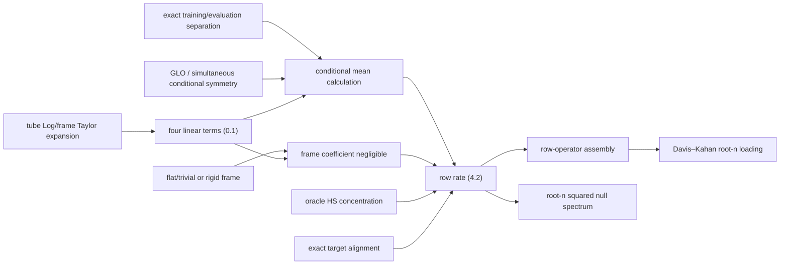

# APP-B — cancellation and oracle-rate proof dossier

> **Authority.** This is a `noncanonical-workstream` proof input for the Paper 1 application map. It does not edit or supersede [[HD1 — growing-dimension Paper 1 proof dossier]]. HD1 remains canonical. Paper 2 is out of scope.

## 0. Conclusions first

The feasible lag product has four, and only four, first-order nuisance terms after one common anchor rotation has been removed:

\[
\begin{aligned}
L_{t,h}^{\rm mean}
&=-H_t e_t\otimes Y_{t-h}-Y_t\otimes H_{t-h}e_{t-h},\\
L_{t,h}^{\rm fr}
&=\Omega_tY_t\otimes Y_{t-h}+Y_t\otimes\Omega_{t-h}Y_{t-h}.
\end{aligned}
\tag{0.1}
\]

Here \(e_t=\log_{\mu_t}\hat\mu_t\), \(H_t=\frac12\operatorname{Hess}_{\mu_t}d(\mu_t,X_t)^2\), and \(\Omega_t^*=-\Omega_t\) is the first-order **non-rigid** relative-frame error. Every other term is quadratic in \((e,\Omega)\), subject to the uniform second-differential assumptions already isolated in HD-G.

This decomposition settles the main shortcuts.

1. **Flatness kills geometry, not additive recentering.** On one flat convex tube, \(H_t=I\) and \(\Omega_t=0\) after anchor alignment, but (0.1) still contains \(-e_t\otimes Y_{t-h}-Y_t\otimes e_{t-h}\). These terms require centring plus either genuine training/evaluation separation, a special same-sample calculation, or an estimator-level correction.
2. **GLO kills only the mean coefficient.** After exact sample separation it conditionally centres \(L^{\rm mean}\); its empirical fluctuation is \(O_p(\ell_n/\sqrt n)\), not identically zero. GLO says nothing about \(L^{\rm fr}\).
3. **A non-rigid frame error acts on the signal itself.** Conditional on training,
   \[
   \mathbb E L_{t,h}^{\rm fr}
   =\Omega_t\Gamma_{t,h}-\Gamma_{t,h}\Omega_{t-h},
   \tag{0.2}
   \]
   which is generically first order because \(\Gamma_{t,h}\ne0\). Cross-fitting cannot centre it. A common rigid rotation is harmless because it is exact conjugation; a time-varying residual is not.
4. **The weakest honest abstract oracle package is therefore:** oracle lag concentration; exact training/evaluation independence; GLO (or a condition implying it); and a frame-rigidity condition making the non-rigid coefficient in (0.2) \(o(n^{-1/2})\). Exact flat/trivial-holonomy geometry is one concrete sufficient frame condition, but is not logically necessary.
5. Under that package,
   \[
   d_n=O_p\!\left(n^{-1/2}+\ell_n^2+\varepsilon_{G,n}\ell_n
   +\phi_{F,n}+\rho_n\right),
   \tag{0.3}
   \]
   with all terms defined below. If the non-oracle terms are \(o(n^{-1/2})\), then
   \[
   \|\sin\Theta(\hat E_n,E_n)\|_{\rm op}
   =O_p\!\left(\frac{n^{-1/2}}{\Delta_n}\right).
   \tag{0.4}
   \]
6. A root-\(n\) parametric centre gives (0.4) by a different route: its **uncancelled** first-order effect is itself \(O_p(n^{-1/2})\). This is an oracle-order rate, but it is not first-order immunity and need not have the oracle limiting law or constant.

All statements below distinguish pathwise identities, population expectation, conditional expectation after splitting, and empirical fluctuation.

## 1. Inputs retained from canonical HD1

Work in the true reference Hilbert space \(H_n=T_{\mu_n(u_0)}M_n\), after true parallel transport. Let

\[
Y_{t,n}=A_nf_{t,n}+\varepsilon_{t,n},\qquad \|Y_{t,n}\|\le R,
\]

with fixed rank, lag count \(h_0\), and memory length \(m_0\). For \(s=t-h\),

\[
\Gamma_{t,n}(h)=\mathbb E(Y_{t,n}\otimes Y_{s,n}),\qquad
\Gamma_n(h)=N_{n,h}^{-1}\sum_t\Gamma_{t,n}(h).
\]

The exact included-lag factor/noise orthogonality HD-L gives

\[
\Gamma_n(h)=A_nC_{f,n}(h)A_n^*,\quad
\mathbb L_n=\sum_h\Gamma_n(h)\Gamma_n(h)^*,\quad
\Delta_n=\lambda_r(\mathbb L_n)>0.
\tag{1.1}
\]

HD1 proves the dimension-free oracle row rate

\[
d_{{\rm or},n}
=\left\{\sum_{h=1}^{h_0}\|\widetilde\Gamma_n(h)-\Gamma_n(h)\|_{\rm HS}^2\right\}^{1/2}
=O_p(n^{-1/2})
\tag{1.2}
\]

and the deterministic assembly identities

\[
\|\widehat{\mathbb L}_n-\mathbb L_n\|_{\rm op}
\le 2A_{2,n}d_n+d_n^2,
\qquad
\hat\lambda_{r+1,n}\le d_n^2,
\tag{1.3}
\]

where \(A_{2,n}^2=\sum_h\|\Gamma_n(h)\|_{\rm op}^2=O(1)\). This dossier changes none of those facts. It only sharpens the feasible-versus-oracle row term under additional structure.

The positive three-scale centre has grid/RMS error

\[
r_{e,n}=O_p(\ell_n),\qquad
\ell_n=b_n^3+(nb_n)^{-1/2}+n^{-a}+n^{-1}.
\tag{1.4}
\]

## 2. Exact feasible-observation expansion

Suppress \(n\) temporarily. Put \(q_t=\mu(u_t)\), \(\hat q_t=\operatorname{Exp}_{q_t}e_t\), and let \(\Phi_t:T_{q_t}M\to T_{\hat q_t}M\) be the radial connector. The base-point logarithm expansion from HD1-B is

\[
\Phi_t^{-1}\log_{\hat q_t}X_t
=Y_t-H_te_t+r_t,
\qquad
\|r_t\|\le J\|e_t\|^2.
\tag{2.1}
\]

Remove one common anchor rotation \(Q\). On the event \(\max_t\|e_t\|+\max_t\|\Omega_t\|=o(1)\), write the remaining orthogonal relative frame as

\[
R_t=I+\Omega_t+S_t,qquad
\Omega_t^*=-\Omega_t,qquad
\|S_t\|_{\rm op}\le C\|\Omega_t\|_{\rm op}^2.
\tag{2.2}
\]

Thus the aligned feasible vector \(U_t:=Q^*\widehat Y_t\) obeys

\[
U_t=Y_t+\xi_t^{(1)}+\xi_t^{(2)},
\tag{2.3}
\]

where

\[
\xi_t^{(1)}=-H_te_t+\Omega_tY_t,
\tag{2.4}
\]

and, uniformly on the tube,

\[
\|\xi_t^{(2)}\|
\le C\{\|e_t\|^2+\|e_t\|\|\Omega_t\|+R\|\Omega_t\|^2\}.
\tag{2.5}
\]

> **Lemma APP-B1 (term-by-term lag-product expansion — PROVED).** For \(s=t-h\),
> \[
> U_t\otimes U_s-Y_t\otimes Y_s
> =L_{t,h}^{\rm mean}+L_{t,h}^{\rm fr}+Q_{t,h},
> \tag{2.6}
> \]
> with the two linear terms given by (0.1), and
> \[
> \begin{aligned}
> Q_{t,h}
> ={}&\xi_t^{(1)}\otimes\xi_s^{(1)}
> +\xi_t^{(2)}\otimes Y_s+Y_t\otimes\xi_s^{(2)}\\
> &+\xi_t^{(1)}\otimes\xi_s^{(2)}
> +\xi_t^{(2)}\otimes\xi_s^{(1)}
> +\xi_t^{(2)}\otimes\xi_s^{(2)}.
> \end{aligned}
> \tag{2.7}
> \]
> If
> \[
> r_e^2=N^{-1}\sum_t\|e_t\|^2,qquad
> r_F^2=N^{-1}\sum_t\|\Omega_t\|_{\rm op}^2,
> \]
> and the sup-norm tube event holds, then
> \[
> \left\|N^{-1}\sum_tQ_{t,h}\right\|_{\rm HS}
> \le C_{R,J}\{r_e^2+r_er_F+r_F^2\}.
> \tag{2.8}
> \]

**Proof.** Substitute (2.3) into the rank-one product and collect homogeneous degree one. This gives exactly (0.1). The remaining six terms are (2.7). Use \(\|x\otimes y\|_{\rm HS}=\|x\|\|y\|\), (2.5), Cauchy–Schwarz, and the vanishing sup norm to absorb cubic and quartic products into the displayed quadratic expression. \(\square\)

Equation (2.6) is pathwise. No symmetry, independence, or expectation has yet been used.

## 3. The exact first-order coefficients

For deterministic \(v\in H_n\), define the two geometric lag-orthogonality coefficient maps

\[
\mathcal K^L_{t,h}v=\mathbb E(H_tv\otimes Y_{t-h}),\qquad
\mathcal K^R_{t,h}v=\mathbb E(Y_t\otimes H_{t-h}v).
\tag{3.1}
\]

The exact GLO condition is \(\mathcal K^L_{t,h}=\mathcal K^R_{t,h}=0\) for every retained \(t,h\). Its defect is

\[
\varepsilon_{G,n}
=\max_{t,h}\{\|\mathcal K^L_{t,h}\|_{H\to\mathcal S_2},
\|\mathcal K^R_{t,h}\|_{H\to\mathcal S_2}\}.
\tag{3.2}
\]

After exact training/evaluation separation, \(e_t\) is fixed conditional on training and the evaluation law is unchanged. Therefore

\[
\left\|N^{-1}\sum_t\mathbb E(L_{t,h}^{\rm mean}\mid\mathcal T)\right\|_{\rm HS}
\le 2\varepsilon_{G,n}r_e.
\tag{3.3}
\]

Under GLO this conditional mean is zero, but the realised average is not. Fixed finite memory and the Hilbert second-moment inequality give

\[
\left\|N^{-1}\sum_tL_{t,h}^{\rm mean}\right\|_{\rm HS}
=O_p\!\left(JRr_e\sqrt{\frac{m_0+h+1}{N}}+\varepsilon_{G,n}r_e\right).
\tag{3.4}
\]

This is the precise distinction between **expectation cancellation** and **empirical cancellation**.

For the frame term, conditional expectation gives the exact coefficient

\[
N^{-1}\sum_t\mathbb E(L_{t,h}^{\rm fr}\mid\mathcal T)
=N^{-1}\sum_t\{\Omega_t\Gamma_{t,h}-\Gamma_{t,h}\Omega_{t-h}\}.
\tag{3.5}
\]

The minus sign uses \(\Omega^*=-\Omega\). Define the non-rigid frame coefficient

\[
\phi_{F,n}^2
=\sum_{h=1}^{h_0}
\left\|N_{n,h}^{-1}\sum_t
(\Omega_t\Gamma_{t,h}-\Gamma_{t,h}\Omega_{t-h})
\right\|_{\rm HS}^2.
\tag{3.6}
\]

Its centred empirical fluctuation is

\[
O_p\!\left(R^2r_F\sqrt{\frac{h_0(m_0+h_0+1)}N}\right),
\tag{3.7}
\]

but \(\phi_{F,n}\) itself is generically \(O_p(r_F)\). Cross-fitting does not reduce (3.6), because the frame multiplies a lag product with nonzero expectation.

If \(\Omega_t\equiv\bar\Omega\), (3.5) is the derivative of the common conjugation \(\Gamma_h\mapsto e^{\bar\Omega}\Gamma_he^{-\bar\Omega}\). One must absorb this common rotation into \(Q\), not send its commutator through Davis–Kahan. Only the residual after the best common rigid alignment belongs in (3.6).

## 4. The corrected oracle theorem

Let \(\rho_n\) collect only explicitly named non-geometric terms:

\[
\rho_n=d_{{\rm LN},n}+d_{{\rm mask},n}+d_{{\rm disc},n}
+d_{{\rm CF},n}+d_{{\rm db},n},
\tag{4.1}
\]

where these are respectively included-lag population contamination, target-mask mismatch, numerical discretisation, imperfect split/coupling, and debiasing residual. They are not assumed zero unless the selected property package proves them zero.

> **Theorem T-APP-3B (first-order cancellation and oracle numerator — PROVED UNDER EXPLICIT ASSUMPTIONS).** Assume:
>
> 1. the HD1 bounded-total-energy, fixed-memory/rank/lag, tube-Taylor, lag-identification, and oracle concentration assumptions;
> 2. evaluation innovations are independent of the training sigma-field used for \((e_t,\Omega_t)\), as in HD1-B's gapped finite-memory split;
> 3. \(r_e+r_F=o_p(1)\) and the expansion (2.1)–(2.2) holds uniformly;
> 4. GLO has defect \(\varepsilon_{G,n}\) in (3.2);
> 5. the non-rigid frame coefficient is \(\phi_{F,n}\) in (3.6).
>
> Then, for fixed \(h_0,m_0\),
> \[
> \boxed{
> d_n=O_p\!\left[
> n^{-1/2}
> +(r_e+r_F)n^{-1/2}
> +\varepsilon_{G,n}r_e
> +\phi_{F,n}
> +r_e^2+r_er_F+r_F^2
> +\rho_n
> \right].}
> \tag{4.2}
> \]
> If \(r_F=0\), \(r_e=O_p(\ell_n)\), and
> \[
> \ell_n^2+\varepsilon_{G,n}\ell_n+\rho_n=o(n^{-1/2}),
> \tag{4.3}
> \]
> then \(d_n=O_p(n^{-1/2})\). If also \(A_{2,n}=O(1)\), \(n^{-1/2}=o(\Delta_n)\), then
> \[
> \boxed{
> \|\sin\Theta(\widehat E_n,E_n)\|_{\rm op}
> =O_p\!\left(\frac{n^{-1/2}}{\Delta_n}\right),
> \qquad
> \widehat\lambda_{r+1,n}=O_p(n^{-1}).}
> \tag{4.4}
> \]

**Proof.** Sum (1.2), (2.8), (3.3)–(3.7), and the explicit terms in (4.1) in direct-sum Hilbert–Schmidt norm. This proves (4.2). Under (4.3), the centred linear fluctuation \(\ell_n/\sqrt n=o(n^{-1/2})\), so \(d_n=O_p(n^{-1/2})\). Apply HD1's row assembly, Davis–Kahan, and row-operator singular-value square (1.3). \(\square\)

More generally, the same conclusion holds with a nonzero frame error whenever

\[
\varepsilon_{G,n}r_e+\phi_{F,n}+r_e^2+r_er_F+r_F^2+\rho_n
=o(n^{-1/2});
\tag{4.5}
\]

the factors \((r_e+r_F)n^{-1/2}\) are then automatically negligible because \(r_e+r_F=o_p(1)\). Equation (4.5), rather than a manifold label, is the weakest abstract first-order-immunity condition proved here.

The theorem's logically weakest geometric requirement is not “flatness”. It is the pair of coefficient restrictions \(\varepsilon_{G,n}\ell_n=o(n^{-1/2})\) and \(\phi_{F,n}=o(n^{-1/2})\). Flatness plus a correct split is a concrete, easily checked sufficient package because it gives \(H=I\), \(\varepsilon_G=0\), and \(r_F=\phi_F=0\).

## 5. What each candidate property actually cancels

| Candidate | Exact criterion | What it buys | Mode | What it does **not** buy | Status |
|---|---|---|---|---|---|
| Known centre path | Use the true \(\mu(u)\) and its true parallel frame | \(e=0\), \(\Omega=0\); all four terms in (0.1) vanish pathwise | Pathwise | Does not remove oracle sampling or LN contamination | **PROVED** |
| Constant centre, pooled estimator | \(\mu(u)\equiv q\), estimator constrained to one \(\hat q\), no artificial moving frame | \(\Omega=0\); if \(d(\hat q,q)=O_p(n^{-1/2})\), robust first-order recentering is already oracle order | Pathwise rate | Constant truth alone does not make the first derivative zero | **PROVED UNDER EXPLICIT ASSUMPTIONS** |
| Constant centre plus CF+GLO | Previous row, independent training/evaluation, (3.1)=0 | Nuisance contribution improves from \(O_p(n^{-1/2})\) to \(O_p(n^{-1})\) | Conditional plus fluctuation | Does not change oracle sampling | **PROVED** |
| Root-\(n\) parametric centre curve | \(e_t=J_t(\hat\theta-\theta_0)+O_p(n^{-1})\), \(r_F=O_p(n^{-1/2})\) | Gives a root-\(n\) loading numerator even without cancellation | Pathwise rate | Not first-order immunity; centre can change the first-order law and constant | **PROVED** |
| Flat convex tube / Hilbert space | The Riemann tensor vanishes on one convex tube and transports are path-independent there | \(H=I\), log recentering is exactly additive, \(\Omega=0\) after anchor alignment | Pathwise geometric identity | Additive terms remain unless centred/separated/designed away | **PROVED** |
| Trivial holonomy only | Relative frame is one common rigid \(Q\) for all \(t\) | Kills \(L^{\rm fr}\) after alignment | Pathwise | Does not make \(H\) deterministic or imply GLO | **PROVED** |
| Fixed common commuting AIRM-SPD flat | Centre, observations, loadings, and every estimator stage lie in one fixed commuting algebra | Same reduction as the flat row in log-eigenvalue coordinates | Pathwise | Pointwise commutation in rotating bases is insufficient | **PROVED** |
| Local symmetry \(\nabla R=0\) | Geodesic symmetries are local isometries | Makes \(H(Y)=H(-Y)\) and simplifies differential constants | Pathwise identity used by symmetry proof | Does not set \(R\), \(H-I\), holonomy, GLO, or frame coefficient to zero | **DISPROVED as a cancellation by CE-B2** |
| Deterministic observation Hessian | \(H_t=H_t^0\) deterministic and \(\mathbb EY_s=0\) | Implies GLO | Population; conditional after CF | Empirical term remains \(O_p(r_e/\sqrt n)\) | **PROVED** |
| Random scalar Hessian | \(H_t=a_tI\) | Nothing unless \(\mathbb E(a_tY_s)=0\) at each retained lag | — | Scalarity alone does not imply lag orthogonality | **DISPROVED algebraically** |
| Scalar expected Hessian | \(\mathbb EH_t=c_tI\) | Improves a population conditioning constant | Expectation of \(H\) alone | Does not imply \(\mathbb E(H_t v\otimes Y_s)=0\) | **DISPROVED by CE-B4** |
| Simultaneous geodesic-reflection symmetry | On a locally symmetric tube, each retained lag pair is invariant under \((Y_t,Y_s)\mapsto(-Y_t,-Y_s)\) | Since \(H(Y)=H(-Y)\), implies GLO | Population; conditional if symmetry holds given training | Does not kill frame coefficient | **PROVED** |
| Marginal sign symmetry | \(Y_t\overset d=-Y_t\) separately | Odd one-time moments vanish | Marginal expectation | Does not imply lag GLO | **DISPROVED by CE-B3** |
| Conditional simultaneous sign symmetry | The evaluation lag pair is sign-symmetric conditional on training | Directly centres the two mean-linear terms after CF | Conditional expectation | Empirical fluctuation remains | **PROVED** |
| Marginal isotropy | Each \(Y_t\) is invariant under its stabilizer group | Often makes \(\mathbb EH_t\) scalar | Marginal expectation | Does not imply lag GLO or frame rigidity | **DISPROVED by CE-B4** |
| Joint isotropy with no invariant third-order tensor | The lag-pair law is jointly \(G\)-invariant and \(\operatorname{Hom}_G(H,H\otimes H)=\{0\}\) | Forces both maps (3.1) to vanish | Population | Groups with a surviving invariant tensor need a direct check | **PROVED** |
| Joint isotropy with central \(-I\) | Previous row with \(-I\in G\) | Immediate GLO by oddness | Population | Does not kill frame coefficient | **PROVED** |
| Exact GLO | (3.1)=0 for all retained \(t,h\) | Kills population mean-linear coefficient | Population; conditional after CF | Not pathwise; no frame cancellation | **PROVED** |
| Cross-fitting | Training sigma-field independent of retained evaluation innovations | Makes nuisance errors deterministic conditional on training | Conditional framework | Does not imply GLO; does not centre (0.2) | **PROVED / insufficiency DISPROVED** |
| Factor/noise lag orthogonality (LN) | The three included-lag noise/cross covariances vanish | Makes \(\operatorname{ran}\mathbb L=\operatorname{ran}A\) | Population target | Does not cancel mean/frame estimation | **PROVED** |
| Commuting tangent observations only | Observed tangent matrices commute under a stated fibre identification | If the whole support lies in one fixed algebra, reduces to flat row | Pathwise only under global criterion | Individual or time-local commutation does not control holonomy | **CONDITIONAL; shortcut DISPROVED** |
| First-order debiasing | Subtract an approximation to the four terms in (0.1) with RMS residual \(d_{\rm db}\) | Replaces linear error by \(d_{\rm db}\) plus quadratic terms | Pathwise algebra | Calling an estimator “debiased” proves nothing; \(e,H,\Omega\) are not automatically observable | **PROVED CONDITIONALLY** |
| Higher-order mean smoothing | Replace \(b^3\) by \(b^q\) | Improves \(r_e\) | Rate only | With first-order lag sensitivity it never reaches root-\(n\) for finite \(q\) | **PROVED** |

### Proof of the symmetry implications

On a locally symmetric space the geodesic symmetry \(s_q\) fixing \(q\) is an isometry with \(D s_q|_q=-I\). Isometry equivariance of the squared-distance Hessian gives

\[
H(q,\operatorname{Exp}_qY)=H(q,\operatorname{Exp}_q(-Y)).
\tag{5.1}
\]

Under simultaneous sign reversal, \(H_tv\otimes Y_s\) and \(Y_t\otimes H_sv\) change sign, hence have expectation zero. More generally the coefficient in (3.1) is a \(G\)-equivariant element of \(\operatorname{Hom}(H,H\otimes H)\); if that invariant space is zero, GLO follows. A central \(-I\) makes it zero immediately. None of these identities contains \(\Omega_t\Gamma_{t,h}-\Gamma_{t,h}\Omega_s\), so none proves frame cancellation.

## 6. Parametric centres: oracle order is not immunity

Let \(\mu(u;\theta)\) be a \(k\)-dimensional smooth centre family with fixed \(k\), and suppose

\[
\sqrt n(\hat\theta-\theta_0)=O_p(1).
\]

Uniform differential control gives

\[
e_t=J_t(\hat\theta-\theta_0)+O_p(n^{-1}),\qquad
\Omega_t=K_t(\hat\theta-\theta_0)+O_p(n^{-1}).
\tag{6.1}
\]

Substituting into (0.1) gives

\[
N^{-1}\sum_t(L_{t,h}^{\rm mean}+L_{t,h}^{\rm fr})
=\mathcal A_h(\hat\theta-\theta_0)+O_p(n^{-1}),
\tag{6.2}
\]

for an explicit bounded linear map \(\mathcal A_h\). Therefore \(d_n=O_p(n^{-1/2})\) even when \(\mathcal A_h\ne0\). This proves the root-\(n\) loading rate, but the nuisance term generally contributes to the first-order distribution.

Three notions must remain separate:

| Claim | Exact requirement | Parametric centre alone? |
|---|---|---|
| Root-\(n\) loading **rate** | nuisance perturbation \(O_p(n^{-1/2})\) | Yes |
| First-order immunity | \(\mathcal A_h=0\) for all retained lags, plus centred empirical control | No |
| Oracle equivalence / same first-order law | nuisance contribution \(o_p(n^{-1/2})\) | No |

For a constant unknown centre estimated by one pooled root-\(n\) Fréchet estimator, \(K_t=0\) because the estimator respects constancy. The base-point coefficient can still be nonzero on a curved manifold. Under CF+GLO it becomes \(O_p(n^{-1})\); without those conditions it remains root-\(n\), which is sufficient for rate but not immunity. Merely knowing that the true path is constant does not help if the estimator unnecessarily fits a separate local centre at every \(u\).

## 7. Approximate properties and stability penalties

The right defects are coefficients of the expansion, not verbal distances from an application label.

### 7.1 Approximate GLO, symmetry, and conditional centring

The direct GLO defect is (3.2), giving \(\varepsilon_{G,n}r_e\). If a bounded lag-pair law is within total variation \(\delta_{\rm sym,n}\) of a simultaneously reflection-symmetric law, then

\[
\varepsilon_{G,n}\le CJR\,\delta_{\rm sym,n},
\tag{7.1}
\]

so the penalty is \(O(\delta_{\rm sym,n}r_e)\). If each evaluation lag-pair law conditional on training differs from its target law by total variation \(\delta_{{\rm CF},n}\), the same calculation bounds the **conditional mean coefficient only** by \(O(JR\delta_{{\rm CF},n}r_e)\). Pairwise total variation does not preserve the empirical concentration step (3.4): that requires a joint coupling of the whole evaluation row to an independent finite-memory/physical-dependence proxy, or a conditional Hilbert physical-dependence inequality with uniform coefficients. The coupling failure or dependence tail then belongs separately in \(d_{{\rm CF},n}\). Zero covariance is not a substitute for any of these requirements.

### 7.2 Approximate flatness and holonomy

Define the directly consumed Hessian defect

\[
\varepsilon_{H,n}=\sup_{t,x}\|H(\mu_t,x)-I\|_{\rm op}
\tag{7.2}
\]

on the support tube. Under mean zero and exact splitting, the Euclidean part of (3.1) vanishes and \(\varepsilon_{G,n}\le R\varepsilon_{H,n}\). Thus approximate Hessian flatness costs \(O(\varepsilon_{H,n}r_e)\).

For the frame, use the actual non-rigid defect \(\phi_{F,n}\), or a proved geometric upper bound. Define the typed relevant-plane defect

\[
\varepsilon_{R,n}:=\sup_{S,s,\tau}\sup_{\|W\|=1}
\frac{\|R(\partial_sS,\partial_\tau S)W\|}
{\|\partial_sS\wedge\partial_\tau S\|},
\]

with ratio zero when the wedge vanishes, over the actually consumed ribbons. Vanishing sectional-curvature scalars alone would not control holonomy on a general manifold. If this defect and the polygonal proof's Jacobi constants are bounded, then

\[
r_F\lesssim \varepsilon_{R,n}
\{L_\mu r_e+M_nr_e^2+M_n^{-2}\}+\rho_{{\rm top},n},
\tag{7.3}
\]

where \(\rho_{{\rm top},n}\) is any global/topological holonomy not represented by the local ribbon. Put
\[
G_{2,{\rm HS},n}
=\left\{\sum_{h=1}^{h_0}\sup_t\|\Gamma_{t,h}\|_{\rm HS}^2\right\}^{1/2}
\le\sqrt{h_0}R^2.
\]
Then \(\phi_F\lesssim G_{2,{\rm HS},n}r_F\). The former bound by \(A_{2,n}r_F\), with \(A_{2,n}\) built from operator norms, was invalid without a rank restriction because an HS norm need not be controlled by the corresponding operator norm. For \(M_n\asymp r_e^{-2/3}\), the leading moving-centre penalty is \(O(G_{2,{\rm HS},n}\varepsilon_{R,n}L_\mu r_e)\). A small matrix commutator is not, by itself, a proved bound for either (7.2) or (7.3).

### 7.3 Approximate included-lag factor/noise orthogonality

Write

\[
\Gamma_n(h)=A_nC_{f,n}(h)A_n^*+D_n(h),\qquad
\zeta_n^2=\sum_h\|D_n(h)\|_{\rm op}^2.
\tag{7.4}
\]

This is a **population target bias**, not sampling error. It perturbs the factor lag operator by at most

\[
2A_{2,n}\zeta_n+\zeta_n^2.
\tag{7.5}
\]

The exact condition for this population bias to be negligible relative to sampling is
\[
2A_{2,n}\zeta_n+\zeta_n^2=o(n^{-1/2}),
\]
and the analogous \(O(n^{-1/2})\) condition gives root-\(n\) order. The simpler \(\zeta_n=o(n^{-1/2})\) is sufficient when \(A_{2,n}=O(1)\), but is not necessary if the population lag row itself weakens. Exact LN kills (7.4) only in population; it is unrelated to feasible recentering.

### 7.4 Debiasing residual

Suppose an estimator constructs \(\tilde\xi_t^{(1)}\) and subtracts

\[
N^{-1}\sum_t\{
\tilde\xi_t^{(1)}\otimes\tilde Y_{t-h}
+\tilde Y_t\otimes\tilde\xi_{t-h}^{(1)}\}
\tag{7.6}
\]

from the feasible lag covariance. If the difference between (7.6) and the true average of the four terms (0.1) is \(d_{{\rm db},n}\) in direct-sum HS norm, the corrected row bound is (4.2) with the linear terms replaced by \(d_{{\rm db},n}\). This is a pathwise algebraic fact. A feasible oracle theorem still requires a proof that \(d_{{\rm db},n}=o(n^{-1/2})\); because \(e_t,H_t,\Omega_t\) depend on the unknown centre and frame, this does not follow from the word “debiased”. No generic nonparametric construction proving that rate is currently supplied here.

## 8. Bandwidth and cross-term audit

For the canonical positive estimator,

\[
\ell_n=B_n+S_n+A_n+G_n,quad
B_n=b_n^3,quad S_n=(nb_n)^{-1/2},quad
A_n=n^{-a},quad G_n=n^{-1}.
\]

The complete square is

\[
\begin{aligned}
\ell_n^2={}&b_n^6+(nb_n)^{-1}+n^{-2a}+n^{-2}\\
&+2b_n^3(nb_n)^{-1/2}+2b_n^3n^{-a}+2b_n^3n^{-1}\\
&+2(nb_n)^{-1/2}n^{-a}+2(nb_n)^{-1/2}n^{-1}+2n^{-a-1}.
\end{aligned}
\tag{8.1}
\]

Every cross-term is bounded by the corresponding pair of squares. Hence

\[
\ell_n^2=o(n^{-1/2})
\tag{8.2}
\]

follows from, and for the three leading nonnegative components is equivalent at the order level to,

\[
b_n^6=o(n^{-1/2}),\qquad
(nb_n)^{-1}=o(n^{-1/2}),\qquad
n^{-2a}=o(n^{-1/2}).
\tag{8.3}
\]

For \(b_n=n^{-\alpha}\), this is

\[
\boxed{\frac1{12}<\alpha<\frac12,\qquad a>\frac14,}
\tag{8.4}
\]

in addition to the mean theorem's own bandwidth and localisation assumptions. At the robust mean-optimal \(\alpha=1/7\), \(a\ge3/7\), all leading squares are \(O(n^{-6/7})\), safely \(o(n^{-1/2})\). Thus the current mean estimator is already fast enough for the quadratic branch; changing its bias order is unnecessary for oracle **rate** once first-order immunity is proved.

For a bias order \(q<\infty\), ordinary mean optimisation gives \(n^{-q/(2q+1)}\), which is always slower than \(n^{-1/2}\). With first-order lag sensitivity, higher-order smoothing alone therefore never gives an oracle numerator. With quadratic sensitivity, the bandwidth condition becomes \(\alpha>1/(4q)\), \(\alpha<1/2\), and \(a>1/4\); every \(q\ge1\) has a nonempty range.

For the gapped block split of HD1-B, replace \(\ell_n\) by

\[
r_{e,n}^{\rm CF}
=b_n^3+\sqrt{\frac{m_n+1}{nb_n}}+n^{-a}+\frac{L_n}{n}+n^{-1},
\tag{8.5}
\]

where \(L_n\) is the alternating block length. Its square must satisfy the analogues of (8.3), including \((L_n/n)^2=o(n^{-1/2})\). If the estimand is the exact masked finite-array target, no further mask bias occurs. Comparison to the unmasked target adds \(d_{{\rm mask},n}=O(L_n/n)\), for which oracle equivalence requires the stronger \(L_n/n=o(n^{-1/2})\). This distinction must not be hidden inside the squared mean term.

## 9. Analytic counterexamples

### CE-B1 — flatness alone does not give first-order immunity

Let \(M=\mathbb R\), \(\mu=0\), and \(Y_t\) be iid Rademacher. For lag one define a consistent, evaluation-dependent nuisance error \(e_t=c_nY_{t-1}\), \(c_n\downarrow0\), and \(\widehat Y_t=Y_t-e_t\). Then \(r_e=c_n\), but

\[
\mathbb E(e_tY_{t-1})=c_n.
\]

The first term in (0.1) changes the lag covariance by \(-c_n\), not \(O(c_n^2)\). Here the Riemann tensor is zero, \(H=I\), and holonomy is trivial. What fails is centring/separation of the data-dependent error. **Flatness alone is insufficient — DISPROVED.**

### CE-B2 — local symmetry does not imply GLO

Use HD1-B's bounded two-state Markov chain on \(\mathbb H^2(-1)\), supported at \(ae_1\) and \(-be_1\) with mean zero. For a transverse \(e_2\),

\[
H_te_2=\lambda(|Y_t|)e_2,qquad \lambda(r)=r\coth r,
\]

and

\[
\mathbb E\{\lambda(|Y_t|)Y_{t-1}\}
=\pi_+a(1-\alpha-\beta)\{\lambda(a)-\lambda(b)\}\ne0.
\]

Hyperbolic space has constant curvature and \(\nabla R=0\). An independently trained perturbation \(e=c_ne_2\) therefore changes the lag covariance linearly. **Local symmetry, constant curvature, and cross-fitting together are insufficient without GLO — DISPROVED.**

### CE-B3 — marginal sign symmetry does not imply lag GLO

Let \(U_t\) be iid Rademacher and choose \(a_+\ne a_->0\). On one geodesic of \(\mathbb H^2(-1)\), put

\[
Y_t=U_ta_{U_{t-1}}e_1.
\tag{9.1}
\]

The process is bounded and one-dependent. Because \(U_t\) is independent of the magnitude, every marginal law is exactly sign-symmetric and \(\mathbb EY_t=0\). Yet

\[
\mathbb E\{\lambda(|Y_t|)Y_{t-1}\}
=\mathbb E a_{U_{t-2}}\,
\mathbb E\{\lambda(a_{U_{t-1}})U_{t-1}\}\ne0.
\tag{9.2}
\]

Thus \(\mathbb E(H_te_2\otimes Y_{t-1})\ne0\). Separate marginal reflection symmetry is insufficient; simultaneous lag-pair symmetry is the correct condition. **DISPROVED.**

### CE-B4 — marginal isotropy and scalar expected Hessian are insufficient

Let \(U_t\) be iid uniform on \(S^{d-1}\), and choose radii \(a_+\ne a_->0\). Put

\[
R_t=a_+\mathbf1\{\langle U_{t-1},e_1\rangle\ge0\}
+a_-\mathbf1\{\langle U_{t-1},e_1\rangle<0\},qquad
Y_t=R_tU_t
\tag{9.3}
\]

in \(T_q\mathbb H^d\). Since \(R_t\) is independent of \(U_t\), each marginal law of \(Y_t\) is rotationally invariant. Consequently \(\mathbb EH_t=cI\). Averaging \(H_t\) over the independent current direction conditional on \(R_t\) gives a scalar \(c(R_t)I\), with \(c(a_+)\ne c(a_-)\). Since \(Y_{t-1}=R_{t-1}U_{t-1}\),

\[
\mathbb E\{H_tv\otimes Y_{t-1}\}
=v\otimes \mathbb E\{c(R_t)R_{t-1}U_{t-1}\}\ne0;
\]

the hemisphere means in the \(e_1\) direction do not cancel when \(c(a_+)\ne c(a_-)\). Thus marginal isotropy and \(\mathbb EH=cI\) do not imply GLO. **DISPROVED.**

### CE-B5 — GLO does not kill a non-rigid frame term

Take any centred lag process with \(\Gamma(1)\ne0\) and suppose GLO holds. Let the relative frame alternate between \(I\) and \(e^{c_nB}\), where \(B^*=-B\) and \([B,\Gamma(1)]\ne0\). After removing the best common rotation, (3.5) retains a nonzero multiple of \(c_n[B,\Gamma(1)]\). It is first order and is unchanged by sample splitting. **GLO alone is insufficient — DISPROVED.**

### CE-B6 — a root-\(n\) centre is not negligible

In CE-B2 take a deterministic or independently trained perturbation \(e_n=n^{-1/2}e_2\). The population lag covariance changes by a nonzero constant times \(n^{-1/2}\). Thus a root-\(n\) centre gives a root-\(n\) loading rate but can enter the first-order limit. “Root-\(n\) centre” does not imply oracle equivalence. **DISPROVED.**

### CE-B7 — pointwise commuting SPD structure need not give one flat

Let \(D_t\) be diagonal positive matrices and \(U_t\) a changing orthogonal basis. Put

\[
\mu_t=U_tM_tU_t^T,qquad X_t=U_tD_tU_t^T,
\]

with diagonal \(M_t,D_t\). Then \([\mu_t,X_t]=0\) for every \(t\), but unless all \(U_t\) are the same, the union of centres and observations need not lie in one fixed commuting algebra. The AIRM centre path can leave every single diagonal flat, and its ribbon can have nonzero curvature/holonomy. Time-local commutation is insufficient. **DISPROVED.**

### CE-B8 — cross-fitting plus zero covariance is not independence

Let \(W\) be uniform on \(\{-1,0,1\}\) and \(V=W^2-2/3\). Then \(\mathbb E(WV)=0\), but \(V\) determines whether \(W=0\). Conditioning on a training sigma-field containing \(V\) changes the evaluation law of \(W\). More generally a finite gap under mixing leaves dependence. Therefore zero covariance and nominal sample splitting do not justify the conditional step in (3.3); exact finite-memory separation or a coupling bound is required. **DISPROVED.**

## 10. Rate ledger for the proved branches

| Branch | Mean/frame input | Feasible row \(d_n\) | Loading numerator | Beyond rank | Interpretation | Status |
|---|---|---|---|---|---|---|
| Canonical robust HD1 | \(r_e+r_F=O_p(\ell_n)\), no cancellation | \(n^{-1/2}+\ell_n\) | \(n^{-1/2}+\ell_n\) | \((n^{-1/2}+\ell_n)^2\) | Safe pathwise theorem | **PROVED in HD1** |
| Known centre/frame | zero nuisance | \(n^{-1/2}+\rho_n\) | same | \(n^{-1}+\rho_n^2\) | Exact oracle benchmark | **PROVED** |
| Flat/common commuting flat + exact CF | \(r_e=\ell_n,r_F=0,\varepsilon_G=0\) | \(n^{-1/2}+\ell_n^2+\rho_n\) | root-\(n\) if (4.3) | \(n^{-1}\) | Genuine first-order immunity | **PROVED** |
| Curved + CF + GLO + frame rigidity | Same coefficient conditions as T-APP-3B | (4.2) | root-\(n\) if all defects are negligible | \(n^{-1}\) | Abstract weakest package | **PROVED UNDER EXPLICIT ASSUMPTIONS** |
| Constant centre, pooled root-\(n\) estimator | \(r_e=n^{-1/2},r_F=0\) | \(n^{-1/2}\) robustly | root-\(n\) | \(n^{-1}\) | Rate, not immunity | **PROVED** |
| Parametric root-\(n\) centre curve | \(r_e+r_F=n^{-1/2}\) | \(n^{-1/2}\) | root-\(n\) | \(n^{-1}\) | Rate, generally changed first-order law | **PROVED** |
| Approximate symmetry/flatness | defect \(\varepsilon_n\) | \(n^{-1/2}+\ell_n^2+\varepsilon_n\ell_n+\rho_n\) | root-\(n\) iff defect condition holds | square of row rate | Stable only at quantified defect scale | **PROVED with direct coefficient defect** |
| GLO but generic curved moving frame | \(\phi_F=O_p(\ell_n)\) | \(n^{-1/2}+\ell_n\) | nonparametric | canonical robust order | GLO does not accelerate | **DISPROVED as oracle package** |
| Higher-order mean only | \(r_e=n^{-q/(2q+1)}\) | first order in \(r_e\) | slower than root-\(n\) | \(r_e^2\) null scale | Faster mean only | **PROVED** |

At \(b_n=n^{-1/7}\), \(a\ge3/7\), an approximate coefficient defect in (0.3) must satisfy

\[
\varepsilon_n\ell_n=o(n^{-1/2})
\quad\Longleftrightarrow\quad
\varepsilon_n=o(n^{-1/14}).
\tag{10.1}
\]

This is a slowly vanishing but still asymptotically exact requirement. If the application defect is fixed rather than vanishing, the accelerated branch fails and the robust \(n^{-3/7}\) numerator is the honest fallback. Included-lag target contamination enters without multiplication by \(\ell_n\): its exact oracle-negligibility condition is \(2A_{2,n}\zeta_n+\zeta_n^2=o(n^{-1/2})\). Under fixed nondegenerate signal, \(\zeta_n=o(n^{-1/2})\) is a convenient sufficient condition.

For factor selection under the oracle branch, HD1's threshold window becomes

\[
n^{-1}=o(\tau_n),\qquad \tau_n=o(\Delta_n),
\tag{10.2}
\]

plus \(n^{-1/2}=o(\Delta_n)\). The ridged ratio additionally retains HD1's lower bound on adjacent nonzero population eigenvalue ratios.

## 11. Dependency and status ledger

| Node | Status | Consumed by T-APP-3B? |
|---|---|---|
| Base-point Log expansion through quadratic remainder | **PROVED in HD1-B under HD-G** | Yes |
| Relative orthogonal-frame expansion | **PROVED locally by matrix Taylor under the stated tube event** | Yes |
| Exact four-term first derivative | **PROVED, Lemma APP-B1** | Yes |
| Conditional Hilbert/HS fluctuation | **PROVED under exact split and fixed memory** | Yes |
| GLO from simultaneous reflection/sign symmetry | **PROVED on locally symmetric tube** | Optional sufficient input |
| GLO from marginal symmetry/isotropy | **DISPROVED** | No |
| Frame cancellation from GLO/cross-fitting | **DISPROVED** | No |
| Exact flat/common commuting-flat oracle branch | **PROVED** | Concrete corollary |
| Generic curved moving-centre oracle branch | **CONDITIONAL on \(\phi_F=o(n^{-1/2})\)** | No unproved automatic implication |
| Parametric-centre root-\(n\) rate | **PROVED; not immunity** | Separate corollary |
| Generic feasible debiasing | **OPEN beyond the residual theorem** | No |

## 12. Cross-audit questions for the lead and other workstreams

1. Geometry workstream A should check whether any proposed “approximately commuting AIRM” diagnostic actually implies direct bounds on \(\varepsilon_H\) and \(\phi_F\); small commutators alone are not consumed here.
2. Dependence workstream C should replace the fixed-memory conditional inequality only if it proves both training/evaluation coupling and weighted HS concentration with dimension-uniform constants. A mixing label is insufficient.
3. Any curved application row claiming the oracle branch must exhibit a proof of \(\phi_F=o(n^{-1/2})\). GLO, local symmetry, and isotropy address the wrong coefficient.
4. Any parametric-centre application should be labelled “oracle-order, not first-order immune” unless it proves \(\mathcal A_h=0\) in (6.2).
5. Any exact symmetry row needs an approximate-law stability metric. Total variation gives (7.1); weaker diagnostics are **DIAGNOSTIC-ONLY** until linked to (3.2).

## 13. Final workstream verdict

T-APP-3 is attainable, but its minimal honest content is stricter than “flat”, “locally symmetric”, “isotropic”, or “cross-fitted”. The two first-order channels require separate controls:

\[
\boxed{
\text{mean channel: CF + GLO},
\qquad
\text{frame channel: flat/trivial, rigid, orthogonal, or explicitly }o(n^{-1/2}).}
\]

The cleanest exact application package is a Hilbert model or one fixed commuting AIRM-SPD flat, with the estimator constrained to that flat and a genuinely independent/gapped cross-fit. The cleanest curved rate package is instead a known, constant-pooled, or finite-dimensional root-\(n\) parametric centre; it gives the oracle **order** without claiming immunity. Full noncommuting AIRM SPD supplies local symmetry and even Hessians under reflection, but not flatness, GLO, or frame rigidity. Its generic fallback remains canonical HD1 unless the application law and estimator prove the missing coefficient restrictions directly.

## 14. Cross-audit of APP-A and APP-C

This section records the required hostile read of [[APP-A — geometry and differential application atlas]] and [[APP-C — dependence, dimension, and hostile application audit]]. No definite error requiring an edit to either originating dossier was found. One scope correction to this dossier's approximate-cross-fit paragraph was made in §7.1.

> **Post-audit correction.** The subsequent dependence audit found and repaired two APP-A formulations: the near-commuting Hessian proof now uses analytic functional calculus rather than an unjustified global Taylor series, and its ribbon defect is normalised before multiplication by geometric area. APP-B §7.2 was also repaired to use the HS lag-energy budget for \(\phi_F\), rather than the potentially smaller operator-norm quantity \(A_{2,n}\); §7.3 now states the exact lag-contamination condition.

| Audited claim | Objection | Resolution / correction | Verdict |
|---|---|---|---|
| APP-A exact flat reduction | “Flat” is insufficient if the objects leave the flat or topology creates holonomy | Require one simply connected convex flat containing the centre, support, loading/noise directions, all barycentre/Richardson/blend images, connectors, chords, and ribbons. For AIRM this means one fixed eigenbasis. APP-A states this scope. | **ACCEPT** |
| Flatness implies oracle recovery | Even with \(H=I\) and zero holonomy, the two additive terms in (0.1) remain | APP-A retains them and requires a genuinely separated, conditionally centred error field. Its rate \(O_p(\ell/\sqrt n+\ell^2)\) agrees with T-APP-3B. | **ACCEPT; shortcut DISPROVED** |
| APP-A AIRM-HD-G theorem | A fixed spectral band can have AIRM diameter \(O(\sqrt m)\); generic Jacobi comparison would then hide dimension growth | APP-A uses absolute bands, generated expanded bands, AIRM/Frobenius project norms, operator-norm bounds on whitened logs, Sylvester/resolvent calculus, and the commutator Jacobi equation. These give fixed-order dimension-free bounds without using Frobenius geodesic length. The theorem does not cover arbitrary mixed norms or unbanded generated images. | **ACCEPT IN THE STATED NORMS AND FIXED ORDER** |
| AIRM-HD-G yields a faster statistical rate | Uniform differentials might be mistaken for cancellation | It verifies HD-G only. It does not imply bounded total energy, bounded mean length, GLO, conditional centring, lag orthogonality, or frame rigidity. Full noncommuting AIRM therefore remains on robust HD1 absent further law/estimator structure. | **REJECT as a rate implication** |
| APP-A near-commuting stability | A small raw commutator or pointwise diagonalisation need not control the coefficient multiplying \(e\), nor the ribbon planes | The proved Hessian penalty uses the stronger decomposition \(Y=D+N\) with \(D,e\) in one fixed algebra and \(\|N\|\) small. Oracle stability additionally needs the relevant-plane curvature/frame defect involving the mean velocity and error directions. Changing eigenbases, repeated-eigenvalue rotations, and isolated small commutators remain diagnostic only. | **ACCEPT WITH BOTH DIRECT DEFECTS; BROADER SHORTCUT DISPROVED** |
| APP-A local symmetry/reflection | \(\nabla R=0\) might be promoted to GLO | Local symmetry proves only Hessian parity \(H(Y)=H(-Y)\). GLO follows only from simultaneous lag-vector reflection symmetry; marginal symmetry is insufficient. It never removes the frame coefficient (3.5). APP-A makes these distinctions. | **ACCEPT** |
| APP-C C-PD1–2 | Coordinatewise physical dependence or scalarisation could hide dimension factors | The coefficients are Hilbert-norm coefficients and the proof uses martingale orthogonality/innovation bounded differences directly in the Hilbert space. Constants are dimension-free when \(\Theta_2,\Theta_\infty\) are uniform. | **ACCEPT** |
| APP-C physical-dependence HD1 extension | Broader dependence might be confused with oracle acceleration | C-PD supplies score and oracle-row concentration; robust feasible Route R remains pathwise and first order in \(\ell_n\). APP-C does not claim cancellation. | **ACCEPT** |
| Physical dependence plus a finite cross-fit gap | A finite gap does not make infinite-memory training and evaluation sigma-fields independent | APP-C correctly marks the tail argument conditional. T-APP-3B remains proved only under exact finite-memory separation. An infinite-memory oracle extension needs a joint evaluation-row coupling or a conditional C-PD theorem, plus trained-estimator stability. Pairwise total variation controls only the conditional coefficient, not empirical concentration; §7.1 was corrected accordingly. | **ACCEPT AFTER APP-B SCOPE CORRECTION** |
| APP-C constant-curvature signed route | Scalar expected Hessian/isotropy alone cannot remove the empirical operator process | The actual sufficient structure is stronger: \(H=\alpha(r)I+\{1-\alpha(r)\}v\otimes v\), whose remainder has dimension-free Hilbert–Schmidt norm one on a bounded nonpositive-constant-curvature tube. With uniform physical-dependence coefficients this closes signed Hessian concentration. | **ACCEPT UNDER SH/PD/TUBE ASSUMPTIONS** |
| Constant curvature signed route gives oracle loading | Faster signed mean bias could be mistaken for first-order immunity | C-SG1 changes \(b^3\) to \(b^q\) only. Constant curvature leaves random Hessians, GLO can fail, and holonomy/frame terms remain. Loading stays first order under Route R unless T-APP-3B is separately verified. | **REJECT as an oracle implication** |
| APP-C isotropy/block claims | Population scalarity or commuting empirical Hessians might be called dimension-free | APP-C supplies explicit counterexamples and retains a rank-one/HS or controlled-block budget. This is the correct distinction. | **ACCEPT** |
| Application feasibility rows | A geometry/dependence match might be read as a complete Paper 1 corollary | Euclidean/Hilbert and fixed-commuting-SPD rows still require bounded total energy, signal/eigengap, LN, and a valid split for immunity. Full AIRM, changing-eigenvector diffusion tensors, and functional-connectivity covariance do not acquire oracle cancellation from AIRM calculus or physical dependence. Constant-negative-curvature applications acquire a signed mean theorem, not an oracle loading theorem. | **QUALIFY IN CANONICAL INTEGRATION** |

### Cross-audit resolution

The surviving dependency separation is

\[
\begin{aligned}
\text{APP-A AIRM calculus}&\Longrightarrow \text{HD-G verification only},\\
\text{APP-C physical dependence}&\Longrightarrow \text{score/oracle-row concentration only},\\
\text{APP-C structural signed Hessian}&\Longrightarrow \text{faster mean only},\\
\text{APP-B CF+GLO+frame rigidity}&\Longrightarrow \text{first-order immunity/oracle numerator}.
\end{aligned}
\]

No arrow may be skipped. In particular, neither locally symmetric full AIRM geometry nor summable physical dependence supplies the missing statistical cancellation, and near-commuting data are a stable accelerator only after the two directly consumed defects—Hessian action and non-rigid ribbon/frame coefficient—are separately bounded.
