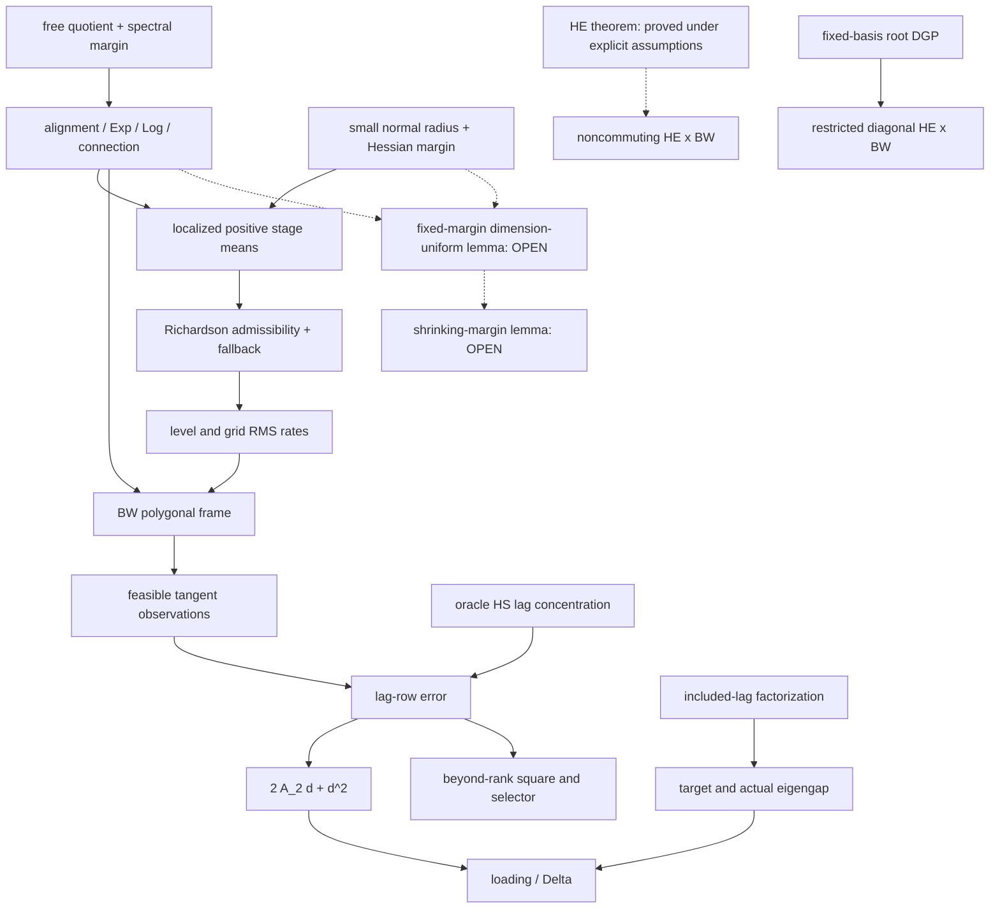

# BW — moving-centre Bures-Wasserstein working dossier

> **Archived proof provenance, not canon.** The fixed-size local result, negative boundary results, and exact growing-size open lemmas survived two hostile passes and have been selectively integrated into the canonical notes. This dossier treats covariance matrices themselves as the manifold observations. A covariance matrix estimated from raw returns is a second statistical layer and is not silently included.

## 0. Bottom line and exact statuses

The optimistic global statement on the whole positive-semidefinite cone is false. A complete fixed-matrix-size local/regularized moving-centre theorem is available on the full-rank Bures--Wasserstein (BW) manifold. Full noncommuting matrix-size-uniform calculus remains an exact open lemma even on fixed spectral and small-normal-radius margins.

| Claim | Final first-pass status | Consequence |
|---|---|---|
| BW-1: full-rank quotient geometry and definitions | **PROVED** | Explicit metric, tangent norm, Exp, Log, alignment, geodesics, connection, and transport are available on \({\rm SPD}(m)\). |
| Repeated positive eigenvalues cause BW nonuniqueness | **DISPROVED** | Matrix square root and polar alignment remain smooth on the invertible cone; rank loss, not multiplicity, is the polar obstruction. |
| BW-2: generated-set closure from raw spectral bounds alone | **DISPROVED** | A signed Richardson image can hit rank zero even in scalar diagonal BW. |
| BW-2: generated-set closure for the safeguarded estimator | **PROVED UNDER EXPLICIT ASSUMPTIONS** | Constrained stage means, nested regular domains, a high-probability Richardson admissibility event, and an off-event fallback close the estimator. |
| BW-3: fixed-size differential package | **PROVED UNDER EXPLICIT ASSUMPTIONS** | Every G1/PF map is smooth with bounded fixed-order derivatives on the named compact regular sets. |
| BW-4: fixed-size statistical theorem | **PROVED UNDER EXPLICIT ASSUMPTIONS** | Mean, grid, polygonal frame, lag row, loading space, and factor number close at the robust Paper 1 rates. |
| Original unconstrained estimator without domain safeguards | **RETRACTED** | The surviving estimator is a constrained local replacement; only its fallbacks are asymptotically inactive. |
| Global PSD/rank-changing theorem | **DISPROVED** | Orthogonal rank-one endpoints have nonunique alignments, geodesics, logarithms, midpoints, and two-point means. |
| BW-5 boundary attacks | **PROVED** | Eigenvalue collapse, rank change, moving eigenvectors, and generated-image escape have analytic attacks. |
| BW-6: growing matrix size on fixed bands and a uniform small normal tube | **OPEN — EXACT LEMMA STATED** | Primitive square-root/Sylvester/polar bounds are dimension-free, but the required PT, curvature, Hessian, Richardson, and ruled-surface chain has not been derived uniformly in \(m\). |
| Shrinking lower spectral margin | **OPEN — EXACT LEMMA STATED** | This is a second size audit, downstream of the fixed-margin lemma; no unconditional \(m_n,n\) window is claimed. |
| BW-7: general high-energy, growing-size noncommuting BW | **RETRACTED under the present local package** | Uniform small-radius/bounded-energy assumptions exclude \(R_n\to\infty\). A concrete fixed-basis diagonal square-root DGP gives a restricted nonempty intersection. |

The fixed-size gate BW-1--BW-4 is completed in Sections 1--7 before the growing-size audit in Section 9.

## 1. BW-1 — domain, quotient, and typed definitions

### 1.1 Domain

For fixed \(m\), the theorem lives on

\[
\mathcal P_m={\rm SPD}(m)=\{A=A^T:A\succ0\}.
\]

It is represented by the free right-orthogonal quotient

\[
\pi:{\rm GL}(m)\to\mathcal P_m,\qquad \pi(L)=LL^T,qquad L\sim LQ,\ Q\in O(m),
\tag{1.1}
\]

with Frobenius metric on \({\rm GL}(m)\). The action is free because \(LQ=L\) and invertibility imply \(Q=I\). Rank-changing PSD matrices are not in this manifold.

At \(L\), the vertical and horizontal spaces are

\[
\mathcal V_L=\{L\Omega:\Omega^T=-\Omega\},\qquad
\mathcal H_L=\{H:L^TH=H^TL\}.
\tag{1.2}
\]

For an arbitrary matrix \(Z\), write \(P_L^{\mathcal H}Z=Z-L\Omega\), where the unique skew matrix \(\Omega\) solves

\[
(L^TL)\Omega+\Omega(L^TL)=L^TZ-Z^TL.
\tag{1.3}
\]

The Sylvester operator is invertible because \(L^TL\succ0\). Thus the horizontal projector is explicit and smooth on \({\rm GL}(m)\).

### 1.2 Tangent metric

For \(A\in\mathcal P_m\), let \(\mathcal L_A(S)=AS+SA\). If \(U,V\in{\rm Sym}(m)=T_A\mathcal P_m\), put

\[
S_U=\mathcal L_A^{-1}U,\qquad
g_A(U,V)=\operatorname{tr}(S_UAS_V)=\frac12\operatorname{tr}(U S_V).
\tag{1.4}
\]

At the principal lift \(L=A^{1/2}\), the horizontal lift of \(U\) is \(H_U=S_UA^{1/2}\), and \(\|H_U\|_F^2=g_A(U,U)\). On \(\alpha I\preceq A\preceq\beta I\),

\[
\frac{\alpha}{4\beta^2}\|U\|_F^2
\le \|U\|_A^2
\le \frac{\beta}{4\alpha^2}\|U\|_F^2.
\tag{1.5}
\]

This is the typed BW tangent norm. It is not the AIRM norm.

### 1.3 Alignment, distance, Log, Exp, and geodesic

For lifts \(L,M\in{\rm GL}(m)\), define

\[
Q(M,L)=\operatorname{polar}(M^TL),\qquad N=M Q(M,L).
\tag{1.6}
\]

Then \(L^TN=N^TL\succ0\), and \(Q(M,L)\) is the unique minimizer of \(\|L-MQ\|_F\) over \(O(m)\). Uniqueness follows because \(M^TL\) is invertible; repeated singular values do not destroy the unique polar factor.

The BW distance is

\[
d_{\rm BW}(A,B)^2
=\min_{Q\in O(m)}\|A^{1/2}-B^{1/2}Q\|_F^2
=\operatorname{tr}A+\operatorname{tr}B
-2\operatorname{tr}(A^{1/2}BA^{1/2})^{1/2}.
\tag{1.7}
\]

With \(L=A^{1/2}\), \(M=B^{1/2}\), and aligned \(N\) from (1.6), the horizontal chord \(H=N-L\) defines

\[
\Log_A B=d\pi_L(H),\qquad
\gamma_{A,B}(t)=\pi(L+tH).
\tag{1.8}
\]

Equivalently, with

\[
T_A^B=A^{-1/2}(A^{1/2}BA^{1/2})^{1/2}A^{-1/2},
\]

\[
\gamma_{A,B}(t)=((1-t)I+tT_A^B)A((1-t)I+tT_A^B),
\quad
\Log_A B=(T_A^B-I)A+A(T_A^B-I).
\tag{1.9}
\]

For \(U=d\pi_L(H)\) with \(H\in\mathcal H_L\),

\[
\Exp_A(U)=\pi(L+H)
\tag{1.10}
\]

whenever \(L+H\) is invertible. The line remains horizontal because \((L+tH)^TH\) is symmetric. An explicit regular Exp margin is

\[
\sigma_{\min}(L+H)\ge\chi>0.
\tag{1.11}
\]

### 1.4 Connection, transport, and score

The quotient Levi--Civita connection is defined by horizontal projection of the Euclidean derivative. If \(X,Y\) have basic horizontal lifts \(\bar X,\bar Y\),

\[
(\nabla_XY)^{\mathcal H}=P_L^{\mathcal H}D\bar Y[L]\bar X.
\tag{1.12}
\]

Along a lifted curve \(L(t)\), a tangent field with horizontal lift \(H(t)\) is parallel exactly when

\[
P_{L(t)}^{\mathcal H}\dot H(t)=0,
\tag{1.13}
\]

together with \(H(t)\in\mathcal H_{L(t)}\). This linear ODE defines the BW parallel transport used in Paper 1. Radial connectors are (1.13) along (1.8); polygonal transport is the composition along the successive chords.

On a regular normal neighbourhood,

\[
\operatorname{grad}_A\frac12d_{\rm BW}(A,B)^2=-\Log_A B,
\qquad
H(A,B)=-\nabla_A\Log_A B.
\tag{1.14}
\]

These formulas define the score and observation Hessian consumed by the mean and feasible-observation expansions.

## 2. Primitive regular-domain assumptions

Fixed spectral bands and a small normal radius are different assumptions. No derivative bound is assumed in this section; Section 4 derives fixed-\(m\) bounded derivatives from the primitive open-set margins below.

**(BW-P1: spectral quotient margin).** There are \(0<\alpha<\beta<\infty\) and nested sets

\[
\mathcal D_{\rm c}\Subset\mathcal D_0\Subset\mathcal D_1\Subset
\mathcal B_{\alpha,\beta}:=\{A:\alpha I\preceq A\preceq\beta I\}.
\tag{2.1}
\]

The constraint set \(\overline{\mathcal D_{\rm c}}\) is compact and strongly geodesically convex. Principal factors on \(\mathcal D_1\) are invertible, and every polar input belonging to the compact pair set below has a stated positive singular-value margin.

**(BW-P2: primitive admissible open sets).** Fix open sets of finite tuples

\[
\mathcal U_{\rm pair},\quad \mathcal U_{\rm R},\quad
\mathcal U_{\rm blend},\quad \mathcal U_{\rm path},\quad
\mathcal U_{\rm ruled},
\tag{2.2}
\]

for, respectively: score/Log/alignment pairs; Richardson triples; blend pairs; chord/connector paths with their endpoints; and the two-parameter ruled comparison surfaces. On these open sets all factors and polar inputs are invertible, every required \(L+H\) has \(\sigma_{\min}(L+H)>\chi\), every output lies in \(\mathcal D_1\), and the displayed ODEs have their trajectories in \(\mathcal D_1\). The population tuples lie in compact subsets \(\mathcal K_\bullet\Subset\mathcal U_\bullet\) with a common positive distance \(\delta_{\rm reg}\) from the corresponding complements. These are domain-membership and invertibility assumptions, not bounds on derivatives.

Write \(\mathcal K_\bullet^+\) for the closed \(\delta_{\rm reg}/2\)-neighbourhood of \(\mathcal K_\bullet\); after decreasing \(\delta_{\rm reg}\) if necessary, \(\mathcal K_\bullet^+\Subset\mathcal U_\bullet\). These enlarged compact sets are the empirical consumer domains.

**(BW-P3: local convexity/Hessian margin).** Every internal constraint geodesic and every score pair belongs to \(\mathcal K_{\rm pair}\), and

\[
\kappa I\preceq H(A,B)\preceq K I
\tag{2.3}
\]

in BW tangent norm for constants \(\kappa,K>0\). This is an explicit local normal-radius assumption. It is nonempty for fixed \(m\): at \(A=B\), \(H=I\), and continuity on the fixed-dimensional full-rank manifold supplies a neighbourhood. No matrix-size-uniform radius is claimed here.

**(BW-P4: actual and proxy laws).** The population centre path, every actual observation, every locally stationary proxy observation, the supports of all proxy laws consumed by the bias calculation, and every actual/proxy score pair lie in the corresponding \(\mathcal K_\bullet\). All population positive stage means lie in the interior of \(\mathcal D_{\rm c}\), a fixed distance from its boundary, and their Richardson/blend tuples lie in \(\mathcal K_{\rm R}\) and \(\mathcal K_{\rm blend}\). The mean path has the required fixed-order derivatives. The support radius in BW norm is bounded by \(R\), separately from spectral conditioning.

**(BW-P5: statistical localization input).** The deterministic population-stage bias and empirical stage-score bounds tend to zero uniformly, and the coarse-grid RMS rate obeys \(\sqrt{M_n}\,r_{\mu,n}=o(\delta_{\rm reg})\). Strong convexity then gives uniform stage-mean convergence to the population stages. No closure statement about Richardson outputs, paths, or ruled surfaces is assumed here; Section 3 obtains those by continuity from the compact population margins.

## 3. BW-2 — generated-set closure and estimator specification

### 3.1 Localized stage means

For the three nonnegative one-sided scale kernels used by HD1, define each stage mean as the unique constrained minimizer

\[
\hat\mu_j(u)=\arg\min_{A\in\overline{\mathcal D_{\rm c}}}
\sum_t w_{j,t}(u)d_{\rm BW}(A,X_{t,n})^2.
\tag{3.1}
\]

The constraint is part of the estimator. By BW-P1 and BW-P3, each objective is \(2\kappa\)-strongly geodesically convex along every internal constraint geodesic, hence has at most one minimizer. Compactness gives existence. BW-P4 and score concentration imply that the minimizer is interior with probability tending to one, so its Karcher equation is valid on that event. This is a localized replacement estimator. It is not claimed equal to the original unconstrained global BW argmin.

### 3.2 Richardson map and safeguard

Let

\[
(c_1,c_2,c_3)=(1,1/2,1/4),\qquad
(\lambda_1,\lambda_2,\lambda_3)=(1/3,-2,8/3).
\]

The regular Richardson output is

\[
\mathscr R(A_1,A_2,A_3)=
\Exp_{A_1}\left(\sum_{j=1}^3\lambda_j\Log_{A_1}A_j\right).
\tag{3.2}
\]

At a lift \(L_1\), align \(L_j\) to \(L_1\), put \(H_j=N_j-L_1\), and observe that \(H_j\in\mathcal H_{L_1}\). Thus (3.2) is represented by

\[
L_R=L_1+\sum_j\lambda_jH_j.
\tag{3.3}
\]

If \(\sigma_{\min}(L_1)\ge\sqrt\alpha\) and

\[
\sum_j|\lambda_j|\,\|H_j\|_F<\sqrt\alpha-\chi,
\tag{3.4}
\]

then \(\sigma_{\min}(L_R)\ge\chi\). The stage errors are

\[
O_p\!\left(b_n+n^{-a}+n^{-1}+\sqrt{\frac{\log n}{nb_n}}\right)
\tag{3.5}
\]

uniformly. Inequality (3.4) proves only invertibility; it is one component of, not a substitute for, the full regular-domain test below.

Define \(\mathcal E_n^{\rm reg}\) to be the event that simultaneously:

1. every empirical stage mean is interior to \(\mathcal D_{\rm c}\);
2. every empirical score/Log/alignment pair belongs to \(\mathcal K_{\rm pair}^+\);
3. every Richardson triple belongs to \(\mathcal K_{\rm R}^+\), its lift satisfies (3.4), and its output lies in the prescribed inner part of \(\mathcal D_1\);
4. every forward/backward blend tuple belongs to \(\mathcal K_{\rm blend}^+\);
5. every chord, connector, endpoint-comparison path, and its full ODE trajectory belongs to \(\mathcal K_{\rm path}^+\);
6. every two-parameter comparison surface used by PF belongs to \(\mathcal K_{\rm ruled}^+\); and
7. every reconstructed Exp input satisfies both its \(\chi\)-invertibility margin and output membership in \(\mathcal D_1\).

On \(\mathcal E_n^{\rm reg}\) use the regular construction. Off it use a fixed interior centre path, identity frame, and fixed interior reconstruction. BW-P4 places the entire population tuple at distance \(\delta_{\rm reg}\) from failure, while BW-P5 and continuity of the finitely many fixed-order maps put the empirical tuple within \(\delta_{\rm reg}/2\), uniformly over the one-dimensional time grid and its interpolants. Hence \(P(\mathcal E_n^{\rm reg})\to1\). This proves generated-set closure from the primitive margins; it does not infer closure from raw spectral bounds alone.

The safeguard is asymptotically inactive relative to this constrained estimator. It does not prove equality with the original global unconstrained estimator, and that former equality claim is **RETRACTED**.

### 3.3 Chords, connectors, frames, blends, and reconstruction

On \(\mathcal E_n^{\rm reg}\), all outputs and complete paths/surfaces pass the membership tests above. Chord/blend closure is therefore not inferred from an undeclared global convexity property of \(\mathcal D_1\). The constraint domain itself is strongly geodesically convex by BW-P1; later generated paths are closed by their explicit \(\mathcal U_{\rm path}\) and \(\mathcal U_{\rm ruled}\) tests. Raw and proxy observations are covered by BW-P4, so their Logs at generated centres are regular.

For reconstruction from a fitted tangent vector \(U=d\pi_L(H)\), use

\[
\operatorname{clip}_{\chi}(H)
=H\min\left\{1,\frac{\sigma_{\min}(L)-\chi}{\|H\|_{\rm op}}\right\}
\tag{3.6}
\]

with the factor interpreted as one when \(H=0\), followed by (1.10). Any equivalent spectral radial clipping is allowed. If the model's reconstructed vectors have the (1.11) margin, clipping is asymptotically inactive and the scientific estimand is unchanged. If clipping is active with nonvanishing probability, it changes the reconstruction/forecast target; no unregularized reconstruction claim is then made. Loading-space estimation itself is unaffected by (3.6).

### 3.4 Raw spectral bounds are not closure

In scalar diagonal BW, use root coordinate \(r=\sqrt a>0\). Richardson becomes the signed affine combination of the three roots. Taking \((r_1,r_2,r_3)=(1,3/2,1)\) gives

\[
\frac13r_1-2r_2+\frac83r_3=0.
\tag{3.7}
\]

All three inputs have eigenvalues in \([1,9/4]\), but the generated image is rank zero. Thus a raw-data lower spectral bound does not imply generated-set closure. The unsafeguarded claim is **DISPROVED**.

## 4. BW-3 — fixed-size differential calculus

> **Theorem BW-DIFF-FIX.** For fixed \(m\), under BW-P1--BW-P4, all covariant derivatives through the fixed order consumed by HD1 of the score/Hessian, Exp, Log, polar alignment, horizontal lift/projector, radial connector, parallel transport, Richardson map, fixed-width blend, geodesic chord, and ruled-surface comparison are bounded on their named compact admissible sets.

**Proof.** No derivative conclusion is assumed in BW-P1--BW-P4. On the open primitive domains, multiplication and transpose are polynomial; inversion is smooth away from singular matrices; positive square root is smooth on SPD; the polar factor is the explicit smooth map \(C(C^TC)^{-1/2}\) on \({\rm GL}(m)\); and the horizontal projector is obtained from the uniquely invertible Sylvester equation (1.3). Consequently (1.8)--(1.12) are smooth finite compositions on \(\mathcal U_{\rm pair}\) and \(\mathcal U_{\rm path}\).

For transport, write (1.13), together with differentiated horizontality, as a finite-dimensional linear ODE \(\dot z=B(\theta,t)z\), where \(\theta\) denotes the path endpoints/parameters and \(B\) is a smooth composition of the preceding primitives. Standard parameter differentiation gives, for every multi-index \(|\nu|\le k_0\), an inhomogeneous variational equation
\[
\partial_t(\partial_\theta^\nu z)
=B\,\partial_\theta^\nu z+F_\nu
\tag{4.0}
\]
with \(F_\nu\) built from lower derivatives. Induction and Gronwall give continuity of every fixed-order derivative on the finite time interval. The ruled-surface comparison is the same ODE with two smooth path parameters; its mixed derivatives satisfy (4.0). Richardson and blend are finite compositions of the already smooth Exp/Log maps. The score is (1.14), so its Hessian and the finitely many higher derivatives are derivatives of the smooth Log map.

All consumer tuples lie in the compact sets \(\mathcal K_\bullet\Subset\mathcal U_\bullet\) on \(\mathcal E_n^{\rm reg}\). Each continuous fixed-order derivative therefore attains a finite maximum. This proves fixed-\(m\) finiteness only; it supplies no matrix-size-uniform constant. \(\square\)

This proof does not use an AIRM formula, a Hadamard theorem, or Sturm convexity. The lower Hessian bound is an explicit local assumption/proved small-radius consequence, not a consequence of nonnegative curvature.

The feasible observation expansion is consequently

\[
\Phi_{e_t}^{-1}\Log_{\hat\mu_t}X_t
=Y_t-H_t e_t+O(\|e_t\|^2),
\tag{4.1}
\]

and the quotient parallel-transport variation gives the same typed polygonal/ribbon area bound used by PF, with BW curvature and Jacobi constants. This establishes the replacement frame route: the original polygonal construction survives, with BW quotient transport in place of AIRM transport.

## 5. Fixed-size mean and polygonal-frame theorem

Assume the fixed-memory, local-stationarity, kernel, design, smooth-law, and bandwidth package of canonical HD1, with BW-P1--BW-P5 replacing the Hadamard/AIRM geometry.

> **Theorem BW-MEAN-FIX — PROVED UNDER EXPLICIT ASSUMPTIONS.** Put
> \[
> r_{\infty,n}^{\rm BW}=b_n^3+n^{-a}+n^{-1}
> +\sqrt{\frac{\log n}{nb_n}},
> \quad
> \ell_n^{\rm BW}=b_n^3+(nb_n)^{-1/2}+n^{-a}+n^{-1}.
> \tag{5.1}
> \]
> Then the safeguarded three-scale estimator satisfies
> \[
> \sup_u d_{\rm BW}(\hat\mu^{(3)}(u),\mu(u))
> =O_p(r_{\infty,n}^{\rm BW}),
> \tag{5.2}
> \]
> \[
> \|\Log_\mu\hat\mu^{(3)}\|_{L^2}=O_p(\ell_n^{\rm BW}),
> \tag{5.3}
> \]
> and the same RMS rate holds on every deterministic coarse grid.

**Proof.** Strong convexity (2.3) replaces empirical Sturm: along the unique geodesic from the population smoothed minimizer to the constrained empirical minimizer, integration of the Hessian gives distance at most \(\kappa^{-1}\) times the empirical score at the deterministic population point. Fixed-dimensional bounded-score finite-memory concentration gives the uniform and integrated stochastic terms. The fixed-size differential theorem gives the second-order population expansion and the cubic base-change remainder. The scale identities \(\sum\lambda_jc_j=\sum\lambda_jc_j^2=0\) cancel both second-order terms. Interior localization and (3.4) hold with probability tending to one, so the safeguard contributes nothing on the theorem event. \(\square\)

Take \(M_n\asymp(\ell_n^{\rm BW})^{-2/3}\), join the estimated grid vertices by BW geodesic chords, and transport by (1.13).

> **Theorem BW-PF-FIX — PROVED UNDER EXPLICIT ASSUMPTIONS.** After radial endpoint connectors,
> \[
> \left\{n^{-1}\sum_t d_{\rm BW}(\bar\mu(u_t),\mu(u_t))^2\right\}^{1/2}
> =O_p(\ell_n^{\rm BW}),
> \qquad
> \sup_u\|\bar P(u)-P(u)\|_{\rm op}
> =O_p(\ell_n^{\rm BW}).
> \tag{5.4}
> \]

**Proof.** Grid RMS gives \(\max_j e_j\le\sqrt{M_n+1}\,{\rm RMS}=O_p((\ell_n^{\rm BW})^{2/3})\), placing every chord and comparison surface in \(\mathcal D_1\). Smooth geodesic interpolation gives centre RMS \(O_p(\ell_n^{\rm BW}+M_n^{-2})\). The quotient connection-variation identity and BW-DIFF-FIX bound one cell by
\[
C\{M_n^{-1}(e_j+e_{j+1})+e_j^2+e_{j+1}^2\}.
\]
Summation yields \(C\{\ell_n^{\rm BW}+M_n(\ell_n^{\rm BW})^2+M_n^{-2}\}=O_p(\ell_n^{\rm BW})\). Corners are harmless because transport is composed along chords. \(\square\)

## 6. BW-4 — fixed-size lag, loading, and factor-number theorem

At the true BW centre, define the anchor-frame observation

\[
Y_{t,n}=\mathcal P^{\mu}_{u_t\to u_0}\Log_{\mu(u_t)}X_{t,n}
=A_nf_{t,n}+\varepsilon_{t,n},\qquad A_n^*A_n=I_r,
\tag{6.1}
\]

The feasible and oracle rows are compared only after endpoint typing. Let
\[
P_t:T_{\mu(u_t)}\mathcal P_m\to H_0:=T_{\mu(u_0)}\mathcal P_m,
\quad
\hat P_t:T_{\hat\mu(u_t)}\mathcal P_m\to
T_{\hat\mu(u_0)}\mathcal P_m
\]
be true and estimated polygonal transports, and let \(C_t:T_{\mu(u_t)}\to T_{\hat\mu(u_t)}\) be the radial connector. Define the feasible vector in the true anchor fibre by
\[
U_t=C_0^{-1}\hat P_t\Log_{\hat\mu(u_t)}X_{t,n}\in H_0.
\tag{6.1a}
\]
Then both \(U_t\otimes U_{t-h}\) and \(Y_t\otimes Y_{t-h}\) act on \(H_0\). If numerical frames are used, one common orthogonal anchor gauge is removed by conjugating every feasible row with the same \(Q\); only the time-varying residual
\[
R_t=C_0^{-1}\hat P_tC_tP_t^{-1}:H_0\to H_0
\tag{6.1b}
\]
enters the non-rigid frame bound. No operators on different tangent fibres are subtracted.

where adjoints and norms use the BW metric at the anchor. Assume fixed \(r,h_0,m_0\), \(\|Y_{t,n}\|\le R\), and, for every included lag,

\[
E(\varepsilon_t\otimes\varepsilon_{t-h})
=E(Af_t\otimes\varepsilon_{t-h})
=E(\varepsilon_t\otimes Af_{t-h})=0.
\tag{6.2}
\]

Then

\[
\Gamma_n(h)=A_nC_{f,n}(h)A_n^*,\qquad
\mathbb L_n=\sum_h\Gamma_n(h)\Gamma_n(h)^*=A_nQ_nA_n^*,
\tag{6.3}
\]

with \(Q_n=\sum_hC_f(h)C_f(h)^*\). Let \(\Delta_n=\lambda_r(\mathbb L_n)-\lambda_{r+1}(\mathbb L_n)\) and \(A_{2,n}^2=\sum_h\|\Gamma_n(h)\|_{\rm op}^2\).

In the fixed-size theorem, bounded total tangent energy and fixed lag count make this signal-row scale bounded:
\[
\|\Gamma_n(h)\|_{\rm op}
\le E\|Y_t\|\,\|Y_{t-h}\|\le R^2,
\qquad A_{2,n}\le\sqrt{h_0}\,R^2=O(1).
\tag{6.3a}
\]
The display is not used in the later HE intersection, where \(A_{2,n}\) may grow.

BW-PF-FIX and Log stability give feasible observation RMS error

\[
q_n^{\rm BW}=O_p(\ell_n^{\rm BW}).
\tag{6.4}
\]

The oracle lag products live in the Hilbert space of Hilbert--Schmidt operators on the fixed anchor tangent space, hence finite-memory concentration gives \(d_{{\rm or},n}=O_p(n^{-1/2})\). Pathwise expansion gives

\[
d_n\le d_{{\rm or},n}+\sqrt{h_0}
\{2R q_n^{\rm BW}+(q_n^{\rm BW})^2\}
=O_p(n^{-1/2}+\ell_n^{\rm BW}).
\tag{6.5}
\]

> **Theorem BW-E-FIX — PROVED UNDER EXPLICIT ASSUMPTIONS.** Under Sections 2, 5, and (6.1)--(6.3),
> \[
> \|\hat{\mathbb L}_n-\mathbb L_n\|_{\rm op}
> \le 2A_{2,n}d_n+d_n^2=: \eta_n.
> \tag{6.6}
> \]
> If \(\eta_n=o_p(\Delta_n)\),
> \[
> \boxed{\|\sin\Theta(\hat E_n,E_n)\|_{\rm op}
> =O_p\!\left(\frac{n^{-1/2}+\ell_n^{\rm BW}}{\Delta_n}\right).}
> \tag{6.7}
> \]
> Moreover \(\hat\lambda_{r+1,n}\le d_n^2\). Therefore the canonical threshold selector is consistent when \(d_n^2=o_p(\tau_n)\), \(\tau_n=o(\Delta_n)\), and \(\eta_n=o_p(\Delta_n)\); the ridged ratio additionally needs the canonical adjacent nonzero-spectrum ratio bound. The raw unregularized ratio remains disproved.

The proof after (6.5) is the metric-Hilbert row assembly, singular-value square, and Davis--Kahan argument of HD1; it does not depend on AIRM. One full-rank included factor lag implies \(\Delta_n\ge s_n^2\), but the theorem pays the actual \(\Delta_n^{-1}\).

At \(b_n=n^{-1/7}\) and \(a\ge3/7\), the robust numerator is \(n^{-3/7}\). This is a fixed-size local BW theorem, not a global PSD theorem and not a high-energy theorem.

**Edge checks.** If every included factor lag is zero, then \(\Delta_n=0\); (6.7) and the factor-number window make no conclusion, regardless of geometric regularity. If idiosyncratic noise is identically zero, oracle lag sampling may simplify, but estimating a moving centre still creates base-point and non-rigid frame errors; zero noise is not a known-centre or flat-frame theorem. When all BW constants, energy, rank, lag count, and dependence budgets are fixed, (5.1)--(6.5) reduce row by row to canonical HD1: \(r_\mu=O(\ell_n)\), \(r_F=O(\ell_n)\), \(q_R=O_p(\ell_n)\), and \(d_n=O_p(n^{-1/2}+\ell_n)\).

## 7. Scientific observation versus preliminary covariance estimation

The theorem above begins with a matrix time series \(X_{t,n}\in\mathcal P_m\). If raw returns or signals \(z_{i,t}\) are first converted to windowed covariance estimates \(\tilde X_{t,n}\), then \(\tilde X\) is the observed process and the relation to a latent covariance \(X\) requires an additional model. At minimum it must specify:

1. regularization ensuring \(\tilde X\in\mathcal D_0\);
2. BW measurement error \(a_{t,n}=d_{\rm BW}(\tilde X_{t,n},X_{t,n})\);
3. dependence created by overlapping windows;
4. bias and included-lag covariance/cross-covariance contamination;
5. whether the target is latent covariance dynamics or dynamics of the estimator itself.

An RMS tangent measurement error \(q_{{\rm meas},n}\) produces the pathwise row penalty \(2R q_{{\rm meas},n}+q_{{\rm meas},n}^2\), plus its own target contamination. No rate for this layer is claimed here.

## 8. BW-5 — hostile analytic boundary attacks

### 8.1 Eigenvalue collapse

Let \(A_\varepsilon=\operatorname{diag}(\varepsilon,1)\) and \(U=E_{11}\). Since \(\mathcal L_{A_\varepsilon}^{-1}U=(2\varepsilon)^{-1}E_{11}\),

\[
\|U\|_{A_\varepsilon}^2=\frac1{4\varepsilon}.
\tag{8.1}
\]

Thus the metric, Sylvester inverse, Log/base derivatives, and quotient projector constants blow as \(\varepsilon\downarrow0\). A theorem hiding the lower spectral margin is false.

### 8.2 Rank change, nonunique alignment, Log, geodesic, and mean

In \({\rm PSD}(2)\), take \(A=e_1e_1^T\), \(B=e_2e_2^T\), with factors \(L=\operatorname{diag}(1,0)\), \(M=\operatorname{diag}(0,1)\). Then \(M^TL=0\), so every orthogonal \(Q\) is Procrustes-optimal. The projected straight lines

\[
\pi((1-t)L+tMQ)
\tag{8.2}
\]

vary with \(Q\), giving a continuum of minimizing geodesics and logarithms. Their midpoints are distinct equal-weight Fréchet means of \(A,B\). Hence the proposed global rank-changing theorem is **DISPROVED**.

### 8.3 Repeated or crossing positive spectra

For SPD matrices, positive square root is analytic as a matrix function on \((0,\infty)\), the polar map \(C\mapsto C(C^TC)^{-1/2}\) is smooth on \({\rm GL}(m)\), and \(M^TL\) is invertible. Eigenvalue repetition or crossing therefore creates no invariant BW singularity. Formulas that divide by eigenvalue gaps are coordinate artifacts. The required margin is from zero singular value, not from repeated positive eigenvalues.

### 8.4 Moving eigenvectors versus the diagonal flat

Let

\[
A(t)=R_t\operatorname{diag}(4,1)R_t^T
\]

with a nonconstant planar rotation \(R_t\). Generic \(A(s),A(t)\) do not commute, so there is no single fixed diagonal algebra containing the path. Coordinatewise square-root differences omit the Procrustes alignment and do not equal full BW Log/transport. Thus the diagonal proof cannot be transferred to moving eigenvectors.

### 8.5 Generated images leaving the regular domain

Equation (3.7) is an exact rank-collapse example for Richardson. Separately, (1.10) reaches rank loss whenever \(L+H\) is singular. These show why stage constraints, an Exp margin, and reconstruction clipping/fallback are logically consumed rather than cosmetic.

### 8.6 Globality classification

The surviving result is:

\[
\boxed{\text{full-rank, local/regularized, generated-set-controlled BW theorem}.}
\]

It is not global on SPD, not stratified across ranks, and not a PSD-boundary theorem. The fixed-basis diagonal model is a separate flat submodel.

## 9. BW-6 — post-gate growing-size audit

This section begins only after BW-1--BW-4 have closed above.

### 9.1 What is proved uniformly

For \(\alpha I\preceq A\preceq\beta I\), the following Frobenius-operator bounds have no factor of \(m\):

\[
\|\mathcal L_A^{-1}\|_{F\to F}\le(2\alpha)^{-1},\qquad
\|XY\|_F\le\|X\|_{\rm op}\|Y\|_F,
\tag{9.1}
\]

\[
\|D^k(A^{1/2})\|\le c_k\alpha^{1/2-k},\qquad
\|D^k(A^{-1})\|\le c_k\alpha^{-1-k}\quad(k\le k_0),
\tag{9.2}
\]

with the usual multilinear interpretation. For polar inputs \(C\) with \(\sigma_{\min}(C)\ge\alpha\) and \(\|C\|_{\rm op}\le\beta\), the explicit polar formula gives dimension-free fixed-order primitive bounds \(c_k(\alpha,\beta)\). The horizontal-projection Sylvester inverse has the same type of fixed-band bound. These primitive claims are **PROVED**.

They do not, by themselves, prove matrix-size-uniform derivatives for the parameter-dependent parallel-transport ODE, O'Neill curvature, squared-distance Hessian, Richardson composition, or ruled-surface comparison. Fixed-dimensional compactness in Section 4 cannot be made uniform in a changing dimension by assertion.

### 9.2 Fixed-margin size lemma

> **OPEN — EXACT LEMMA STATED (BW-SIZE-FIXED-MARGIN).** On fixed \(0<\alpha<\beta<\infty\), a fixed Exp/polar margin \(\chi>0\), and a declared normal radius \(r_0>0\), derive in Frobenius/BW operator norms, with constants independent of \(m\):
>
> 1. the first \(k_0\) derivatives of the horizontal projector and quotient connection;
> 2. the O'Neill curvature operator and the derivatives used by the connection-variation formula;
> 3. parameter derivatives of radial and polygonal PT from the typed variational ODE;
> 4. the observation Hessian and its fixed-order base/observation derivatives;
> 5. Richardson, blend, chord, and two-parameter ruled-surface derivatives; and
> 6. a dimension-uniform positive Hessian/normal-radius theorem on every generated pair.
>
> The proof must use operator-by-Frobenius estimates at every multiplication and must not pass through \(\|L\|_F\asymp\sqrt m\) or an untyped path length. It must output one explicit constant \(C_{\rm BW}(\alpha,\beta,\chi,r_0,k_0)\) consumed by G1 and PF.

Until BW-SIZE-FIXED-MARGIN is proved, there is **no growing-matrix-size full noncommuting BW theorem**, even on fixed bands. In particular, the former arbitrary-\(m_n\) theorem is **RETRACTED**.

### 9.3 Shrinking-margin size lemma

> **OPEN — EXACT LEMMA STATED (BW-SIZE-SHRINKING-MARGIN).** After BW-SIZE-FIXED-MARGIN, derive the smallest exponents \((a_k,b_k,c_k)\) such that
> \[
> C_{{\rm BW},n}\le C\alpha_n^{-a_k}\beta_n^{b_k}\chi_n^{-c_k},
> \]
> propagate them through mean localization, the full generated-set test, PF, the lag row, and \(2A_{2,n}d_n+d_n^2\), and state the resulting \(m_n\)-versus-\(n\) window.

Fixed spectral bands and a small normal radius remain separate. There is no spectral-multiplicity margin in either open lemma. A fixed band also does not imply bounded total BW energy: root-coordinate energy can be \(O(\sqrt m)\).

## 10. BW-7 — intersection with HE

The full noncommuting theorem above assumes a uniform small normal radius and bounded total BW tangent energy \(R\). It therefore does **not** contain a genuine \(R_n\to\infty\) HE regime. Claiming that intersection from Section 9 would be circular; it is **RETRACTED**.

After HE closes, a noncommuting intersection would require, at minimum,

\[
q_{R,n}^{\rm BW}
=O_p\!\left[L_{\log,n}\{r_{\mu,n}+K_{\mu,n}M_n^{-2}\}
+r_{F,n}\{\mathcal E_{2,n}+L_{\log,n}r_{\mu,n}\}
+\rho_{{\rm con},n}+\rho_{{\rm obs},n}\right],
\tag{10.1}
\]

\[
d_{{\rm samp},n}
=O_p\!\left[\omega_n+\sqrt{h_{0,n}}
\{2\mathcal E_{2,n}q_{R,n}^{\rm BW}+(q_{R,n}^{\rm BW})^2\}
+\rho_{{\rm mask},n}+\rho_{{\rm disc},n}\right],
\tag{10.2}
\]

where \(d_{\rm samp}\) is error about the actual population row. For ideal factor-row contamination \(\zeta_n\), put

\[
d_{{\rm ideal},n}\le d_{{\rm samp},n}+\zeta_n,
\qquad
\eta_n=2A_{2,n}d_{{\rm ideal},n}+d_{{\rm ideal},n}^2.
\tag{10.3}
\]

The exact loading condition is

\[
\boxed{\eta_n=o_p(\Delta_n),}
\tag{10.4}
\]

together with the HE score/product assumptions, a proved generated-set event, and BW-SIZE-FIXED-MARGIN (plus BW-SIZE-SHRINKING-MARGIN when relevant). No division by \(A_{2,n}\) is made: \(A_{2,n}\) can vanish or grow, and the \(d_n^2\) term remains. Under the present full noncommuting assumptions, the small-normal support condition forces bounded local energy, so no nontrivial full-BW HE conclusion is proved.

The clear nonempty exception is the fixed-basis diagonal BW model. In root coordinates

\[
A=Q\operatorname{diag}(r_1^2,\ldots,r_m^2)Q^T,\qquad r_i>0,
\]

the metric is Euclidean:

\[
d_{\rm BW}(A,B)^2=\sum_i(r_i-s_i)^2.
\tag{10.2}
\]

Here is a concrete nonempty diagonal intersection. Fix one orthogonal \(Q\), let \(a_n=m_n^{-1/2}{\bf1}\), and define positive root coordinates

\[
x_{t,n}=c_0{\bf1}+s(u_t)a_n+\sqrt{m_n}\,a_ng_t
+\sigma\xi_{t,n},
\qquad
X_{t,n}=Q\operatorname{diag}(x_{t,n,1}^2,\ldots,x_{t,n,m_n}^2)Q^T.
\tag{10.5}
\]

Assume \(s\in C^3[0,1]\) is bounded; \(g_t\) is bounded, centred, finite-memory, and has \(E(g_tg_{t-h_*})=c\ne0\); and the coordinates of \(\xi_{t,n}\) are iid centred Rademachers, independent over time and from \(g\). Choose

\[
c_0>\|s\|_\infty+\|g\|_\infty+\sigma+\delta
\tag{10.6}
\]

for fixed \(\delta>0\). Then every root coordinate is at least \(\delta\), the centre path is \(c_0{\bf1}+s(u)a_n\), its speed/derivatives are \(O(1)\), and the tangent observation is

\[
Y_{t,n}=\sqrt{m_n}\,a_ng_t+\sigma\xi_{t,n}.
\tag{10.7}
\]

Thus \(R_n\asymp\sqrt{m_n}\), the noise has zero positive-lag covariance and zero factor--noise cross terms, and

\[
\Gamma(h_*)=m_nc\,a_n\otimes a_n,
\quad A_{2,n}\asymp m_n,
\quad \Delta_n\asymp m_n^2,
\quad \omega_n=O(m_n/\sqrt n).
\tag{10.8}
\]

The root-coordinate geometry is globally flat on the fixed algebra, so \(r_{F,n}=0\). With the positive three-scale constrained estimator,

\[
q_{R,n}=O_p\!\left(b_n^3+\sqrt{\frac{m_n}{nb_n}}+n^{-a}\right),
\tag{10.9}
\]

and the coordinatewise boundary/Richardson safeguard is inactive if, for example,

\[
b_n\to0,\quad {m_n\log n\over nb_n}\to0,
\quad n^{-a}\to0,
\quad \|\lambda\|_1 r_{\infty,n}<\delta/2
\quad\text{with probability tending to one}.
\tag{10.10}
\]

Moreover

\[
d_n=O_p\!\left({m_n\over\sqrt n}+\sqrt{m_n}\,q_{R,n}+q_{R,n}^2\right),
\quad
{\eta_n\over\Delta_n}
=O_p\!\left({d_n\over m_n}+{d_n^2\over m_n^2}\right)=o_p(1).
\tag{10.11}
\]

For \(b_n=n^{-1/7}\), (10.10) has the nonempty window \(m_n=o(n^{6/7}/\log n)\). This gives a **PROVED UNDER EXPLICIT ASSUMPTIONS diagonal/fixed-basis HE--BW corollary** within the working dossier. It is a model on covariance-root dynamics themselves; an estimated covariance series from raw returns still needs the measurement layer in Section 7. It is not evidence for moving eigenvectors or the full noncommuting branch.

## 11. Dependency chart

Solid arrows consume only proved nodes under the displayed assumptions. The two full noncommuting size lemmas and general HE intersection remain dashed. The diagonal DGP is a separate flat proof and does not consume those open nodes.

## 12. First-pass objection response table

| Claim | Attack | Resolution | Final status | Canonical consequence |
|---|---|---|---|---|
| SPD quotient alignment | repeated eigenvalues might make polar nonunique | polar is unique on \({\rm GL}(m)\); only singular values reaching zero obstruct it | **PROVED** | do not require eigenvalue-gap margins |
| BW-G3 circular calculus | derivative boundedness was assumed and then proved by compactness | removed BW-G3; BW-P1--P4 state only primitive open-set, invertibility, compact-membership, and Hessian margins; Section 4 derives fixed-\(m\) smoothness and ODE variational equations | **REPAIRED; BW-DIFF-FIX PROVED FOR FIXED \(m\)** | fixed-size chain may consume it |
| proxy/population reach | proxy supports and population stage tuples were absent | BW-P4 now includes actual/proxy supports, score pairs, population stages, Richardson, and blend tuples | **REPAIRED** | mean bias/local stationarity are typed |
| constrained uniqueness | domain convexity and internal Hessian reach were unstated | BW-P1 makes the compact constraint strongly geodesically convex; BW-P3 covers every internal geodesic | **REPAIRED** | localized argmin exists and is unique |
| equality to global argmin | local constraint need not equal the original global BW barycentre | equality retracted; the proved estimator is explicitly constrained/localized | **RETRACTED / REPLACED** | canon must name the changed estimator |
| Richardson-only invertibility test | invertibility did not imply membership for later consumers | \(\mathcal E_n^{\rm reg}\) tests every pair, triple, output, chord, connector, ODE path, and ruled surface against primitive admissible sets | **REPAIRED** | generated-set closure is load-bearing and explicit |
| chord/blend closure | undeclared convexity of \(\mathcal D_1\) was invoked | closure now uses full path/surface membership tests; only the constraint domain is assumed convex | **REPAIRED** | PF no longer uses an unnamed global property |
| endpoint typing | feasible and population rows appeared in different anchor fibres | (6.1a)--(6.1b) insert endpoint connectors, define the common anchor fibre, and remove only one common gauge | **REPAIRED** | lag/operator subtraction is typed |
| fixed-size theorem consumed provisional nodes | calculus and closure were incomplete | repaired Sections 2--4 rerun the mean/PF/lag dependency chain | **PROVED UNDER EXPLICIT ASSUMPTIONS** | fixed-size local theorem survives |
| full PSD extension | quotient action/alignment may be singular | orthogonal rank-one example gives continuum geodesics/means | **DISPROVED** | no rank-changing theorem |
| fixed band implies bounded energy | BW distance can aggregate over coordinates | retain total BW tangent energy separately | **DISPROVED** | growing-size corollary is trace-class/local-energy |
| fixed-margin growing-size calculus | fixed-\(m\) compactness and primitive bounds do not prove uniform PT/Hessian/ruled constants | arbitrary-\(m\) theorem retracted; BW-SIZE-FIXED-MARGIN states the exact missing equations | **OPEN — EXACT LEMMA STATED** | no full growing-size BW claim |
| shrinking margin was the only size gap | fixed-margin chain is also open | split into fixed-margin and shrinking-margin lemmas | **REPAIRED STATUS** | correct execution order |
| HE intersection hid \(d^2\) and divided by \(A_2\) | schematic (10.1) was not the exact HE ledger | (10.1)--(10.4) now define \(q_R,\omega,d_{\rm samp},\zeta,d_{\rm ideal},\eta\) and require \(\eta=o(\Delta)\) | **REPAIRED** | no general noncommuting intersection |
| diagonal intersection was only a label | no boundary, product, target, gap, or DGP proof | (10.5)--(10.11) give a positive-root moving-centre DGP and a nonempty bandwidth/dimension window | **PROVED UNDER EXPLICIT ASSUMPTIONS** | restricted diagonal HE--BW branch survives |
| fixed-size \(A_2\) | boundedness was used but not displayed | (6.3a) proves \(A_2\le\sqrt{h_0}R^2\) | **REPAIRED** | fixed-size loading display is honest |
| zero signal / zero noise | possible hidden spectral or oracle shortcut | if \(\Delta=0\), no loading/selector conclusion; if noise is zero, centre and non-rigid frame errors remain unless known/flat | **ACCEPTED EDGE CHECK** | no false oracle claim |

## 13. Files and estimator consequence

This archived workstream preserves the derivation and audit responses. Canonical theorem status is recorded in the analytical reconstruction and Paper 1 notes.

The Paper 1 positive three-scale plus polygonal-frame architecture survives on the regular event, but the stage estimator is a genuine localized replacement. The finite-sample estimator is corrected in three ways:

1. positive stage means are constrained to a declared regular domain and are not identified with the global unconstrained argmin;
2. one full generated-tuple test, not merely an invertibility test, guards Richardson, blends, chords, connectors, frames, and ruled surfaces;
3. reconstructed Exp vectors are clipped only when they would violate the declared full-rank/domain margin.

The constraint in item 1 is part of the proved estimator even asymptotically; no equality to the original global estimator is claimed. The fallbacks in item 2 are asymptotically inactive under BW-P5. Item 3 is asymptotically inactive under the reconstruction margin; otherwise it changes the reconstruction target and must be reported as regularization.

No numerical suite is designed here because the analytical campaign requires both HE and BW verdicts and two hostile passes first.
