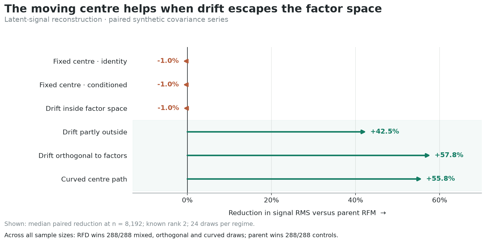
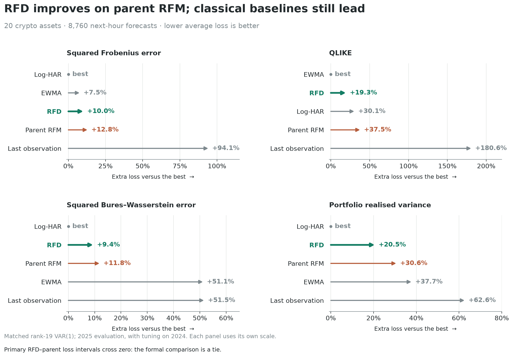
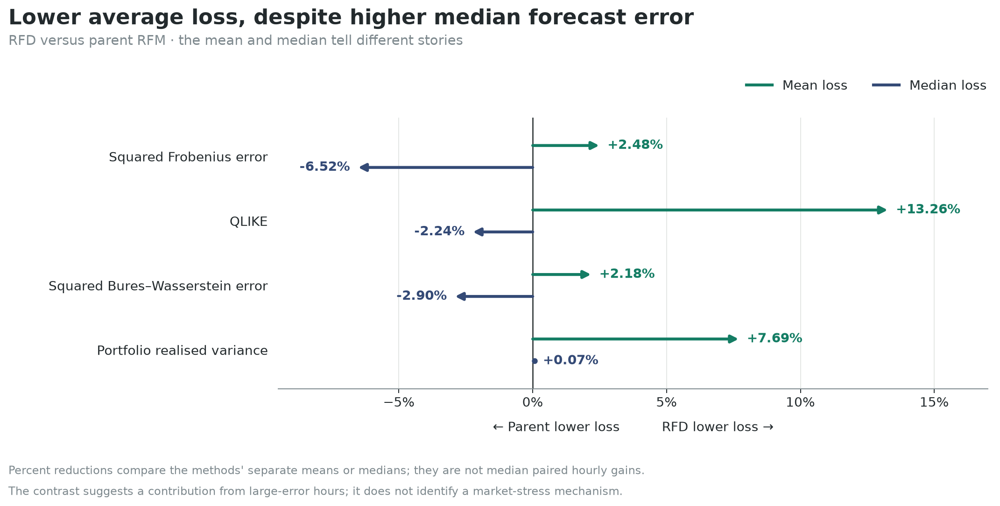
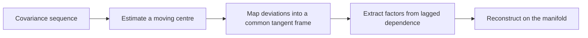

# Riemannian Factor Dynamics

**Factor models for covariance matrices whose baseline changes over time.**

A market's covariance structure moves. A factor model built around one fixed
baseline can mix that movement with the persistent co-movement it is trying
to recover. Riemannian Factor Dynamics (RFD) estimates a moving geometric
centre and extracts dynamic factors around it.

The project combines a Python implementation, controlled simulations and a
20-asset crypto forecasting study. Its central question is simple:
**when does separating the moving baseline actually make a difference?**

[Results](#when-the-moving-centre-matters) · [Try RFD](#try-rfd) ·
[How it works](#how-it-works) · [Reproduce](#reproduce-the-results)

## When the moving centre matters

In paired synthetic covariance series, RFD reduces median latent-signal error
by **42.5–57.8%** at 8,192 observations when centre drift is mixed, orthogonal
or curved relative to the factor space. The benefit disappears when the
centre is fixed or its drift lies inside that space.



Both methods receive the same observations, known rank two and two lags.
Parent RFM is the fixed-centre baseline from the
[original implementation](https://github.com/shuochieh/Riemannian_factor_model).
Across four sample sizes and 576 paired draws, RFD wins every
mixed/orthogonal/curved comparison; parent RFM wins every home/fixed/aligned
comparison. These are in-sample recovery results.

There is a revealing detail in the aligned case: RFD estimates the centre
**60.5% more accurately**, yet parent RFM still reconstructs slightly better.
The factor space can absorb that drift. A good reconstruction does not, by
itself, tell us how movement should be divided between baseline and factors.

[Full synthetic comparison](results/final/parent_rfd_bw_parity_adjudication/report.md)
· [All sample sizes](results/figures/parent_rfd_bw_parity/signal_gain_heatmap.png)

## An application: the next hour's covariance

The crypto study forecasts hourly **20 × 20 covariance matrices** from
one-minute returns. The comparison covers all **8,760 hours of 2025**, with
model choices made on 2024 data. RFD and parent RFM use the same rank-19 VAR(1)
score head; classical methods provide a practical benchmark.



RFD lowers average loss versus parent RFM by **2.48% under Frobenius,
13.26% under QLIKE, 2.18% under Bures–Wasserstein and 7.69% in portfolio
realised variance**. The paired primary-loss intervals cross zero, so the
formal result is a tie. Log-HAR and EWMA remain strong competitors.

The more interesting detail is the difference between the mean and median:



The average improves even though the median forecast error usually rises.
This suggests that large-error hours contribute disproportionately to the
gain. It does not yet establish a market-stress effect. The chart compares
each method's separate means and medians, rather than the median of paired
hourly percentage gains.

[Crypto result and uncertainty](results/final/crypto_forecast/report.md)
· [Recorded means](results/final/crypto_forecast/headline_losses.csv)
· [Mean and median contrasts](results/final/crypto_forecast/rfd_vs_parent.csv)

## How it works

RFD models observations on a Riemannian state space. For covariance matrices,
that means working with their positive-definite geometry throughout the fit.
The implementation also supports directional observations on a sphere.



The model writes an observation as

$$
X_t = \operatorname{Exp}_{\mu(t)}\!\left(P_t A f_t + \delta_t\right).
$$

Here $\mu(t)$ is the moving centre, $A f_t$ is the low-dimensional dynamic
component, $P_t$ transports it along the centre path, and $\delta_t$ is tangent
noise. The exponential map returns the observation to the manifold. RFD
estimates the centre path, transports local deviations to a shared reference
frame, and uses nonzero-lag covariance to find persistent directions.

Three analytical ideas motivate the construction:

- **The centre/factor split needs structure.** An unrestricted stochastic
  baseline and persistent factors can explain the same observed process.
  Separation conditions make the target explicit and quantify the price of
  persistence when estimating it from one path.
- **The reference can change the apparent factor count.** In curved geometry,
  changing the reference point can turn a rank-one configuration into rank
  two. Choosing a centre is part of the model.
- **Geometry for fitting and loss for forecasting are separate choices.**
  A geometric distance scored against a noisy covariance proxy can reward a
  shrunken forecast instead of the conditional mean. Squared Frobenius and
  QLIKE are the primary forecast criteria here; BW is a secondary diagnostic.

The estimation theory is conditional on explicit energy, dependence, domain
and signal-separation assumptions. A separate fixed-rank BW simulation found
centre-error exponents of **0.41 and 0.42**, close to the $3/7$ reference rate
for commuting and curved paths.
[Numerical convergence and boundaries](results/final/bw_closure_adjudication/report.md)

## Try RFD

Install from a local checkout using Python 3.10 or newer. The core package
needs NumPy and SciPy; it does not need R or market data.

```bash
git clone https://github.com/AdarshArunEire/Riemannian-Factor-Dynamics.git
cd Riemannian-Factor-Dynamics
python -m venv .venv
```

Activate the environment with `.venv\Scripts\Activate.ps1` in PowerShell or
`source .venv/bin/activate` on macOS/Linux, then:

```bash
python -m pip install -e .
python examples/quickstart.py
```

The [small covariance example](examples/quickstart.py) generates 96 positive-
definite matrices with a moving baseline, fits one factor and prints the
reconstruction error. To fit your own sequence:

```python
import numpy as np
from rfd.geometry import BW_GEOMETRY
from rfd.model import RFDConfig, fit_rfd

covariances = np.load("covariances.npy")  # shape (n, m, m), symmetric positive definite
time = np.linspace(0.0, 1.0, len(covariances))

fit = fit_rfd(
    covariances,
    time,
    BW_GEOMETRY,
    RFDConfig(
        bandwidth=0.2,
        n_cells=4,
        max_lag=2,
        rank_method="fixed",
        rank=2,
    ),
)

scores = fit.factor_scores
loadings = fit.loadings
reconstructed = fit.reconstructed_observations
centre_path = fit.centre.polygon
```

Bandwidth is measured in the supplied time units; `n_cells` controls the
polygonal centre path, `max_lag` controls the lag operator, and `rank` is the
requested factor count. The values above illustrate the API, not a tuning
rule for arbitrary data. Use the observation timestamps, rescaled if needed,
when sampling is uneven; lags count observation steps, not elapsed time.

Choose `AIRM_GEOMETRY` or `BW_GEOMETRY` for positive-definite matrices, or
`SPHERE_GEOMETRY` for unit vectors. The fitted object retains intermediate
centre, tangent, lag and spectral estimates for inspection. See
[`model.py`](py/rfd/model.py) and [`geometry.py`](py/rfd/geometry.py).

`fit_rfd` fits and reconstructs the supplied sample. Causal forecasting is
implemented in the experiment runners; it is not a `.predict()` method on
this fit. Rank selectors are available, but the headline synthetic comparison
supplies the true rank and does not validate automatic rank selection.

## Reproduce the results

**Regenerate the README figures** from the committed CSV extracts:

```bash
python -m pip install -e ".[plots]"
python experiments/generate_readme_figures.py
```

The [generator](experiments/generate_readme_figures.py) writes PNG and editable
SVG figures to [`results/figures/readme`](results/figures/readme). It requires
no raw-data downloads or experiment reruns.

**Check the core implementation:**

```bash
python -m pip install -e ".[test]"
python -m pytest py/tests/test_model.py py/tests/test_airm.py py/tests/test_bw.py py/tests/test_sphere.py
```

**Rerun the paired synthetic campaign.** This additionally requires R, the
packages in `renv.lock`, and the pinned parent implementation. From the repo
root, restore the recorded environment and fetch the parent into the path
expected by the runner:

```bash
python -m pip install -r requirements.txt
git clone https://github.com/shuochieh/Riemannian_factor_model.git reference/Riemannian_factor_model-main
git -C reference/Riemannian_factor_model-main checkout c07d49c257d489e00b7e15bdd432954946a2a694
Rscript -e "renv::restore(prompt = FALSE)"
python experiments/run_parent_rfd_bw_parity.py --profile smoke --check-r
python experiments/run_parent_rfd_bw_parity.py --profile smoke
```

For the complete 576-draw campaign:

```bash
python experiments/run_parent_rfd_bw_parity.py --profile overnight --workers 8
python experiments/analyze_parent_rfd_bw_parity.py
```

The recorded workload implies roughly **10 hours on eight workers**, with
runtime depending on the machine. The runner resumes completed task keys.
[Configuration](config/parent_rfd_bw_parity.yaml) ·
[Parent provenance](reference/PROVENANCE.md) · [Recorded environment](VERSIONS.md)

**The crypto study has a separate data pipeline.** Its scripts and frozen
configurations are included; the raw minute bars and full intermediate caches
are not. Acquisition starts with
`python experiments/run_hf0_crypto_preflight.py --profile full`, followed by
the centre, representation and forecasting stages below. This is a substantial
data-and-compute run, not required to use RFD or redraw the figures.

| Stage | Runner | Configuration |
|---|---|---|
| Asset selection and covariance panel | [HF-0](experiments/run_hf0_crypto_preflight.py) | [Data contract](config/hf0_crypto.yaml) |
| Centre selection on 2024 | [HF-1](experiments/run_hf1_centre_gate.py) | [Centre gate](config/hf1_centre_gate.yaml) |
| Representation and rank comparison | [HF-2](experiments/run_hf2_representation.py) | [Representation](config/hf2_representation.yaml) |
| One-hour forecasts on 2025 | [HF-4](experiments/run_hf4_forecast.py) | [Forecast study](config/hf4_forecast.yaml) |

The current HF-4 runner also retains later score-head diagnostics. Only its
frozen rank-19 VAR(1) rows and classical baselines belong to the public result
above; the [result note](results/final/crypto_forecast/report.md) records that
selection.

## Inside the repository

| Path | Contents |
|---|---|
| [`py/rfd`](py/rfd) | Geometry, centre estimation, factor extraction and reconstruction |
| [`examples`](examples) | A small runnable starting point |
| [`experiments`](experiments) | Simulation, application and figure runners |
| [`config`](config) | Experiment designs and fixed choices |
| [`results/final`](results/final) | Public result summaries and selected data |
| [`notebooks`](notebooks) | Plotting and exploration notebooks; some require regenerated intermediates |

RFD is research software. The core fitting interface is usable; a public PyPI
release and standalone manuscript are not yet available. The parent RFM code
is fetched separately and remains unmodified. A licence for this repository
has not yet been selected.
