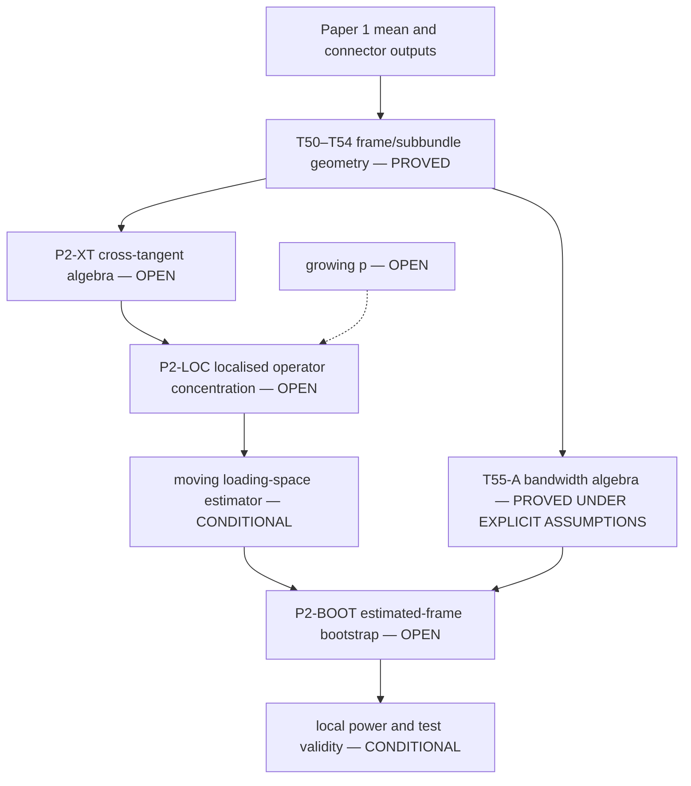

# Parked programme — Intrinsically moving loading subspace

> Former working name: “Paper 2 — Moving loading subbundle.” Parent: [[Time-varying Fréchet mean Riemannian factor model]]. Sibling: [[Paper 1 — Locally stationary Riemannian factor model]]. Current statuses are governed by [[Analytical reconstruction — proof ledger and rebuilt spec]]. This remains a standalone parked programme after the Paper 1 HE and fixed-size BW closure campaign; no HE/BW result changes its mathematics. It is deliberately **not assigned a paper number** until its estimator and bootstrap boundaries close and an application earns that role.

## Current verdict

The former “fold this programme into Paper 1” verdict is **RETRACTED**. Its two supporting claims failed: the ribbon theorem is substantive and required a typed repair, and the crossover is not a structural constant but shrinks with $n$. The moving-loading problem remains a distinct paper candidate, but no publication decision is forced because three load-bearing nodes remain open: cross-tangent operator algebra, localised concentration, and estimated-frame bootstrap validity.

The current moving-loading theory is fixed-$p$ only. Growing-$p$ is downstream of unresolved fixed-$p$ nodes.

## Model and estimand

$$
X_{t,n}=\operatorname{Exp}_{\mu(u_t)}[A(u_t)f_{t,n}+\delta_{t,n}],
\qquad E(u)=\operatorname{Im}A(u),
$$
with projector $\Pi(u)=A(u)A(u)^*$. The defining alternative is
$$
\frac D{du}\Pi(u)\ne0.
$$
Paper 1 is the null branch $D\Pi/du=0$; this programme estimates a genuinely moving loading subbundle.

## Proved pullback/frame machinery

Let $P(u)=\mathcal P^\mu_{u\to u_0}$. For any smooth section $V$ of $\mu^*TM$,
$$
P(u)\frac D{du}V(u)=\frac d{du}[P(u)V(u)].
$$
For an endomorphism field $B$ and $\tilde B=PBP^{-1}$,
$$
P\left(\frac D{du}B\right)P^{-1}=\frac d{du}\tilde B.
$$
Consequently
$$
\frac D{du}\Pi=0\iff \tilde\Pi=P\Pi P^{-1}\text{ is constant},
\qquad
\left\|\frac D{du}\Pi\right\|=\left\|\frac d{du}\tilde\Pi\right\|
$$
in Frobenius and operator norm. Covariant smoothness transfers exactly to the parallel frame. Chart smoothness does not; sieve regularity must be imposed covariantly.

The pullback connection over $[0,1]$ is flat because curvature is a two-form on a one-dimensional base. This supplies a global parallel frame but does not remove the error from estimating $\mu$.

## Estimated-frame channel

Let $R(u)=\hat P(u)P(u)^{-1}$ after inserting the connector maps required to compare the two fibres. Under the Paper 1 null, $\tilde\Pi(u)=\tilde\Pi_0$ is constant, but the estimated-frame projector is
$$
R(u)\tilde\Pi_0R(u)^\top,
$$
which is non-constant when $R$ is. Thus frame error manufactures exactly the alternative tested by the moving-loading programme.

The correct ribbon bound is
$$
\|R(u)-I\|
\lesssim \Lambda\int_0^u
\left|e\wedge\left(\mu'+\tfrac12\nabla_se\right)\right|ds,
\qquad e=\log_\mu\hat\mu,
$$
not a bound involving only $\|e\|_\infty L(\mu)$. This channel vanishes in flat simply connected geometry. A geodesic mean path does not generally make it vanish.

## What is proved about smoothing

T55-A is an **algebraic compatibility result**, not a bootstrap theorem. Conditional on a future internally proved uniform P2 localisation scale and one of the canonical fixed-$p$ sup-norm G1 routes, the frame-error comparison gives $q\ge3$ and the mean smoothed at least as heavily as the loading space. At $q=3$, the old algebraic window is represented by $n^{-1/5}\ll b\ll n^{-2/15}$.

G1$_{L^2}$ does not justify replacing the uniform error in this comparison or inside a multiplier-bootstrap proof. The bootstrap's functional topology and anti-concentration/remainder steps must be checked directly.

## Current dependency chain

## Independent gaps

### P2-XT — cross-tangent operator algebra

Derive and type-check
$$
\Gamma_t(h)=A_tC_t(h)A_{t-h}^*
$$
as an operator between the correct tangent fibres, including factor–noise cross terms. Prove conditions under which the local loading operator has image $\operatorname{Im}A_t$. Do not treat $A_{t-h}^*A_{t-h}=I$ as a harmless normalisation without checking every lagged fibre.

### P2-LOC — localised concentration

Prove the lag-operator and score bounds at effective sample size $nh$ under the stated dependence assumptions. Track $p$, $h$, block length, lag count, factor strength, and eigengap explicitly. Until then, neither a $p$-free nor a growing-$p$ rate is available.

### P2-BOOT — estimated-frame multiplier bootstrap

Show that the bootstrap reproduces the estimated-frame channel, or that the channel is negligible in the precise uniform topology of the statistic. Resampling/re-estimating $\hat\mu$ inside the bootstrap is a possible route; merely citing the Euclidean bootstrap or substituting an $L^2$ mean rate is not closure.

### P2-POWER — local power

After P2-BOOT, derive the detection boundary of the exact block statistic with its tuning and dependence parameters. Old simulation tables have zero proof status.

## Crossover correction

Ignoring a loading rotation of size $\omega$ produces global bias of order $\omega$, while localisation produces variance of order $(nh)^{-1/2}$. Thus the crossover is
$$
\omega^*\asymp(nh)^{-1/2},
$$
and for $h\asymp n^{-1/5}$ it is $n^{-2/5}\to0$. The former numerical value near $0.44$ is not structural. Any publication case for this programme must rest on its theorem and application, not that constant.

## Fixed p versus growing p

Current classification: **FIXED-p NODES STILL OPEN**. The frame identities themselves are dimension-free algebra. The following are not proved even for a complete moving-loading theorem at fixed $p$: P2-XT, P2-LOC, and P2-BOOT. Consequently all growing-$p$ claims, factor-number selection, and high-dimensional power calculations remain OPEN.

## Claims this paper must not make

- that Paper 1's sup-norm G1 is a current bottleneck;
- that G1$_{L^2}$ alone validates a uniform multiplier bootstrap;
- that the old crossover is a constant or supports folding the paper away;
- that the Euclidean localised estimator transfers before P2-XT and P2-LOC are proved;
- that time-varying contemporaneous idiosyncratic covariance is free at the sample-rate level;
- that $p$-free or $p_n\to\infty$ rates have been inherited;
- that the cited Euclidean paper supplies a repository quantity named $\varrho_n$;
- that simulations close local power or bootstrap validity.

## Paper status

The geometry and scientific distinction are real: the formulation separates coordinate motion induced by a moving centre from intrinsic motion of the loading subspace. That is enough to retain this as a distinct research programme. It is not enough to call the estimator or test theorem complete, and it is not enough to reserve the label “Paper 2.”

## Related notes

- [[Analytical reconstruction — proof ledger and rebuilt spec]]
- [[Paper 1 — Locally stationary Riemannian factor model]]
- [[Time-varying Fréchet mean Riemannian factor model]]
- [[G1 audit — resolution of the uniform local Fréchet rate]]
- [[OPEN OBLIGATIONS — current research actions]]
