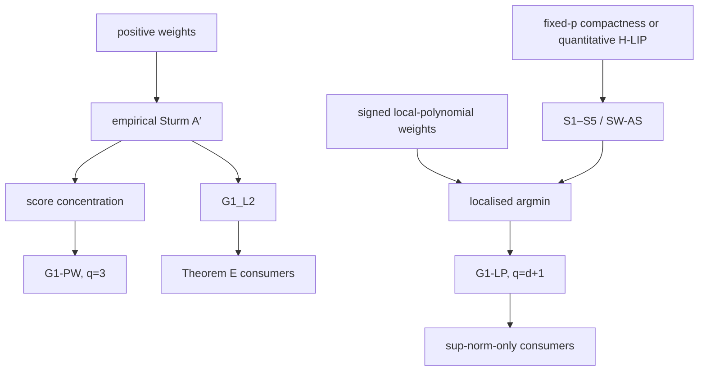

# G1 audit — resolution of the uniform local Fréchet rate

> **CURRENT MEAN-PROOF SOURCE.** The complete robust growing-dimension result is [[HD1 — growing-dimension Paper 1 proof dossier]], with independent HD1-A/B/C details preserved under `Archived/Proof workstreams`. The fixed-dimensional material below is retained as proof history and for the signed alternative.
>
> **Scope.** No claim below is called “unconditional” merely because a geometric side condition disappears. Mixing, smoothness, support, local-stationarity, design, and estimator-specification assumptions remain explicit.
>
> **Energy boundary.** The baseline growing-\(p_n\) rates below use a dimension-uniform total-energy envelope. When \(R_n\to\infty\), the score benchmark acquires \(R_n(nb_n)^{-1/2}\) and the baseline proof cannot be rescaled by inspection. The separate bounded-tail and expanding-domain HE campaigns have now rederived the localisation, bias, frame, row, assembly, signal, and generated-domain chain under their explicit assumptions; see [[Paper 1 — Locally stationary Riemannian factor model]] and [[Analytical reconstruction — proof ledger and rebuilt spec]].

## 0. Growing-dimension verdict — 2026-08-08 proof run

For a uniformly controlled Hadamard triangular array of arbitrary dimension $p_n$, bounded total tangent energy, fixed finite memory, the positive three-scale estimator, endpoint-flat kernels, and a fixed-width forward/backward blend,

$$
\sup_u d(\hat\mu_n^{(3)}(u),\mu_n(u))
=O_p\!\left(b_n^3+n^{-a}+n^{-1}+\sqrt{\frac{\log n}{nb_n}}\right),
$$

$$
\|\log_{\mu_n}\hat\mu_n^{(3)}\|_{L^2}
=O_p\!\left(b_n^3+(nb_n)^{-1/2}+n^{-a}+n^{-1}\right),
$$

with the same RMS rate on any deterministic coarse grid. The proof concentrates the tangent score directly as a Hilbert-valued sum; no $S^{p_n-1}$ net is used.

Under level-only local stationarity, the correct derivative theorem is

$$
\|\nabla_u\log_{\mu_n}\hat\mu_n^{(3)}\|_{L^2}
=O_p\!\left(b_n^3+(nb_n^3)^{-1/2}+\frac{n^{-a}}{b_n}+\frac1{nb_n}\right).
$$

The $n^{-a}/b_n$ term is sharp even on $\mathbb R$. It improves to $n^{-a}$ only under the explicit $C^1$ weighted score-discrepancy assumption in HD1-A. A width-$b_n$ boundary blend is retracted: its derivative bias is $b_n^{5/2}$; use the fixed-width overlap.

These results require higher uniform Exp/Log/Richardson differential bounds as explicit manifold-sequence assumptions. The earlier affine-invariant SPD H-LIP result proves the curvature/Hessian portion but, by itself, does not prove every higher differential bound.

## 0H. Historical fixed-p verdict

There are two proved fixed-dimensional routes.

| Route | Current result | Extra cost |
|---|---|---|
| **G1-LP: signed degree-$d$ local polynomial** | **PROVED UNDER EXPLICIT ASSUMPTIONS.** For the localised argmin, $d\ge2$, $q=d+1$, $$\sup_{u\in[0,1]}d(\hat\mu(u),\mu(u))=O_p\!\left(b^q+n^{-a}+\sqrt{\frac{p+\log n}{nb}}\right).$$ If $n^{-a}$ is dominated, this is the advertised $b^q+\sqrt{\log n/(nb)}$ fixed-$p$ rate. | Consumes SW-AS, including a pathwise modulus in $q$ and expected-Hessian smoothness. A localised estimator is mandatory. For a fixed finite-dimensional Hadamard manifold with a compact bounded tube, finiteness of the Hessian moduli follows from smoothness and compactness. For dimension-uniform quantitative control on a manifold sequence, impose SW-G or the abstract SW-AS constants directly. |
| **G1-PW: positive-weight scale-family extrapolation** | **PROVED UNDER EXPLICIT ASSUMPTIONS.** Three positive-weight barycentres, followed by a tangent-space Richardson combination, give $$\sup_{u\in[0,1]}d(\hat\mu^{(3)}(u),\mu(u))=O_p\!\left(b^3+n^{-a}+\sqrt{\frac{p+\log n}{nb}}\right).$$ | Avoids SW-AS and SW-G. It is capped at certified bias order $3$ because the uncorrected change-of-base-point error is cubic. The tangent combination inflates constants by $\|\lambda\|_1=5$. |

On affine-invariant SPD, the quantitative geometric input for the signed route is uniform in $p$ when the support radius is uniformly bounded: the space is Hadamard and locally symmetric, $\nabla R=0$, and the curvature-operator bound used below is dimension-free. This removes an additional SW-G geometric assumption; it does **not** prove the full $p_n\to\infty$ statistical factor theorem.

The positive-weight and signed routes are alternatives, not interchangeable proof steps. A theorem proved for probability weights must not be reused for a signed objective.

## 1. Standing statistical setup

Let $(M,g)$ be a $p$-dimensional Cartan–Hadamard manifold for the main G1 statements. Put $u_t=t/n$ and assume a locally stationary approximation $X_t^{(u)}$ satisfying
$$
\mathbb E d(X_{t,n},X_t^{(u_t)})^2\le Cn^{-2a}.
$$
Let $\mu(u)$ be the barycentre of $P_u=\operatorname{Law}(X_t^{(u)})$. Assume the smoothness required by the estimator: $\mu\in C^{d+1}$ for G1-LP and the joint law/score differentiability stated below for bias and derivative results. For the uniform exponential argument assume an almost-sure support radius $\rho^*$, deterministic kernels of compact support, $b=n^{-\alpha}$, $nb/\log n\to\infty$, and polynomial mixing
$$
\alpha(m)\le Am^{-\beta},\qquad \beta>1+\frac{2\gamma}{1-\alpha}.
$$
For fixed $p$, $\gamma$ is chosen larger than the constants required by the time, spatial, and sphere nets. The current proof does not establish a triangular-array theorem with $p=p_n\to\infty$ under a fixed polynomial-mixing exponent.

For deterministic weights $w_t(u)$ with $\sum_tw_t(u)=1$, define
$$
\hat F_u(q)=\sum_tw_t(u)d(X_{t,n},q)^2,\qquad
\hat G_u(q)=\sum_tw_t(u)\log_qX_{t,n}.
$$
Let $\bar F_u=\mathbb E\hat F_u$, $G_u=\mathbb E\hat G_u$, and let $\mu_b(u)$ denote the relevant population smoothed minimiser when it is uniquely specified.

The deterministic local-stationarity remainder $n^{-a}$ is part of every raw mean rate. At $b=n^{-\alpha}$ it can be suppressed only under
$$
a>\min\!\left(q\alpha,\frac{1-\alpha}{2}\right).
$$
For $q=3$, $\alpha=1/5$, this requires $a>2/5$.

## 2. Empirical Sturm reduction: the positive-weight branch

When $w_t\ge0$, $\hat P_u=\sum_tw_t\delta_{X_{t,n}}$ and $\bar P_u=\sum_tw_t\operatorname{Law}(X_{t,n})$ are probability measures. Sturm’s barycentre inequality gives existence, uniqueness, and a quadratic minorant with constant $1$.

> **Theorem A′ (empirical Sturm).** For every $u$,
> $$
> d(\hat\mu(u),\mu_b(u))
> \le \|\hat G_u(\mu_b(u))-G_u(\mu_b(u))\|,
> $$
> where the score is evaluated at the deterministic point $\mu_b(u)$.

Indeed, strong convexity gives $\|\operatorname{grad}\hat F_u(z)\|\ge2d(z,\hat\mu)$; set $z=\mu_b$, use $\operatorname{grad}\hat F=-2\hat G$, and use $G_u(\mu_b)=0$.

This supersedes the former random-$q$ reduction. Random-$q$ localisation, peeling, dyadic shells, a covering of the random estimator ball, and the old Lemmas P2/P3 are not prerequisites of the positive-weight rate. The support bound remains useful for bounded summands in the mixing inequality, not for confining the barycentre.

After transport to a deterministic orthonormal frame, scalar concentration plus a net of $S^{p-1}$ yields
$$
\sup_u\|\hat G_u(\mu_b(u))-G_u(\mu_b(u))\|
=O_p\!\left(\sqrt{\frac{p+\log n}{nb}}\right).
$$
No random tangent space appears in the centring step.

## 3. CE-9 and the exact signed-weight issue

Degree-$d\ge2$ local-polynomial equivalent weights must change sign: exact reproduction includes $\sum_tw_t(u)(u_t-u)^2=0$, impossible for a non-degenerate nonnegative weight measure.

> **CE-9 (arbitrary signed criteria can be non-unique).** On $\mathbb H^2$, let $o=\gamma(0)$ and $z_\pm=\gamma(\pm2)$ on one geodesic. With weights $(3,-1,-1)$,
> $$F(q)=3d(o,q)^2-d(z_+,q)^2-d(z_-,q)^2$$
> is coercive, has $o$ as a transverse local maximum, has no minimiser on $\gamma$, and is reflection-symmetric across $\gamma$. Hence it has at least two global minimisers. With weights $(1+2c,-c,-c)$ the failure occurs for support radius of order $(c\sqrt{\bar K})^{-1}$.

CE-9 proves only the following:

- an arbitrary signed Fréchet criterion need not be convex or uniquely minimised, even on a Hadamard manifold;
- a bare global `argmin` is not a valid estimator specification for the signed route;
- the finite-sample condition $\zeta(2\rho)W^-<W^+$ is a sufficient support-radius/negative-mass condition for global uniqueness and is sharp in order as a finite-sample safeguard.

CE-9 does **not** disprove the local-polynomial statistical rate. Nearby observations carry laws converging to the same $P_u$, and SW-AS controls that structured signed perturbation. The former headline “G1 as stated is disproved” is retracted. The contrast with Nguyen–Uribe is exactly this: their signed weights are generated by a *fixed* extrapolation distance and never become benign, whereas these are generated by a *shrinking* bandwidth and do — SW-AS needs **no condition relating curvature, support radius and negative mass**. **Scope caveat:** SW-AS consumes \(H_{P_u}\succeq\mathrm{Id}\) and is therefore a **Hadamard** result. Bures–Wasserstein is nonnegatively curved, so this route does **not** transfer to the flagship covariance branch as written.

> **External comparison — Nguyen & Uribe (arXiv:2604.03566v1), Theorem 3.2.** The same *kind* of positive-dominates-negative condition appears in the literature, on a different geometry and for a different failure mode. For a signed BW barycentre they prove existence under **Spectral Dominance of Positive Weights**,
> \[
> \sum_{i\in I}\lambda_i^{+}\sqrt{\lambda_{\min}(\Sigma_i)}>\sum_{j\in J}\lambda_j^{-}\sqrt{\lambda_{\max}(\Sigma_j)},
> \]
> with the square roots part of the statement. **The two results are complementary, not competing.** CE-9 lives on \(\mathbb H^2\) (Hadamard, negatively curved) and its failure is **non-uniqueness** with a coercive objective; theirs lives on BW (nonnegatively curved) and its failure is **non-existence** through loss of coercivity, with minimising sequences drifting to the PSD boundary (their Example 3.1). Their negative weights come from **extrapolation** in global Fréchet regression on i.i.d. pairs and have a fixed magnitude; the negative weights here are forced by the degree-\(d\ge2\) moment condition above and are tamed by \(b\to0\) — see the SW-AS remark in §6. **This citation must accompany any presentation of signed-BW existence as untouched prior art.** It is also the correct citation at the BW signed-Richardson safeguard, where the project independently found the same cone-exit phenomenon; see [[Literature review — external positioning and prior art]] §2.6.2.

The finite-sample signed-weight condition is
$$
\frac12\operatorname{Hess}\hat F_u\succeq
[W^+-\zeta(2\rho)W^-]\operatorname{Id},
\qquad
\zeta(r)=\sqrt{\bar K}r\coth(\sqrt{\bar K}r).
$$
It is not an asymptotic hypothesis of G1-LP.

## 4. Correct second-order barycentre expansion

Fix $m=\mu(u)$ and write $x_*=\log_m\mu_b(u)$. For normalised design moments $m_k=b^{-k}\sum_tw_t(u)(u_t-u)^k$, put
$$
h(u,v)=\mathbb E\log_{\mu(u)}X^{(v)},\quad
H_0=\mathbb EH(m,X^{(u)}),\quad
H_1=\partial_v\mathbb EH(m,X^{(v)})|_{v=u}.
$$
Let $T_0$ be the third normal-coordinate derivative of the population Fréchet criterion at $m$. Differentiating the Karcher equation gives the exact identity
$$h_1=H_0\mu'(u),\qquad A:=H_0^{-1}h_1=\mu'(u).$$

> **Theorem X (second order).** Under the stated domination and $C^3$ law smoothness,
> $$
> x_*=bm_1A+b^2\left[\frac12m_2B+m_1^2C\right]+O(b^3)+O(n^{-a}),
> $$
> where
> $$B=H_0^{-1}h_2,\qquad
> C=-H_0^{-1}\left(H_1A+\frac12T_0[A,A]\right).
> $$

The proof is plug-in plus coercivity: substitute the displayed candidate into the score, show a residual $O(b^3)+O(n^{-a})$, and convert score error to distance by strong convexity. It does not assume a formal expansion exists.

In Euclidean space $H_1=T_0=0$, hence $C=0$. On the explicit rotating two-atom family in $\mathbb H^2$, $C=\psi(\lambda-1)\lambda^{-1}e_2\ne0$ with $\lambda=R\coth R$. Thus the $m_1^2$ term is real and the former three-different-shape-kernel proof was false: for its own example $\sum_j\lambda_jm_1(j)^2=-1/8$.

Local-polynomial reproduction avoids this defect entirely. If the local design matrix is uniformly nonsingular, then
$$
\sum_tw_t(u)(u_t-u)^k=\delta_{k0},\qquad k=0,\ldots,d,
$$
exactly, including at the boundary. Hence $m_1=\cdots=m_d=0$ and every nonlinear cross-term below order $d+1$ vanishes.

## 5. The positive-weight scale-family repair

The former claim that bandwidth Richardson extrapolation necessarily fails at the boundary is retracted. It fails for a two-sided kernel truncated by the domain; it works for a one-sided kernel looking into the domain, whose shape moments do not depend on $u$.

Let $K\ge0$ on $[0,1]$ and $K_j(v)=K(v/c_j)/c_j$. Then
$$m_1(j)=c_j\mu_1,\qquad m_2(j)=c_j^2\mu_2,\qquad
m_1(j)^2=\frac{\mu_1^2}{\mu_2}m_2(j).$$
Thus any $\lambda$ satisfying $\sum\lambda_j=1$, $\sum\lambda_jc_j=0$, and $\sum\lambda_jc_j^2=0$ kills both first- and second-order bias, including the $m_1^2C$ term. One explicit choice is
$$
c=(1,1/2,1/4),\qquad \lambda=(1/3,-2,8/3),\qquad \|\lambda\|_1=5.
$$
The proposed four-equation system $(1,m_1,m_2,m_1^2)$ is singular for every scale family because its fourth row is proportional to its third. Four genuinely different shapes could make those constraints independent, but are unnecessary here.

For the positive-weight barycentres $\hat\mu_{(j)}(u)$, define
$$
\hat\mu^{(3)}(u)=\operatorname{Exp}_{\hat\mu_{(1)}(u)}
\left(\sum_{j=1}^3\lambda_j
\log_{\hat\mu_{(1)}(u)}\hat\mu_{(j)}(u)\right).
$$
Every minimisation has positive weights; the signed $\lambda_j$ act only after minimisation. The base-point expansion of the logarithm makes the combination error cubic, giving G1-PW. A certified order $q\ge4$ would require an explicit third-order curvature correction; it remains optional and open.

## 6. SW-AS and G1-LP

The signed estimator is specified by a preliminary positive-weight mean $\tilde\mu(u)$ and fixed $\delta_0>0$:
$$
\hat\mu(u)=\arg\min\{\hat F_u(q):q\in\bar B(\tilde\mu(u),\delta_0)\}.
$$
On the SW-AS event this convex ball contains a unique interior critical point. This localisation is part of the estimator, not merely a proof device.

Write $H(q,x)=\tfrac12\operatorname{Hess}_qd(q,x)^2$. The minimal abstract SW-AS assumptions are:

- **S1:** $\sup_{q,x}\|H(q,x)\|_{\mathrm{op}}\le\bar H$ on the estimation tube;
- **S2:** $H(q,x)$ has a pathwise Lipschitz (or entropy-compatible) modulus in $q$, after transporting both operators to one tangent space;
- **S3:** \(\sup_q\|\mathbb EH(q,X_{t,n})-\mathbb EH(q,X_t^{(u_t)})\|\le\delta_{H,\mathrm{LS},n}\);
- **S4 / SW-L:** $\sup_q\|\mathbb EH(q,X^{(v)})-\mathbb EH(q,X^{(u)})\|\le L_{\mathrm{law}}|v-u|$;
- **S5:** $\mathbb EH(q,X^{(u)})\succeq\operatorname{Id}$.

> **Theorem SW-AS.** With $\sup_u\|w(u)\|_1\le W$,
> $$
> \sup_{u,q}\left\|\frac12\operatorname{Hess}\hat F_u-H_{P_u}(q)\right\|_{\mathrm{op}}
> =O_p\!\left(W\left[L_{\mathrm{law}}b+\delta_{H,\mathrm{LS},n}+(\bar H+L_q)\sqrt{\frac{p+\log n}{nb}}\right]\right).
> $$
> If the right side is $o_p(1)$, the local criterion is uniformly strongly convex with lower constant tending to $1$.

**Operator-entropy correction.** The centred Hessian sum is self-adjoint. For a $1/4$-net $\mathcal N\subset S^{p-1}$,
$$
\|A\|_{\mathrm{op}}\le2\max_{v\in\mathcal N}|v^TAv|,
\qquad |\mathcal N|\le9^p.
$$
Therefore SW-AS needs a sphere net of entropy $O(p)$, not a net of the unit sphere in $\operatorname{Sym}^2$ of entropy $O(p^2)$. The old $5^{p(p+1)/2}$ claim is retracted. This repair removes a bogus extra $p^2$ penalty; it does not by itself prove the full growing-$p$ theorem.

For a fixed finite-dimensional Hadamard manifold with a compact bounded tube, $d^2$ is smooth and the tube is compact by Hopf–Rinow, so finite $\bar H$, $L_q$, and an $x$-modulus follow by compactness. A curvature-derivative primitive is therefore unnecessary merely to obtain fixed-$p$ finiteness.

For a sequence of manifolds, direct dimension-uniform control must be proved or assumed. The geometric primitive SW-G below is one sufficient route.

For full-rank Bures–Wasserstein SPD on one compatible complete generated domain with fixed spectral, polar, Exp, normal-pair, and path-length margins, BW-SIZE-FIXED-MARGIN proves that quantitative producer uniformly in matrix size. In particular, the mixed observation derivative of the squared-distance Hessian produces a dimension-uniform positive-Hessian radius, and the Richardson/blend/chord/ruled maps are controlled by the recurrence-defined \(C_{\rm BW}(\alpha,\beta,\chi,r_0,k_0)\).

If \(\alpha_n\downarrow0\), the proved replacement is restricted: every population/proxy score pair must have strict slack inside \(\rho_{H,n}=O(\sqrt{\alpha_n})\), the support and score-energy scale is \(O(\sqrt{\alpha_n})\), first local score/Log/Richardson stability stays \(O(1)\), deterministic cubic bias may pay \(O(\alpha_n^{-1})\), and the quadratic Log remainder pays \(O(\alpha_n^{-1/2})\). Grid maxima, generated-object counts, and fractional-normal cell tests remain explicit. Thus the restricted shrinking-margin theorem supplies G1 geometry only under shrinking support; it does not supply a pervasive-energy G1 branch, dependence, localization probability, or signal.

## 7. H-LIP, non-conjugacy, and the SPD case

On a geodesic tube, let $\gamma(t)=\exp_q(t\log_qx)$, $t\in[0,1]$, and let $J_w$ solve
$$
\nabla_t^2J_w+R(J_w,\dot\gamma)\dot\gamma=0,\qquad J_w(0)=w,\quad J_w(1)=0.
$$
Then
$$H(q,x)w=-\nabla_tJ_w(0).$$
Differentiating the Jacobi equation produces both
$$
(\nabla_SR)(J,T)T\quad\text{and}\quad(\nabla_TR)(S,T)J,
$$
as well as terms involving $R$, $J$, $S$, and their first derivatives. A forced boundary-value estimate yields:

> **Theorem H-LIP.** If $|R|\le K_0$, $|\nabla R|\le K_1$, the tube radius is at most $\rho^*$, and the endpoint Jacobi map has inverse norm at most $\Theta$, then
> $$
> \|\nabla_qH\|+\|\nabla_xH\|
> \le L_H(K_0,K_1,\rho^*,\Theta)<\infty,
> $$
> with no explicit dimension factor. On non-positive curvature, $\Theta=1$.

The locally symmetric version sets $K_1=0$. The averaged quantity $K_1^{\mathrm{av}}$ defined by integrating the two $\nabla R$ forcing terms against the Jacobi Green kernel is a **formally weaker sufficient condition**. No proved example in this repository separates finite $K_1^{\mathrm{av}}$ from bounded $\|\nabla R\|_\infty$, so “strictly weaker” is not claimed.

The sphere calculation proves only that $K_0$ without quantitative non-conjugacy is insufficient: as $\theta\uparrow\pi$, the tangential Hessian eigenvalue $\theta\cot\theta$ has derivative of order $(\pi-\theta)^{-2}$ while $K_0$ and $\nabla R=0$ stay fixed. It does **not** settle whether $(K_0,\rho^*,\Theta)$ alone controls $\nabla H$. Necessity of any $\nabla R$ bound remains OPEN.

For affine-invariant SPD, congruences are isometries and inversion $A\mapsto A^{-1}$ is an isometry fixing $I$ with derivative $-\operatorname{Id}$. Since $\nabla R$ is an odd-degree covariant tensor, invariance under this geodesic symmetry gives $(\nabla R)_I=0$, and transitivity gives $\nabla R\equiv0$. The Koszul formula gives, at $I$,
$$R(U,V)W=-\frac14\bigl[ [U,V],W\bigr].$$
Using $\|[U,V]\|_F\le2\|U\|_F\|V\|_F$ twice yields $|R|\le1$, uniformly in $p$. Thus H-LIP-SYM supplies dimension-uniform $L_H$ when $\rho^*=O(1)$.

## 8. Correct $L^2$ and derivative theorems

Let $r>2$ be a **moment order**, not the smoothness order of $\mu$, and assume
$$
\sup_{t,n}\mathbb E d(X_{t,n},\mu_b(u))^r<\infty,
\qquad
\sum_{h\ge1}\alpha(h)^{1-2/r}<\infty.
$$
Rio/Davydov covariance control and Theorem A′ give
$$
\|d(\hat\mu,\mu_b)\|_{L^2(du)}=O_p((nb)^{-1/2}).
$$
For the localised signed estimator, the same calculation holds on the SW-AS event with the strong-convexity factor $\lambda_n^{-1}=O_p(1)$ replacing the Sturm constant. Thus the theorem is positive-weight by Sturm, or signed under SW-AS; it is not a transfer from positive to signed weights without that extra step.
Including deterministic bias and local stationarity,
$$
\|d(\hat\mu,\mu)\|_{L^2}
=O_p\!\left(b^{q_{\mathrm{int}}}+b^{q_{\mathrm{bdry}}+1/2}+(nb)^{-1/2}+n^{-a}\right).
$$
For the plain positive-weight kernel this is $O_p(b^{3/2}+(nb)^{-1/2}+n^{-a})$. This theorem has no entropy step and no uniform mixing-rate threshold.

For G1′$_{L^2}$ additionally require: a $C^1$ kernel vanishing with its first derivative at window endpoints; denominators bounded away from zero; a **fixed-width** (C^1) forward/backward blend; Hessian invertibility (Sturm for positive weights, SW-AS for signed weights); and joint differentiability of the bias law. Under level-only local stationarity the corrected result is
$$
\|\nabla_se\|_{L^2(du)}=O_p\!\left(b^q+(nb^3)^{-1/2}+n^{-a}/b+(nb)^{-1}\right),
\qquad e(u)=\log_{\mu(u)}\hat\mu(u).
$$
Under differentiably coherent local stationarity, (n^{-a}/b) improves to (n^{-a}). The forward/backward blend is necessary because a hard switch creates a distributional derivative, but a width-(b) blend is also invalid at order (b^q); it must have fixed-width overlap.

## 9. Dependency and scope summary

G1-LP requires dimension-uniform signed-Hessian structure when \(p_n\) grows. [[Application map — geometry, symmetry, and rate accelerators]] T-APP-5 now supplies such a route for deterministic, scalar-plus-uniformly-Hilbert–Schmidt, and controlled block-scalar Hessians; flat/common flats and bounded constant-negative-curvature tubes qualify. Unrestricted full AIRM remains open. G1-PW, its integrated theorem, and corrected G1′ remain dimension-free under the HD1 assumptions. The final robust growing-$p_n$ loading theorem consumes level/grid G1 through a polygonal-frame theorem and does not consume G1′.

FRAME-2P-U consumes two independent instances of the same positive three-scale level/grid machinery: the training path at \(b_n=n^{-1/7}\) and an undersmoothed validation path at \(c_n=n^{-\gamma}\), \(1/6<\gamma<3/14\). Its new root-\(n\) row comes from the fitted polygon functional derivative and dimension-uniform replacement/Hájek argument, not from a faster G1 rate. The G1 theorem and its robust rate are unchanged.

The growing-$p_n$ positive route is **PROVED UNDER EXPLICIT ASSUMPTIONS** in HD1. The structural signed route and causal Hilbert physical-dependence extension are **PROVED UNDER EXPLICIT ASSUMPTIONS** in the application map. Neither is consumed by the original HD-E statement.

## 10. Live unresolved questions

- **HD1:** **PROVED UNDER EXPLICIT ASSUMPTIONS**; see [[HD1 — growing-dimension Paper 1 proof dossier]].
- **Necessity of curvature-derivative control:** optional sharpness; $(K_0,\rho^*,\Theta)$-only H-LIP is unresolved.
- **Separation for $K_1^{\mathrm{av}}$:** no example yet proves it strictly weaker than bounded $|\nabla R|$.
- **Finite-sample SW-AS constants:** optional unless an unlocalised finite-$n$ theorem is claimed.
- **Positive-weight order $q\ge4$:** optional third-order correction.
- **Sharp mixing threshold:** sufficient only; no lower bound.
- **Unrestricted full-AIRM signed structure:** optional; no matrix-size-uniform scalar-plus-HS/fixed-block decomposition is known.

## Historical retractions retained for audit value

- **RETRACTED:** “G1 as stated is disproved.” CE-9 attacks arbitrary signed objectives, not the structured local-polynomial rate.
- **RETRACTED:** the original $J=3$ different-shape construction. It misses $m_1^2C$.
- **RETRACTED:** “bandwidth Richardson fails at the boundary.” It fails only for a truncated two-sided family; the one-sided scale family works.
- **SUPERSEDED:** random-$q$ peeling for positive weights. Empirical Sturm evaluates the score at deterministic $\mu_b$.
- **CORRECTED:** the $L^2$ mixing exponent uses moment order $r$.
- **CORRECTED:** every raw rate carries $n^{-a}$.
- **CORRECTED:** the Hessian operator net has entropy $O(p)$, not $O(p^2)$.
- **CORRECTED:** bounded curvature is disproved only without quantitative non-conjugacy; necessity of $\nabla R$ is not known.

## Related notes

- [[Analytical reconstruction — proof ledger and rebuilt spec]]
- [[Paper 1 — Locally stationary Riemannian factor model]]
- [[Parked programme — Intrinsically moving loading subspace]]
- [[Time-varying Fréchet mean Riemannian factor model]]
- [[OPEN OBLIGATIONS — current research actions]]
